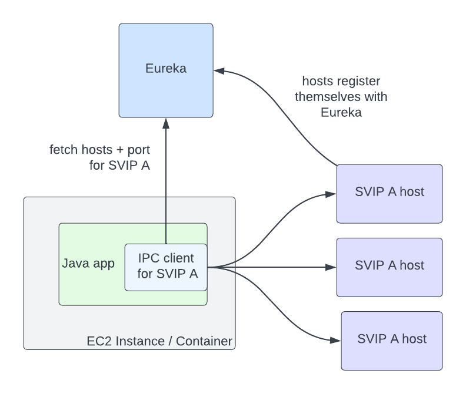

<head>
    
    
</head>

# Table of Contents

1.  [Algorithm](#org8ea6433)
2.  [Review](#org265583d)
    1.  [Netflix IPC 的简史](#org559bfa8)
3.  [Tips](#org06bb5fd)
    1.  [面试基础](#orgd27739f)
        1.  [10 个面试规则](#org1da2e06)
        2.  [面试类型](#org323c9b1)
        3.  [面试官类型](#org09fad85)
        4.  [回答不适合的问题](#org34c5425)
        5.  [掌握你的非语言交流](#org2146bb2)
        6.  [分析职位描述](#org34b2df8)
    2.  [解决常见问题](#org3656be6)
        1.  [自我介绍](#org4a5edf0)
        2.  [为什么你想在这里工作](#org0608e3f)
        3.  [你的优势是什么](#org3e5b4d2)
        4.  [问问题](#org9d988a7)
    3.  [解决高级面试问题](#orga3fe92c)
        1.  [行为面试问题](#org687861c)
        2.  [谈谈你的弱点](#org2a1cf9e)
        3.  [未来 5 年的规划](#orgd7226a6)
        4.  [工资问题](#org0aca910)
    4.  [优化简历](#orge216122)
        1.  [简历格式](#org86412e5)
        2.  [适配机器人的简历](#org438fa41)
    5.  [提高工作搜索能力](#org7496282)
4.  [Share](#org56f2a56)

# Algorithm

Leetcode 850: [Rectangle Area II](https://leetcode.com/problems/rectangle-area-ii/)

<https://dreamume.medium.com/leetcode-850-rectangle-area-ii-c8fe17dc1077>

# Review

[按需簇发现的零配置网](https://netflixtechblog.com/zero-configuration-service-mesh-with-on-demand-cluster-discovery-ac6483b52a51)

本文我们讨论 Netflix 服务网的适配：一些历史、动机、我们如何在 Kinvolk 和 Envoy 社区在复杂微服务环境下流水线服务网适配如何工作：按需簇发现

## Netflix IPC 的简史

Netflix 早期用云，特别对大规模的公司：我们开始在 2008 年迁移，在 2010 年，Netflix 流完全运行在 AWS 上。今天我们有大量的工具，OSS 和商业的，都设计为云环境。在 2010 年，然而，几乎都不存在：CNCF 在 2015 年才出来！因为没有现存的解决方案，我们需要自己构建

对服务间的 IPC，我们需要一个中间层负载均衡器典型地提供丰富的特性集。我们也需要一个解决方案处理云中实际的工作：一个高度动态环境，节点上线下线，且服务需要对改变和路由失败快速反应。为改进有效性，我们设计组件可独立故障且避免单点故障的系统。这些设计原则让我们对客户端负载均衡，且 2012 年圣诞前夜运行中断进一步坚固了这个决定。在云上的早些年，我们构建了 Eureka 作为服务发现和 Ribbon（内部称为 NIWS）作为 IPC。Eureka 解决了如何发现服务跟哪个实例联系，而 Ribbon 提供负载均衡的客户端逻辑，及其他许多适应特性。这两个技术，和一些其他适应和混杂工具一起，有巨大的不同：我们的可靠性可度量地改进

Eureka 和 Ribbon 呈现了一个简单强大的接口，使得适配它们很容易。为了一个服务跟另一个联系，它需要知道两件事：目标服务的名字，和流量是否应该是安全的。Eureka 提供的抽象是用虚拟 IP（VIPs）来非安全地通讯，和安全 VIPs（SVIPs）作为安全通讯。一个服务广播一个 VIP 名字和端口到 Eureka（例如：myservice，端口 8080），或一个 SVIP 名字和端口（例如：myservice-secure，端口 8443）或同时这两者。IPC 客户端实例化 VIP 或 SVIP 的目标，Eureka 客户端代码处理转换 VIP 为一系列 IP 端口对通过 Eureka 服务器获取。客户端也可选择启动 IPC 特性比如重试或电路阻断，或与一系列合理的默认值挂钩

在这个架构中，服务到服务的通讯不再通过单点故障的负载均衡器。下流是 Eureka 作为一个单点故障的真实源，注册 VIPs。然而，如果 Eureka 下线，服务可继续相互通讯，虽然它们的主机信息随着 VIP 的上线下线会变成脏数据。在运行中断时作为降级但有效的状态的能力对完全停止流量来说是一个标志性地改进

# Tips

[The Art of the Job Interview](https://www.coursera.org/learn/art-of-job-interview/)

经典的讲面试的课程，没学过类似课程的建议都看一遍，基本上是一个精华版的面试大全，几乎每句话都是经典，整个面试过程中的要点都提到了，看了这个课程其他相关课程应该就没必要看了

课程内容深入详细，视频语速很快，对听力考验很大，也可以重点看内容忽略听力的训练。课程一共分 5 周课时

## 面试基础

第一周内容为面试基础，需要知道并内在化的基本原则是

1.  真实可信
    
    并不是要你坦白所有事情，你需要有策略地说明什么是你想强调地及你如何展现它们，但不要说谎。要让面试官感受到你真实可信
2.  销售自己
    
    但不要过于真实，你需要平衡真实与最佳体验，把自己销售出去。大多数人对自我广告没有太多经验，所以导致面试感觉有些讨好或糟糕。
    
    我们推荐的准备和我们关键问题的处理，聚焦在准备真实可信的回答，且使你高亮你最大的能力和成就。这其中最大一部分是学习把你的经验中好的，有趣的相关故事说出来。行为面试是面试中一个最常见的面试形式，你要确保能很好的回答大量这些问题。这些故事是你以真实可信的方式销售自己和展示你的能力的机会
3.  说话简洁
    
    不要漫谈和离题。不要害怕谈论。最关键点是不要在任何单个回答中超过两分钟除非你被要求继续。准备是简洁回答的关键，且要强调最印象深刻的点。我强烈相信做好准备的任何人都是很好的面试者
4.  显示热情
    
    你要显示你的兴趣，证明对公司和职位有说服力的热情。没有人想要雇佣一个对工作不热情的候选人

4 个最常见出现的候选人的错误：

1.  缺乏专业
    
    迟到，不合适的着装，不合适的自我展现，没有遵从面试礼仪比如发送感谢信（这个需要吗？不确定）
2.  缺乏准备
    
    好的准备包括分析职位描述，研究公司，思考关键问题的回答和你的行为故事，并进行练习
3.  缺乏内容
    
    你的回答缺乏说服力，可能你的回答太一般化了，或你没有好的行为故事。或者回避问题或回答脱口而出导致亮红灯
4.  悲观消极
    
    垃圾谈论。不要对你当前或以前的管理者或同事说坏话。即是他们确实很糟糕。你需要保持正面或至少中立。如果确实结果不好，你需要特别准备一些银弹，这样你可以提供足够的细节和正确的词语来避免显得负面或不专业

### 10 个面试规则

1.  面试时不要撒谎
    
    这不意味着你需要暴露你的弱点。我们将教你如何回答困难问题，重塑负面，且显现出正面
    
    但是我们不会教你撒谎

2.  总是回答问的问题
    
    可以使用问句来提升或强调你想要的点。然而，避免导致引起你想要隐藏什么的怀疑

3.  个性
    
    不是每个人都会找一个闪耀的健谈者。化学反应是一个团队环境的关键，且注意你如何适应其他人
    
    让你自己尽可能成为你最自信的版本（大面试将帮助你精确理解这是什么意思）

4.  不要害怕谈论
    
    简洁，不要漫谈。在任何单个问题回答上不要超过两分钟除非你被问到更多的信息

5.  总是让别人感觉到你的兴趣
    
    显示对工作和公司的热情。他们想要你如同对你好奇一样你也好奇他们
    
    问问题总是加分的，要一直专业和相关

6.  所有问题的关键
    
    要显示你能为他们做什么，而不是他们能为你做什么。你想要在这个角色上表现出色，迎接新的挑战且和公司成长
    
    你想要贡献，努力工作，且使你的面试职位更简单。你可在他们提供 offer 之后问假期时间，奖金结构和着装规范

7.  准备说故事
    
    关于你的工作经验，但要确保简短简洁。准备会帮助你缩减和提炼你的故事
    
    你绝对不能准备太过。然而，你也不想显得太过排练的样子。练习，但不要记住每个回答的单词

8.  思考如何使用我和我们
    
    面试者需要知道你可以很好的在一个团队中工作，但他们也对你的个人贡献感兴趣。另外，“我”能够做这个且这个帮助了团队，或“我们”，来获得成功

9.  未来能力
    
    从过去的行为预测，这样你应该思考你在找的工作如何应用到你分享的例子
    
    如果问你错误或失败，把你的回答放在你学到了什么且从经验中得到成长并不会再犯相似的错误

10. 如果问你个人兴趣
    
    爱好，选择分享有意思且显示正面可应用到工作的例子。例如，你喜欢旅游显示你有冒险精神和适应性

11. 总是 24 小时跟随
    
    面试后，感谢面试官并表达你如何享受这次体验且对希望在公司工作的激动心情
    
    Email 很好，但一个手写信将帮助你在一些面试官中的印象。记住小心校对拼写和语法错误

### 面试类型

1.  电话面试

    注意说话简洁并在点上

2.  一对一面试

    典型的面试方式，通常持续 20 到 45 分钟。在简单介绍和小谈论之后，面试主要就是面试官问问题，你来回答。在你回答完他们的问题之后，你有机会问他们你的问题
    
    注意非语言交流，坏的习惯比如紧张和说话太快，无精打采及总是嗯呃将导致面试失败。

3.  视频面试

    你要准备你的环境，背景幕，照明，背景噪声，摄像头角度，做一个网络摄像头测试，调整你的摄像头或对鼻子做点美容。做一个模拟面试测试最好

4.  小组面试

    同时面试你的人一般有 2 到 4 个，注意联系到每个人

5.  群面

    公司使用群面的形式通常是他们要雇佣多个职位，这允许雇佣的管理者观测候选人之间的交互并获得一个更好的感觉他们是如何处理任务的。你在里面扮演什么角色？你建立起想法了吗？你尊重其他人的观点吗？你是很舒适地进入一个新组和一个新环境吗？

### 面试官类型

1.  外部招聘者

    公司会雇佣外部招聘者做初步筛选。外部招聘者成功把候选人得到雇佣后才拿到钱。所以他也想你能成功被雇佣。不要害怕问他们问题，他跟你是同盟关系

2.  内部招聘者或 HR

    首先通常是电话面试，他们聚焦于检验你的简历，检查任何亮红灯的地方。他的目的是挑选潜在的成功者并避免浪费人的时间。你要使得他喜欢你，当过了这一关，他会是你非常好的联系人

3.  招聘经理人

    招聘经理人即如果你得到职位后他将是你的上司。他是是否雇佣你的主要决定人。记住你得如招聘经理人所想一样，你想要一个能做出好工作，赶上最后期限，能转达他们想要的转达，跟团队融洽，即使得招聘经理人认为他做出了好的雇佣决定
    
    招聘经理人会问更深入的日常工作中的技术栈或经验。他也最关心你的个性和风格

4.  跟高层领导

    一般会问你一些一般化的问题，但有些领导是在专业里面有深入的也会问深入的问题

### 回答不适合的问题

许多面试官未经过培训或怀有恶意。你可能会碰到一些不合适的问题。你应该知道哪些类型问题是不合适的，及为什么

婚姻状况、家庭责任包括是否你有孩子或其他照顾责任，来自哪国或种族、年龄、性别、性偏向和任何缺陷或健康问题。这时，你可礼貌地婉拒不回答，你可转向更适合的话题，比如“我不认为这有什么关联，我更想要表达一些我的编程经验。“记住这会影响你获得这份工作，至少这会是一个不好的印象。希望面试官意识到他的错误并调整到更好的话题。然而，如果面试官基于你不回答明显不合适的问题而对你进行判定，这也很可能是你不想要一块工作的人。所以，不用害怕不合适的问题

### 掌握你的非语言交流

研究显示人们经常依赖第一印象，如果你给了别人不好的第一印象，即是你尝试了修复，第一印象仍然在起作用。在你面试回答问题之前，非语言交流，眼神、身体语言、声音、声调等将主要形成面试官对你的第一印象。一些研究声称 65% 的日常交流是非语言交流

1.  眼神交流

    许多应聘者在面试时紧张分神导致没有自然自信的眼神交流。眼神交流的重要性在于：
    
    1.  传达自信
        
        你对自己自信，对有能力做这个工作的自信
    
    2.  传达注意力和兴趣
        
        显示对这次机会的热情
    
    3.  对别人如何记住你有非常正面的影响
    
    4.  眼神交流是建立有意义的联系的重要部分
    
    但也不是要在说话时一直保持眼神交流，太多强制的眼神交流让人觉得有点发毛。微笑使你的眼神交流更加温暖、更加有吸引力。微笑也会传达兴趣、热情和友好

2.  身体语言

    不好的身体语言会破坏或分心你的回答。身体语言在职业生涯中非常重要。职位越高越重要。我们来说明一些身体语言的一些元素：
    
    1.  基本的姿势
        
        坐直并尽量高，这样传达自信和力量
    
    2.  留意你的手
        
        手要自然放松
    
    3.  保持姿势自信，有力和受控
    
    4.  避免不好的身体语言
        
        例如不要手交叉的坐或站着。会使人感到你在隐藏什么，不开放
    
    5.  不要做鬼脸
    
    6.  紧张会影响你的声音，确保你的声音正常

### 分析职位描述

如果没有职位描述，使用你的网络看是否能找到更多相关信息。你可尝试查找相似公司相似角色的工作描述

以下 5 个步骤使得职位描述分析更容易高效：

1.  确定技能
    
    阅读职位描述，注意所有资格、职责和想要的技能。特别注意哪些提到超过一次的，有些可能以不同的方式提及。如果提及了 5 次，说明这是个高优先级。确保你已准备好谈论职位描述中的任何技能，特别是那些重点提及的

2.  确定主题
    
    根据重点的内容，确定需要哪些重要的技能。比如沟通，管理等

3.  确定你最重要的卖点

4.  确定欠缺和问题
    
    确定你跟职位最大不匹配的地方，并为此做好回答准备

5.  预测问题
    
    准备最常见问题类型，根据职位描述分析基于特别的机会和你的唯一背景确定最可能添加的问题。很多是关键技能的行为问题

## 解决常见问题

第二周内容为解决常见问题

### 自我介绍

如同坐电梯，总结要足够简洁。包含你对这个职位的最大卖点。你的最大卖点应该根据职位不同而有些变化。你想要在你的卖点中给出一些个性和你的兴趣

有很好的三步公式可参考：

1.  你是谁
    
    第一个关键步骤是自信有魅力的专业陈述你是谁。对大多数候选人，最好是先说明当前或最近的职位并对相关经验的广度和深度做个总结。思路是开始一个有力的说明，在深入之前抓住他们的注意力。告诉他们你是如何想要他们见你

2.  为什么你有资格
    
    进一步分享他们感兴趣的细节。记住，你的面试官时间有限，聚焦于 2 个到 4 个或 5 个点展示。目标是让整个回答在两分钟以内

3.  为什么你在这里
    
    这是你用一句话或两句表达你对这个职位热情的机会

### 为什么你想在这里工作

你需要准备告诉他们为什么你有动机、资格，且让他们觉得雇佣你是最好的选择

他们问这个问题是因为他们想要知道你对这个职位和这个公司特别激动，你知道这个组织、工业、角色，你是否做了一些了解工作。你的回答将帮助你的面试官更好地理解你的优先级和选项

一个好的回答应该有两个重要部分：

1.  为什么你对在这个组织工作感兴趣？
2.  为什么这个职位吸引你？

不要回答得太泛泛。了解下公司网站、公司博客、社会媒体或通过你的网络了解

### 你的优势是什么

做一个列表至少有 5 个你在专业上的点。对每个点给出一些证明。做一个优先级排序，每次面试最多说 3 个。确保这些回答都在两分钟之内

避免以下问题：

1.  不要选择一般化的点除非你有一个优秀的特殊的证明
2.  避免偏弱的点
3.  不要选择不相关的点

### 问问题

对每个面试你应该提前准备至少 3 个问题

以下给出 4 个聪明的问题可参考：

1.  对这个职位哪方面素质是最重要的？
2.  对公司、部门、团队现在最重要的优先事项？
3.  对在这个公司工作你最喜欢的是什么？
4.  你能告诉我更多关于这个职位工作的一天是怎样的？

## 解决高级面试问题

第三周内容为解决高级面试问题

### 行为面试问题

说真实的故事，要证明你有资格这个职位上且能很好地工作。使用 STAR 原则来讲故事。STAR 代表情况、任务、处理和结果

情况、任务是给面试官一些上下文、一些背景，使后续的故事自然有意义。这里不要太深入细节，足够说明你的角色和理解困难、复杂度或挑战即可

处理指你采取的行动，包括完成任务、解决问题、处理事故、改进情形。为什么你做那些？这后面的策略是什么？这将帮助展示你喜欢这个工作、你如何处理事情和你怎样思考。你想要提及使用和展示的相关技巧，因为这将实际上帮助突出你的能力和技能。告诉他们你显示的长处。记住聚焦于关键细节避免偏题

每个好的故事都有个好的结局。你需要强调一个正面的输出。不止显示你是结果驱动的，也要有一个漂亮干脆自信地结束。首先，确保提及任何明确的结果。可以是产生的收入、降低成本、节省时间、广告收入、让客户成功、保留客户。面试官喜爱硬的数字、硬的事实，但你也可以谈论一些软的结果。不是每个故事有一个可度量的结果。你也可以提及从你的管理者或客户或 CEO 那里得到的正面反馈。你可以谈论一般性改进。即使你不能量化它，你可谈论获得的经验、学到的技能和关系的改进

下一步是定义每个例子显示的能力。你需要知道每个能力对应最适合的故事。每个故事只要把关键点写出来，当你练习时把它说得自然就行

### 谈谈你的弱点

好的回答包含两部分：

1.  你的弱点
    
    简单描述一个真实的弱点不会严重妨碍工作

2.  对于这个弱点你怎么处理的
    
    这将显示你是有自知的，有动力成为最好的，且这个弱点不会让你屈服

那么

-   首先，你得是真实可信的。你要选择一个弱点对手头的工作来说是可接受的
-   其次，选择一个相对影响小的且可修复的弱点，以简洁中性的方式描述你的弱点，不用深入太细节，避免有戒备的或过于负面，描述你已在克服你的弱点及你如何采取步骤来改进

### 未来 5 年的规划

他们想知道，如果雇佣你，你是否很可能停留在该职位且被激发努力工作且做得很好。在大多数情况下，最大的因素是强调你在这个公司一个长期的职业。且如果你的简历上有短期的工作经历则会更显得重要，如果你感觉他们可能会认为你是一个会经常跳槽的人。每个候选人需要准备谈论简历上的每个角色且为什么离开了该职位。你需要特别准备解释一年或少于一年的短期工作经历，特别是当你有多个这样的经历时。你也需要直言不讳地表达你对下一个职位的欲望、理想情况下，你面试的这个职位是长期的。你想要说明你会留在该职位，你会学习到、成长他们花在培训发展你的投资会是一份好的投资

所以这里你应该避免的错误是

1.  不要过度思考
    
    目标是确保面试官认为这个职位和你当前的目标匹配

2.  不要太明确的信息
    
    比如我要成为一个 VP，等等等

3.  不要让人感觉奇怪或发散

### 工资问题

它们想要知道是否他们能支付得起你。要知道太早说出你的工资期望会导致问题：

1.  他们还没最后确定选择你且在你和其他候选人之间进行比较中
2.  你可能被引诱导致工资过低
3.  过高的工资可能会在你获得机会留下好印象之前以被排除在外
4.  过低的工资也会让人觉得你配不上这份工作

所以在回答工资问题之前，了解工资水平很重要。你可通过 payscale.com, glassdoor.com 或 salary.com 来了解

你也可以想想什么工资会让你答应？什么样的工资你会拒绝？一些建议可策略性的延后回答明确的工资问题，当问到你的工资期望时，你可用这个机会抛售你自己并把压力转给组织给你一个公平的工资

当你收到一个 offer，但工资不满意时，记住，一个 offer 只是一个开始，有时它甚至是一个测试，你对 offer 的反应可改变一切。当协商一个工作 offer 时，保持积极正面：

1.  在深入协商之前显示你对 offer 的感激和对该职位的热情
2.  使你的还价公平、有理且是深思熟虑的。一个提示是给一个工资范围而不是确切的数字，一些公司会避免提供最低范围来避免显得不礼貌
3.  从长期职业目标来看选择接收这个 offer
4.  一些公司对 offer 有工资限制，但不意味着他们不能提供其他方式的 offer 补偿。如果你拿不到高工资，尝试协商其他利益可以补偿你，性能红利、签字费、将来的支付上升锁定、附加的假期、公司股票、退休贡献

## 优化简历

第四周内容为优化简历

### 简历格式

首先，简历应该限制在一页到两页。简历要尽量聚焦和简洁。最好的信息高亮在首页的头部，确保在 20 秒内能被看到

简历你要去掉“I“，使用主动表达，注意字体和布局要专业和高效。专业意味着使用一种现代、容易阅读的字体比如 Calibri、Garamond 或 Arial。不要使用过时的或不易阅读的字体比如 Courier、Brush Script 或 恐怖的 Comic Sans。字体大小要易读，一般为 10 到 12.5。你可对段落头和头位置选择大一些的字体大小，你也可以使用粗体或斜体，但要保持一致。确保用更大的字体大小和格式突出你的名字。选择那些要居中或左对齐、使用粗体、斜体、关键点、使用横线、额外的空白或其他方式分割段落。这些用的话要保持一致

工作经验按时间顺序从新到旧写。首页头部很重要，对大多数应聘者来说，要使用一个总结陈述。总结陈述是你的技能和经验的总结，让预期的雇主看到你的关键卖点和给你 offer 的价值。总结陈述有多个形式，一句话或多个关键点。看情况有时包含重要的技能或出版，有时聚焦于工业特长或实现

总结陈述之后，是你的工作经历和教育背景。对工作经历，对每个职位描述用最引人注目和相关的信息开始。你的关键点可对不同的职位自定义和重排序，但要用段落或职位描述的头一行或头两行抓住你的读者

### 适配机器人的简历

## 提高工作搜索能力

第五周内容为提高工作搜索能力

# Share

