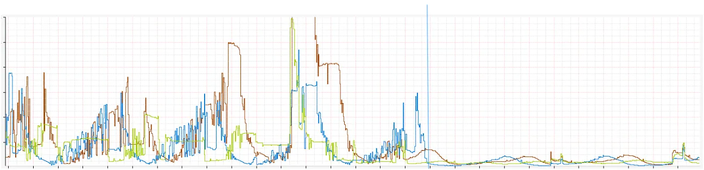
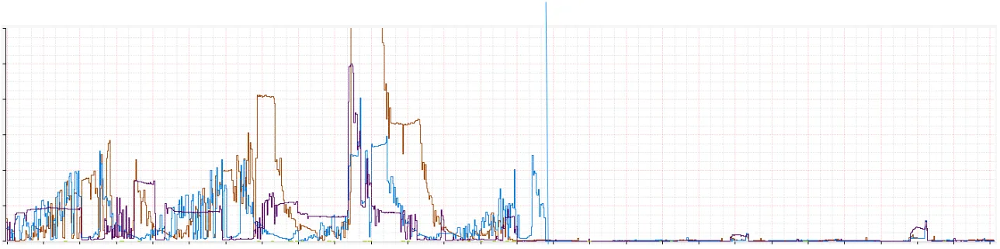
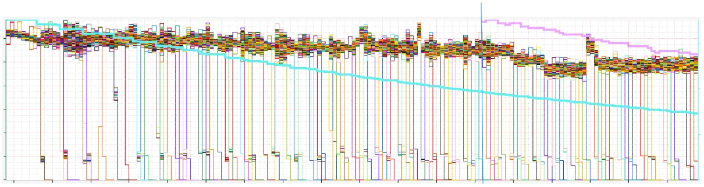
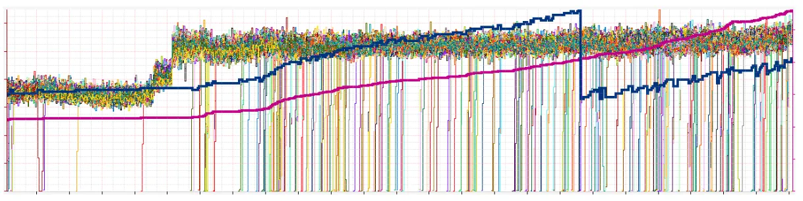

<head>
    
    
</head>

# Table of Contents

1.  [Algorithm](#org74b1ff3)
2.  [Review](#org72a81e3)
    1.  [文字的过去](#org7308dea)
    2.  [固定流](#org88860a9)
    3.  [分治](#org80e6d67)
    4.  [Zuul 中的实现](#orgef4396d)
    5.  [子集的成功](#org1076b86)
        1.  [总连接数](#org89998c5)
        2.  [搅动](#org0981678)
        3.  [负载均衡](#org54302bc)
        4.  [系统度量](#orgd94a9ff)
    6.  [首次发布](#org1e15dc3)
3.  [Tips](#orgb6186e5)
    1.  [运算符](#orgcc01ec5)
    2.  [流程控制](#org59030b6)
    3.  [集合类](#orgbffbb04)
    4.  [面向对象编程](#org8341858)
    5.  [第三方库](#org964e109)
    6.  [Swift 和 Objective-C 混合编程](#orga8a8f73)
4.  [Share](#org5bcb15d)
    1.  [需求](#orgdf787d5)
    2.  [Top k 算法实现](#orge5a3416)
    3.  [Hash table, 多主机](#org0adcb8e)
    4.  [Hash table，多主机，分区](#org5797bca)
    5.  [更简单的解决方案](#org55ab56a)
    6.  [高层架构](#org051d31e)
    7.  [数据获取](#org48de513)

# Algorithm

Leetcode 866: [Prime Palindrome](https://leetcode.com/problems/prime-palindrome/description/)

<https://dreamume.medium.com/leetcode-866-prime-palindrome-1eaf3748c375>

# Review

[Curbing Connection Churn in Zuul](https://netflixtechblog.com/curbing-connection-churn-in-zuul-2feb273a3598)

## 文字的过去

当 Zuul 设计开发后，有一个内在的假设连接是高效免费的，给定不使用手工的 TLS（mTLS）。它基于 Netty 构建，使用事件循环非阻塞式执行请求，每个核一个循环。为减少事件循环的竞争，我们对每个循环创造连接池，使它们完全独立。结果是整个请求响应循环发生在同一个线程，显著减少上下文切换

还有一个明显的下行。这意味着如果每个事件循环有一个连接池连接到每个源（后台）服务器，则服务器上 Zuul 实例有多个事件循环。例如，一个 16 核连接到一个 800 服务器源有 12800 个连接。如果 Zuul 簇有 100 个实例，则有 1280000 个连接。这是一个很大的数量且在多数簇上比相关必要的流量要多

当流随着每年增长，更多的 Zuul 和源簇导致数量更大。更精确地说，如果一个流量高峰发生且 Zuul 实例扩展，它将使到源的连接指数级增长。虽然这是一个长期以来的已知问题，它未成为关键痛点直到我们移动大量流应用程序到 mTLS 和我们基于 Envoy 的服务网格

## 固定流

改进过度连接的第一步是实现 HTTP/2 多路复用到源。多路复用允许通过创建每个连接多个流来重用现存的连接，每个可以发送一个请求。与每个请求需要一个连接不同，我们可对许多同时的请求重用相同的连接。我们重用的连接越多，在建立 mTLS 会话需要的来回、握手等就越少

虽然 Zuul 有时有 H2 代理，它不支持多路复用。它只是把 H2 连接当作 HTTP/1（H1）连接。向后兼容现存的 H1 功能，我们修改 H2 连接改进来创建一个流且立即释放连接到池中。后来的请求将可以重使用现存的连接而不需要新创建一个。理想情况下，到每个源服务器的连接应该趋于每事件循环有一个。这看着是一个小改动，但它已无缝集成到我们现在的度量和连接记录中

通过 TLS 初始化 H2 连接的标准化方法是通过 ALPN（应用层协议协商）升级。ALPN 允许我们优雅地降级到 H1 如果源不支持 H2，这样我们可广泛地启动它而不影响客户。服务网格在许多服务上有效使得测试和回滚该特性非常容易因为它默认启动 ALPN。这意味着在服务网格和 mTLS 上的服务不需要任何额外工作

可惜地是，当我们回滚多路复用时我们的计划遇到了一个问题。虽然特性是稳定的且对功能没有影响，我们对过度连接没有得到减少。因为一些源簇太大，且我们从所有事件循环连接它们，没有足够现存的连接复用来触发多路复用。甚至我们现在可用多路复用，我们却不能利用它

## 分治

当对所有现存连接有巨大需求时 H2 多路复用在负载下将改善连接高峰，但在稳定状态下却没有什么帮助。分区整个源为子集将允许我们减少总连接数，平衡多路复用来维持现存的吞吐和空间

我们这些年已讨论过子集多次，但担心干扰对负载均衡算法的有效性。一个流量到源的平均分布对精确的金丝雀分析和防止在源实例上的蜜罐流量是关键

在阅读了最近谷歌发布的 ACM 论文中子集也是最重要的思想。它描述了他们使用多年在他们的长期确定性子集算法上的改进。Ringsteady 算法（如下）创建了一个服务器的平均分布环且在环上游走来配置它们到每个前端任务（蓝色节点）

算法依赖低差异数值序列来创建一个自然平衡分布环的想法比构建一个基于随机的一致性哈希更精确。使用的特殊序列是 Van der Corput 序列的二进制变种。被添加的服务器序列是单调增长的，对每个增加的服务器，分布将在 0 - 1 之间平衡分布。如下是一个二进制 Van der Corput 序列的例子

$ \\frac{1}{2}, \\frac{1}{4}, \\frac{3}{4}, \\frac{1}{8}, \\frac{5}{8}, \\frac{3}{8}, \\frac{7}{8}, \\frac{1}{16}, \\frac{9}{16}, \\frac{5}{16}, \\frac{13}{16}, \\frac{3}{16}, \\frac{11}{16}, \\frac{7}{16}, \\frac{15}{16}, \\ldots $

这个分布的另一个大好处是当服务器添加和删除时它提供环的一致性扩展，平均扩展新的节点到子集上。子集稳定性和无迭代搅拌的这个结果随着源改变。每个节点添加或删除将只影响一个子集，且新节点每次被添加到不同的子集

这儿有对以上序列的更多清晰的展示，以十进制，每个数字在 0 - 1 之间赋值到 4 个子集。在这个例子中，每个子集有 0.25 的用它自己颜色描述的范围

你可看到每个添加的新节点非常平衡地跨过子集。如果 50 个节点被快速添加，它们将平衡地分布。相似地，如果大量节点删除，它将平等地影响所有子集

真正的杀手级特性，是如果一个节点添加或删除，它不需要所有子集打乱且重计算。每次单个改变将一般化地只创建或删除一个连接。对更大的改动也会保持，减少子集中的所有破坏

## Zuul 中的实现

在 Zuul 实现这个，我们的处理是集成 Eureka 服务发现改变和反馈它们到一个分布式环，基于以上我们讨论的想法。当在 Zuul 注册新的源，我们加载它们的实例并创建一个新环，用递增的 delta 管理它。我们也使用额外的步骤在添加到环之前先重排节点的顺序。这帮助防止在 Zuul 实例间意外的蜜罐或重叠

谷歌的任意负载均衡算法的奇怪之处是他们集中式地做负载均衡。他们的中心服务创建子集且在他们整个运行中负载均衡，以一个世界的全局观点。为使用这个算法，关键的洞察力是应用它到事件循环而不是实例上。这允许我们继续去中心化，客户端负载均衡同时也获得精确子集的好处。虽然 Zuul 继续连接所有源服务器，每个事件循环的连接池只是整个的一个小子集。我们以我们能在每个实例控制的一个单一、全局视点的分布结束 - 一个单一的我们可对每个源的环递增的序列号

当一个请求来临时，Netty 把它递给一个事件循环，且它仍然在请求响应生命周期中。在运行输入过滤后，我们决定目标且加载这个事件循环的连接池。这将从一个池到子集的映射拉，给我们一个要寻找的限制集合的节点。我们然后使用一个修改的 2 选择（之前讨论过）负载均衡。如果着看着熟悉，因为这对 Zuul 如何工作没有基本改变。不同只在于我们提供一个循环有边界的节点子集来负载均衡作为决定的开始点

另一个洞察是我们需要在事件循环之间复制子集数。这允许我们对大和小的源维护低连接数。同时，有一个合理的子集大小确保我们可继续提供源的好的平衡和抗阻特性。多数源需要这个因为在每个子集中他们不够大来创建足够的实例

然而，我们也不想要频繁改变这个复制因素因为它会导致整个环的重混淆和引入大量搅动。在多次迭代后，我们通过开始一个理想的子集大小实现这个。我们通过计算获得对一个给定源节点的 cardinality 获得理想复制因素子集大小。我们能通过增长我们的子集直到想要的子集大小被获得来扩展跨源的复制因素，特别当基于流量范型扩展或收缩时。最后，我们基于计算后的子集大小后向分割环为平均的分片

我们理想子集端大约为 25 - 50 个节点，一个 400 个节点的源将有 8 个 50 个节点的子集。在一个 32 核的实例上，我们有一个 4 的复制因子。然而，这也意味着在 200 到 400 节点之间，我们不能完全重混淆子集。这个子集重计算的例子在后面章节有图可查看

一个有趣的挑战是满足 cardinality 一个范围的源节点和持有子集的事件循环数的双重限制。我们的目标是扩展子集作为我们运行在更高事件循环上的实例，在所有连接上半线性增长，且保障高效复制的有效性。上述描述地弹性扩展复制因子帮助我们取得成功

## 子集的成功

结果是非常好的。我们看到 Zuul 上所有关键指标都有改进，但最重要的，在总连接数和搅动上有现在地减少

### 总连接数

上图显示了一周的数据，典型的 Netflix 白天使用循环。每 3 个颜色代表 AWS 中我们的采用区域，蓝色竖线显示我们打开特性的时间

峰值上总连接数以 10 倍在所有区域上显著减少。如果你深入了解子集如何工作会发现这是一个巨大的改进。例如，一个运行 16 个事件循环的机器可以有 8 个子集 - 每个子集在 2 个事件循环上。这意味着我们把源分成 8 份，有 8 倍的改进。对于为什么峰值时改进为 10 倍，它可能是因为相关搅动的减少

### 搅动

上图是对搅动的一个好的代理。它显示每秒 Zuul 打开的 TCP 连接数。你可清晰地看到之前和之后的效果。对峰值到峰值的改进，大约是 8 倍的改进

搅动的减少是对子集稳定性的证明，甚至当源扩展、收缩和重采用时

特别注意池中连接的创建，其缩减更是明显

峰值到峰值的减少是巨大的且清晰显示这个分布是如何的稳定。虽然在图上难以看到，缩减从峰值每秒数千到 60。没有明显地连接搅动，即使在峰值流量上

### 负载均衡

子集的关键限制是确保负载均衡在后端依然有一致性和平均的分布。你将注意到所有源节点上的 RPS 如期望般紧密分组。密的线代表子集大小和总的源大小

在第二张图中，你将注意到我们重计算了子集大小（蓝线）因为源（紫线）变得足够大我们可在子集中有更少的复制。在这个例子中，我们把 400 服务器的 100 子集大小（分 4 份）到 50（分 8 份）

### 系统度量

给定连接数的显著减少，我们看到 Zuul 上 CPU 利用率（～4%），高峰使用率（～15%），和延迟（～3%）的减少

## 首次发布

当我们首次发布这个特性到我们最大的源 - 流播放 API - 我们看到上述的范型继续，但当扩展时，它变得更加令人印象深刻。在一些 Zuul 分片上，我们看到在峰值时达到 1300 万的缩减，几乎没有搅动

今天特性被广泛发布，我们服务相同的总流量但连接少了 几十千万。尽管连接缩减，在适应性和负载均衡上却没有降低。H2 多路复用允许我们从连接独立扩展请求，且我们的子集算法确保一个平均的负载均衡

虽然挑战还有，子集是一个非常值得的投资

# Tips

Swift 核心技术与实战    张杰

## 运算符

Swift 在支持 C 中大多数标准运算符的同时也增加了一些排除常见代码错误的能力：

-   赋值符号（=）不会返回值，以防它被误用于等于符号（==）
-   算数符号（+，-，\*，/，% 以及其他）可以检测并阻止值溢出

三个支持溢出的运算符：

-   &+
-   &-
-   &\*

类和结构体可以为现有的运算符提供自定义的实现，称为运算符重载

    struct Vector2D {
        var x = 0.0, y = 0.0
    }
    
    extension Vector2D {
        static func + (left: Vector2D, right: Vector2D) -> Vector2D {
            return Vector2D(x: left.x + right.x, y: left.y + right.y)
        }
    }
    
    let vector = Vector2D(x: 3.0, y: 1.0)
    let another = Vector2D(x: 2.0, y: 4.0)
    let combined = vector + another

类与结构体也能提供标准一元运算符的实现，要实现前缀或者后缀运算符，需要在声明运算符函数的时候在 func 关键字之前指定 prefix 或者 postfix 限定符

    extension Vector2D {
        static prefix func - (vector: Vector2D) -> Vector2D {
            return Vector2D(x: -vector.x, y: -vector.y)
        }
    }
    
    let vector = Vector2D(x: 3.0, y: 1.0)
    let negative = -vector

组合赋值运算符将赋值运算符（=）与其他运算符进行结合，在实现的时候，需要把运算符的左参数设置成 inout 类型，因为这个参数的值会在运算符函数内直接被修改

    extension Vector2D {
        static func += (left: inout Vector2D, right: Vector2D) {
            return left = left + right;
        }
    }
    
    var original = Vector2D(x: 1.0, y: 2.0)
    let toAdd = Vector2D(x: 3.0, y: 4.0)
    original += toAdd

自定义类和结构体不接受等价运算符的默认实现，也就是所谓的“等于”运算符（==）和“不等于”运算符（！=），要使用等价运算符来检查你自己类型的等价，需要和其他中缀运算符一样提供一个“等于”运算符重载，并且遵循标准库的 Equatable 协议

    extension Vector2D : Equatable {
        static func == (left: inout Vector2D, right: Vector2D) -> Bool {
            return (left.x == right.x) && (left.y == right.y)
        }
    }

Swift 为以下自定义类型提供等价运算符合成实现：

-   只拥有遵循 Equatable 协议存储属性的结构体
-   只拥有遵循 Equatable 协议关联类型的枚举
-   没有关联类型的枚举

代码如下：

    struct Vector3D : Equatable {
        var x = 0.0, y = 0.0, z = 0.0
    }
    
    let vector = Vector3D(x: 2.0, y: 3.0, z: 4.0)
    let another = Vector3D(x: 2.0, y: 3.0, z: 4.0)
    if (vector == another) {
        print("These two vectors are also equivalent.")
    }

除了实现标准运算符，在 Swift 当中还可以声明和实现自定义运算符（custom operators），新的运算符要在全局作用域中，使用 operator 关键字进行声明，同时还要指定 prefix、infix 或者 postfix 限定符

    prefix operator +++
    extension Vector2D {
        static prefix func +++ (vector: inout Vector2D) -> Vector2D {
            vector += vector
            return vector
        }
    }
    
    let vector = Vector2D(x: 2.0, y: 3.0)
    let afterDoubling = +++vector

自定义的中缀（infix）运算符也可以指定优先级和结合性，每一个自定义的中缀运算符都属于一个优先级组，优先级组指定了自定义中缀运算符和其他中缀运算符的关系

    precedencegroup MyPrecedence {
        associativity: left
        lowerThan: AdditionPrecedence
    }

          infix operator +-: AdditionPrecedence
          extension Vector2D {
              static func +- (left: Vector2D, right: Vector2D) -> Vector2D {
                  return Vector2D(x: left.x + right.x, y: left.y - right.y)
              }
          }
    
    //      infix operator *^: MultiplicationPrecedence
          infix operator *^: MyPrecedence
          precedencegroup MyPrecedence {
              associativity: left
              lowerThan: AdditionPrecedence
          }
    
          extension Vector2D {
              static func *^ (left: Vector2D, right: Vector2D) -> Vector2D {
                  return Vector2D(x: left.x * right.x, y: left.y * left.y + right.y * right.y)
              }
          }
    
          let first = Vector2D(x: 1.0, y: 2.0)
          let second = Vector2D(x: 3.0, y: 7.0)
          let plusMinusVector = first +- second
          let third = Vector2D(x: 2.0, y: 2.0)
          let vector = first +- second *^ third
          print(vector.x)
          print(vector.y)

## 流程控制

使用 stride(from:to:by:) 函数来跳过不想要的标记（开区间），使用 stride(from:through:by:) 跳过不想要的闭区间

    let interval = 5
    for tickMark in stride(from: 0, to: 50, by: interval) {
        print(tickMark)
    }
    
    for tickMark in stride(from: 0, through: 50, by: interval) {
        print(tickMark)
    }

repeat-while 循环

    var count = 0
    repeat {
        print(count)
        count += 1
    } while count < 5

switch 可以用元组匹配

    let somePoint = (1, 1)
    switch somePoint {
    case (0, 0):
        print("(0, 0) is at the origin")
    case (_, 0):
        print("(\(somePoint.0), 0) is on the x-axis")
    case (0, _):
        print("(0, \(somePoint.1)) is on the y-axis")
    case (-2...2, -2...2)
        print("(\(somePoint.0), \(somePoint.1)) is inside the box")
    default:
        print("(\(somePoint.0), \(somePoint.1)) is outside of the box")
    }

switch 的 case 可以将匹配到的值临时绑定为一个常量或变量，来给 case 的函数体使用，对其变量的改变只会在 case 的函数体内有效

    let somePoint = (1, 1)
    switch somePoint {
    case (let x, 0):
        print("on the x-axis with an x value of \(x)")
    case (0, let y):
        print("on the y-axis with an y value of \(y)")
    case let (x, y):
        print("somewhere else at (\(x), \(y))")
    }

switch case 可以使用 where 分句来检查是否符合特定的结果

    let somePoint = (1, 1)
    switch somePoint {
    case let (x, y) where x == y:
        print("(\(x), \(y)) is on the line x == y")
    case let (x, y) where x == -y:
        print("(\(x), \(y)) is on the line x == -y")
    case let (x, y):
        print("(\(x), \(y)) is just some arbitrary point")
    }

复合匹配同样可以包含值绑定，所有复合匹配的模式都必须包含相同的值绑定集合，并且复合情况中的每一个绑定都得有相同的类型格式，这才能确保无论复合匹配的哪部分命中了，接下来的函数体中的代码都能访问到绑定的值并且值的类型也都相同

    let somePoint = (1, 1)
    switch somePoint {
    case (let distance, 0), (0, let distance):
        print("On the axis, \(distance) from the origin")
    default
        print("Not on an axis")
    }

使用 fallthrough 关键字在 switch case 中实现贯穿操作

    let integerToDescribe = 5
    var description = "The number \(integerToDescribe) is"
    switch integerToDescribe {
    case 2, 3, 5, 7, 11, 13, 17, 19:
        description += " a prime number, and also"
        fallthrough
    default:
        description += " an integer."
    }
    print(description)

用语句标签来给循环语句或条件语句做标记，在一个条件语句中，你可以使用一个语句标签配合 break 语句来结束被标记的语句。在循环语句中，你可以使用语句标签来配合 break 或 continue 语句来结束或者继续执行被标记的语句

    var number = 10
    whileLoop: while number > 0 {
        switch number {
        case 9:
            print("9")
        case 10:
            var sum = 0
            for index in 0...10 {
                sum += index
                if index == 9 {
                    print(sum)
                    break whileLoop
                }
            }
        default:
            break
        }
        number -= 1
    }

Swift 拥有内置的对 API 可用性的检查功能，它能够确保你不会悲剧地使用了对部属目标不可用的 API，你可以在 if 或则 guard 语句中使用一个可用性条件来有条件地执行代码，基于在运行时你想用的哪个 API 是可用的

    if #available(platform name version, ..., *) {
        // statements to execute if the APIs are available
    } else {
        // fallback statements to execute if the APIs are unavailable
    }
    
    if #available(iOS 10, macOS 10.12, *) {
        // Use iOS 10 APIs on iOS, and use macOS 10.12 APIs on macOS
    } else {
        // Fail back to earlier iOS and macOS APIs
    }

可选项模式匹配 Optional<Wrapped> 枚举在 some(Wrapped) 中包装的值

    let someOptional: Int? = 42
    if case .some(let x) = someOptional {
        print(x)
    }
    
    if case let x? = someOptional {
        print(x)
    }

可选项目模式为 for-in 语句提供了一种迭代数组的简便方式，只为数组中非 nil 的元素执行循环体

    let arrayOfOptionalInts: [Int?] = [nil, 2, 3, nil, 5]
    for case let number? in arrayOfOptionalInts {
        print("Found a \(number)")
    }

is 和 as 是两种类型转换模式，is 只能用在 switch case 中

    protocol Animal {
        var name: String { get }
    }
    
    struct Dog: Animal {
        var name : String {
            return "dog"
        }
        var runSpeed: Int
    }
    
    struct Bird: Animal {
        var name: String {
            return "bird"
        }
    
        var flightHeight: Int
    }
    
    struct Fish: Animal {
        var name: String {
            return "fish"
        }
        var depth: Int
    }
    
    let animals:[Any] = [Dog(runSpeed: 55), Bird(flightHeight: 2000), Fish(depth: 100)]
    
    for animal in animals {
        switch animal {
        case let dog as Dog:
            print("\(dog.name) can run \(dog.runSpeed)")
        case let fish as Fish:
            print("\(fish.name) can dive depth \(fish.depth)")
        case is Bird:
            print("bird can fly!")
        default:
            print("unknown animal!")
        }
    }

表达式模式代表表达式的值，表达式模式只出现在 switch 语句中的 case 标签中

表达式模式代表的表达式会使用 Swift 标准库中的 ~= 运算符与输入表达式的值进行比较。如果 ~= 运算符返回 true，则匹配成功。默认情况下，~= 运算符使用 == 运算符来比较两个相同类型的值。它也可以将一个整型数值与一个 Range 实例中的一段整数区间做匹配

可以重载 ~= 运算符来提供自定义的表达式匹配行为

    func ~= (pattern: String, value: Int) -> Bool {
        return pattern == "\(value)"
    }
    
    switch point {
    case ("0", "0"):
        print("(0, 0) is at the origin.")
    default:
        print("The point is at \(point.0), \(point.1)).")
    }

自定义类型默认也是无法进行表达式模式匹配的，也需要重载 ~= 运算符

    struct Employee {
        var salary: Float
    }
    let e = Employee(salary: 9999)
    func ~= (lhs: Range<Float>, rhs: Employee) -> Bool {
        return lhs.contains(rhs.salary)
    }
    
    switch e {
    case 0.0..<1000:
        print("艰难生活")
    case 1000..<5000:
        print("小康社会")
    case 5000..<10000:
        print("活得很滋养")
    default:
        break
    }

## 集合类

初始化器参数

-   init<S>(_ elements: S) where S : Sequence, Self.Element == S.Element
-   init(from decoder: Decoder) throws

示例如下

    let numbers = [Int](0...7)
    print(numbers)
    let persons = ["zhangsan": 27, "lisi": 28, "wangwu": 29]
    let names = [String](persons.keys)
    print(names)

enumerated() 同时得到索引和值

    let numbers = [Int](2...7)
    for (index, num) in numbers.enumerated() {
        print("the index is: \(index)")
        print(num * 10)
    }

-   append(\_:) 在末尾添加一个元素
-   append(contentsOf:) 在末尾添加多个元素

示例代码如下

    var numbers = [Int](2...7)
    numbers.append(100)
    print(numbers)
    numbers.append(contentsOf: 200...205)
    print(numbers)

通过 prefix 得到 ArraySlice

-   prefix() 获取数组前面指定个数的元素组成的 ArraySlice
-   prefix(upTo:) 获取数组到指定位置（不包含指定位置）前面的元素组成的 ArraySlice
-   prefix(through:) 获取数组到指定位置（包含指定位置）前面的元素组成的 ArraySlice
-   prefix(while:) 获取数组前面符合条件的元素（到第一个不符合条件的元素截止）组成的 ArraySlice

示例如下：

    let array = [5, 2, 10, 1, 0, 100, 46, 99]
    array.prefix(4)
    array.prefix(upTo: 4)
    array.prefix(through: 4)
    print(array.prefix { $0 < 10 })

可以使用 Range 获得 ArraySlice

partition(by belongsInSecondPartition:(Element) throws -> Bool) 将数组以某个条件分组，数组前半部分都是不符合条件的元素，数组后半部分都是符合条件的元素

    var array = [10, 20, 45, 30, 98, 101, 30, 4]
    let index = array.partition { (element) -> Bool
        in 
        element > 30
    }
    print(array)
    let partition1 = array[..<index]
    let partition2 = array[index...]
    print(partition1)
    print(partition2)

自定义类型需要实现 Hashable 协议来创建对应的 Set

    struct Person {
        var name: String
        var age: Int
    }
    
    extension Person: Hashable {
        func hash(into hasher: inout Hasher) {
            hasher.combine(name)
            hasher.combine(age)
        }
    }
    
    var personSet = Set<Person>()
    personSet.insert(Person(name: "zhangsan", age: 28))

Set 添加元素：

-   insert(\_:) 添加一个元素
-   udpate(with:) 如果已经有相同的元素，替换为新的元素。如果 Set 中没有，则插入

示例如下

    struct Person {
        var name: String
        var age: Int
    }
    
    extension Person: Hashable {
        func hash(into hasher: inout Hasher) {
            hasher.combine(name)
        }
    }
    
    extension Person: Equatable {
        static func == (lhs: Person, rhs: Person) -> Bool {
            return lhs.name == rhs.name
        }
    }
    
    var personSet = Set<Person>()
    personSet.insert(Person(name: "zhangsan", age: 28))
    personSet.update(with: Person(name: "zhangsan", age: 38))

## 面向对象编程

枚举可以有关联值

    enum Barcode {
    case upc(Int, Int, Int, Int)
    case qrCode(String)
    }
    
    var produceBarcode = Barcode.upc(8, 85909, 51226, 3)
    print(produceBarcode)
    produceBarcode = .qrCode("ABCDEFGHIJKLMNOP")
    print(produceBarcode)

递归枚举是拥有另一个枚举作为枚举成员关联值的枚举。当编译器操作递归枚举时必须插入间接寻址层。你可以在声明枚举成员之前使用 indirect 关键字来明确它是递归的

    indirect enum ArithmeticExpression {
    case number(Int)
    case addition(ArithmeticExpression, ArithmeticExpression)
    case multiplication(ArithmeticExpression, ArithmeticExpression)
    }
    
    let five = ArithmeticExpression.number(5)
    let four = ArithmeticExpression.number(4)
    let sum = ArithmeticExpression.addition(five, four)
    let product = ArithmeticExpression.multiplication(sum, ArithmeticExpression.number(2))

延迟存储属性的初始值在其第一次使用时才进行计算。你可以通过在其声明前标注 lazy 修饰语来表示一个延迟存储属性。如果被标注为 lazy 修饰符的属性同时被多个线程访问并且属性还没有初始化，则无法保证属性只初始化一次

    class DataImporter {
        var fileName = "data.txt"
        init() {
            print("DataImporter inits")
        }
    }
    
    class DataManager {
        lazy var importer = DataImporter()
        var data = [String]()
    }
    
    let manager = DataManager()
    manager.data.append("Some data")
    manager.data.append("Some more data")
    print("manager.data.append finish")
    print(manager.importer.fileName)

除了存储属性，类、结构体和枚举也能够定义计算属性，而它实际并不存储值。相反，它提供一个读取器和一个可选的设置器来间接得到和设置其它的属性和值

    struct Point {
        var x = 0.0, y = 0.0
    }
    struct Size {
        var width = 0.0, height = 0.0
    }
    struct Rect {
        var origin = Point()
        var size = Size()
        var center: Point {
            get {
                let centerX = origin.x + size.width / 2
                let centerY = origin.y + size.height / 2
                return Point(x: centerX, y: centerY)
            }
            // set(newCenter) {
            //     origin.x = newCenter.x - size.width / 2;
            //     origin.y = newCenter.y - size.height / 2;
            // }
            set {
                origin.x = newValue.x - size.width / 2;
                origin.y = newValue.y - size.height / 2;
            }
        }
    }

willSet 会在该值被存储之前被调用，didSet 会在一个新值被存储后调用，如果你在属性自己的 didSet 观察者里给自己赋值，你赋值的新值就会取代刚刚设置的值

    class StepCounter {
        var totalSteps: Int = 0 {
            willSet(newTotalSteps) {
                print("About to set totalSteps to \(newTotalSteps)")
            }
            didSet {
                if totalSteps > oldValue {
                    print("Added \(totalSteps - oldValue) steps")
                }
            }
        }
    }
    
    let stepCounter = StepCounter()
    stepCounter.totalSteps = 200
    stepCounter.totalSteps = 360
    stepCounter.totalSteps = 896

观察属性的能力同样对全局变量和局部变量有效

    var count: Int = 0 {
        willSet(newCount) {
            print("About to set count to \(newCount)")
        }
        didSet {
            if count > oldValue {
                print("Added \(count - oldValue)")
            }
        }
    }
    
    count = 10
    if count = 10 {
        print("ten")
    }

使用 static 关键字来定义类型属性。对于类类型的计算类属性，你可以使用 class 关键字来允许子类重写父类的实现

    class SomeClass {
        static var storedTypeProperty = "Some Value."
        static var computedTypeProperty: Int {
            return 27
        }
        class var overrideableComputedTypeProperty: Int {
            return 107
        }
    }

结构体和枚举是值类型，默认情况下，值类型属性不能被自身的实例方法修改，你可以选择在 func 关键字前放一个 mutating 关键字来指定方法可以修改属性

下标脚本允许你通过在实例后面的方括号内写一个或多个值对该类的实例进行查询。它的语法类似于实例方法和计算属性。使用关键字 subscript 来定义下标，并且指定一个或多个输入形式参数和返回类型，与实例方法一样。与实例方法不同的是，下标可以是读写也可以是只读的

    struct TimesTable {
        let multipler: Int
        subscript(index: Int) -> Int {
            return multipler * index;
        }
    }
    let threeTimesTable = TimesTable(multipler: 3)
    print("six times three is \(threeTimesTable[6])")

类似的还有类型下标，使用 static 和 class 关键字

在 init 关键字之前加 convenience 则为便捷初始化器

可以使用属性重写来为继承的属性添加属性观察器。这就可以让你在继承属性的值改变时得到通知，无论这个属性最初如何实现

-   不能给继承而来的常量存储属性或者只读的计算属性添加属性观察器。这些属性的值不能被设置，所以提供 willSet 或 didSet 实现作为重写的一部分也是不合适的
-   不能为同一个属性同时提供重写的 setter 和重写的属性观察器。如果你想要监听属性值的改变，并且你已经为那个属性提供了一个自定义的 setter，那么你从自定义的 setter 里就可以监听任意值的改变

可以通过标记为 final 来阻止一个方法、属性或者下标脚本被重写。通过在方法、属性或者下标脚本的关键字前写 final 修饰符（比如 final var，final func，final class func，final subscript）

extension 的能力：

-   添加计算实例属性和计算类型属性
-   定义实例方法和类型方法
-   提供新初始化器
-   定义下标
-   定义和使用新内嵌类型
-   使现有的类型遵循某协议
-   扩展可以向一个类型添加新的方法，但是不能重写已有的方法

扩展能为类添加新的便捷初始化器，但是不能为类添加指定初始化器或反初始化器。指定初始化器和反初始化器必须由原来类的实现提供

范型类型可能只在某些情况下满足一个协议的要求，比如当类型的范型形式参数遵循对应协议时。你可以通过在扩展类型时列出限制让范型类型有条件地遵循某协议。在你采纳协议的名字后面写范型 where 分句

    extension Array: TextRepresentable where Element: TextRepresentable {
        var textualDescription: String {
            let itemsAsText = self.map { $0.textualDescription }
            return "[" + itemsAsText.joined(separator: ", ") + "]"
        }
    }
    let myDice = [d6, d12]
    print(myDice.textualDescription)

如果一个类型已经遵循了协议的所有需求，但是还没有声明它采纳了这个协议，你可以让通过一个空的扩展来让它采纳这个协议

    struct Hamster {
        var name: String
        var textualDescription: String {
            return "A hamster named \(name)"
        }
    }
    extension Hamster: TextRepresentable {}

你可以使用协议扩展来给协议的任意方法或者计算属性要求提供默认实现。如果遵循类型给这个协议的要求提供了它自己的实现，那么它就会替代扩展中提供的默认实现

当你定义一个协议扩展，你可以明确遵循类型必须在扩展的方法和属性可用之前满足的限制。在扩展协议名字后边使用 where 分句来写这些限制

    extension Collection where Iterator.Element: TextRepresentable {
        var textualDescription: String {
            let itemsAsText = self.map { $0.textualDescription }
            return "[" + itemsAsText.joined(separator: ", ") + "]"
        }
    }

## 第三方库

R.Swift 的使用

1.  在当前项目的 targets 中选择 Build phrase，点击 + 号选择添加 New Run Script Phase
2.  将 Run Script 移动至 Compile sources 之上，Check Pods Manifest.lock 之下。在 Run Script 中添加:"$PODS_ROOT/R.swift/rswift" generate "$SRCROOT/R.generated.swift"
3.  编译你的项目，在 Finder 中你会看到 R.generated.swift 在工程中，将该文件拖动至项目中，切记千万不要勾选 Copy items if needed

R.Swift 特点

-   每当项目 build 时，R.swift 开始运行
-   这个文件根据项目里的资源文件自动在 R.generated.swift 文件中按照类型生成结构体
-   强类型，无需类型判断和转换，自动返回对应类型
-   支持多种资源类型
-   自动完成，无需猜测图像名称，避免资源名称拼写错误

## Swift 和 Objective-C 混合编程

Swift 运行时

-   值类型总是会使用直接派发，简单易懂
-   而协议和类的 extension 都会使用直接派发
-   NSObject 的 extension 会使用消息机制进行派发
-   NSObject 声明作用域里的函数都会使用函数表进行派发
-   协议里声明的，并且带有默认实现的函数会使用函数表进行派发

另外

-   带 final 修饰符的直接派发
-   带 dynamic 修饰符的用消息机制派发
-   带 @objc & @nonobjc 修饰符的改变在 OC 里的可见性
-   带 @inline 修饰符的告诉编译器可以直接派发

可以在标记为 final 的同时，也使用 @objc 来让函数可以使用消息机制派发。这么做的结果就是，调用函数的时候会使用直接派发，但也会在 Objective-C 的运行时里注册相应的 selector。函数可以响应 perform(selector:) 以及别的 Objective-C 特性，但在直接调用时又可以有直接派发的性能

所有 Swift 对象最后都继承自 SwiftObject

NS_SWIFT_NAME 修饰符修饰的对象在 Objective-C 中，重新命名在 swift 中的名称

NS_SWIFT_UNAVAILABLE 修饰符修饰的对象在 swift 中不可见，不能使用

Objective-C 文件里要用到 swift 里的东西的话，Objective-C 文件里要 import "project_name_swift.h" 文件

对于自定义的类而言，Objective-C 的类，不能继承自 Swift 的类，既要混编的 OC 类不能是 Swift 类的子类。反过来，需要混编的 Swift 类可以继承自 OC 的类

Objective-C 的 API 和 Swift 的风格相差比较大，Swift 调用 Objective-C 的 API 时可能由于数据类型等不一致导致无法达到预期（比如，Objective-C 里的方法采用了 C 语言风格的多参数类型；或者 Objective-C 方法返回 NSNotFound，在 Swift 中期望返回 nil）。这时候就要 NS_REFINED_FOR_SWIFT 了

    @interface MyClass : NSObject
    
    - (NSUInteger)indexOfString:(NSString *)aString NS_REFINED_FOR_SWIFT;
    
    @end

    extension MyClass {
        func indexOfString(aString: String!) -> Int? {
            let index = Int(__index(of: aString))
            if (index == NSNotFound) return nil
            return index;
        }
    }

# Share

[System Design Interview - Top K Problem](https://www.youtube.com/watch?v=kx-XDoPjoHw&list=RDLVbUHFg8CZFws&index=4)

例如，我们可能被问到找到在谷歌上搜索最多的前 100 个关键字，或 Youtube 上的视频或 Spotify 上的音乐或 Facebook 上的共享消息。面试官可能对最多转发的推特消息或 Instagram 上的图片感兴趣。我们讨论每秒几十万请求，高峰甚至每秒几百万。数据库如今可处理每秒几百万请求。但是如果我们记录一段时间内所有 Youtube 上视频的浏览数，我们如何计算 top 100?

我们需要扫描数据库里的条目并根据浏览统计排序。对小规模数据是没问题的，但对 Youtube 这种就不高效了，可能成本高且反应慢

MapReduce 将帮助我们解决这个问题，但 MapReduce 还不够。我们需要我们的解决方案返回结果尽量接近实时。例如，我们需要返回最近几分钟内最多浏览视频的一个列表

## 需求

功能上的：

-   topK(k, startTime, endTime)

非功能上的：

-   可扩展（随着数据总数的增加而一起扩展：视频、tweet、post 等等）
-   高有效性（不受硬件/网络故障影响，没有单点故障）
-   高效（几十毫秒内返回 top 100 列表）
-   精确（尽量获得精确的结果）

## Top k 算法实现

    public List<HeavyHitter> topK(String[] events, int k) {
        Map<String, Integer> frequencyTable = new HashMap<String, Integer>();
        for (String event: events) {
            frequencyTable.put(event, frequencyTable.getOrDefault(event, 0) + 1);
        }
    
        PriorityQueue<HeavyHitter> heap = 
            new PriorityQueue<HeavyHitter>(Comparator.comparing( e -> e.getFrequency()));
    
        for (Map.Entry<String, Integer> entry : frequencyTable.entrySet()) {
            heap.offer(new HeavyHitter(entry.getKey(), entry.getValue()));
    
            if (heap.size() > k) {
                heap.poll();
            }
        }
    
        List<HeavyHitter> result = new ArrayList<HeavyHitter>();
        while (heap.size() > 0) {
            result.add(heap.poll());
        }
    
        return result;
    }
    
    class HeavyHitter {
        private final String identifier;
        private final int frequency;
    
        public HeavyHitter(String identifier, int frequency) {
            this.identifier = identifier;
            this.frequency = frequency;
        }
    }

## Hash table, 多主机

以上的实现没有可扩展性，当大量数据来到时，我们希望能并行处理

一个选项之一是引入一个负载均衡器。这可以是一个典型的负载均衡器或一个分布式队列。每个事件到达簇中一个主机时（我们称该主机为处理主机），且因为相同视频唯一标识符的会出现在不同的处理主机，每个处理需要刷新累积数据到一个存储主机。现在这样好了一点，我们可并行处理事件了

虽则系统总的吞吐增长，另一个内存问题出现了。我们可能在每个处理主机或存储主机上使用了太多内存

## Hash table，多主机，分区

我们分区数据到更小的块。我们引入一个新的组件，称为数据分区器。这个组件负责路由每个单独的视频唯一识别符到它自己的处理主机。这样，每个处理主机只存储所有数据的一个子集。现在，每个处理主机包含一个它自己列表的一个 k 子堆。我们如何创建一个最终的列表合并每个处理主机的信息？这相当于另一个系统设计面试问题：合并 n 个排序列表

## 更简单的解决方案

由于数据太大，处理主机不可能存储所有的数据，我们假设它只存储一分钟的，且每一分钟刷新数据到存储主机。这样存储主机存储了每分钟的列表。但如果我们想要知道没小时或每天的，我们如何构建呢？这很难，这里假设我们需要一天的整个数据集。另一方面，我们不能在内存中累积一整天的数据。我们该怎么办？我们存储所有数据到磁盘且使用批处理框架来计算 top k。这就是 MapReduce 可以做的事了。这个架构的另一个问题是它看着简单，但不是。每次我们引入数据分区，我们需要处理数据复制，这样每个分区的拷贝存储在多个节点。我们需要考虑重平衡，当一个节点添加或删除到簇。我们需要处理热分区。所有这些问题不是严重的且解决方案已知。这里我们想一下有更简单的方法来处理 top k 问题吗？答案是是的，有更简单的解决方案。但我们得做出一些牺牲。且主要的妥协就是精确性

我们引入新的数据结构 count-min sketch。count-min sketch 非常简单，我们可把它理解为二维数组。该二维数组有宽度和高度，宽度一般数千左右，高度比较小且代表 Hash 函数个数，比如 5 个。当一个新元素到来时，我们计算每个 Hash 函数值且加 1 到对应的 单元。当获取统计值时，取所有 Hash 函数对应单元中最小的值

## 高层架构

每次我们点击一个视频，请求通过 API 网关，组件呈现一个单条目到一个视频内容转发系统。API 网格路由客户端请求到后端服务。这里 API 网关产生日志，我们用日志统计浏览数。我们可实现一个后台进程从日志读取数据，做一些初始化聚合，且发送这个数据来进一步处理。我们配置一个内存缓存在 API 网关主机，读取每个日志条目且构建一个频率统计 Hash 表。这个缓存大小有限，且当缓存满时，数据被刷新。如果缓存在一个特殊期间没有满，我们可基于时间刷新。有一些其它选项，比如后台聚合数据，甚至不写入日志。或完全跳过在 API 网关聚合数据并发送每个独立视频信息后续再处理。每个选项都有优缺点。我们最好序列化数据为一个压缩的二进制形式。这样我们节省网络 IO 利用率。另外，所有这些考量基于在 API 网关有什么有效的资源：内存、CPU、网络或磁盘 IO。初始化聚合数据然后发送给一个分布式消息系统，比如 Apache Kafka。内部的 Kafka 分割消息跨过多个分区，每个分区可在簇中单独的机器上

我们将分割我们的数据处理流水线为两个部分：快速路径和慢路径。快速路径上，我们将计算一个大约的 top k 列表，且结果在数秒内有效。慢路径，我们将计算一个精确的 top k 列表。结果将在数分钟或数小时后有效，取决于数据容量

让我们先看快速路径。我们有一个服务，称为快速处理器，创建小时间段的 count-min sketch。且因为内存不再是一个问题，我们不需要分区数据。Kafka 的任意消息可被任意快速处理器处理。每次我们保存数据到内存，即使一个小时间段，我们需要考虑数据复制。否则，我们不能声称一个服务有高有效性，因为数据可能由于硬件故障而丢失。因为 count-min sketch 已经处理估计的结果，也就是我们已丢失一些数据，如果我们在一些罕见情况下比如主机死机丢失数据也可以接受。慢路径不丢失数据，我们将在数小时之后有精确的结果。去掉复制将极大地简化系统。当快速处理器把数据发送给存储主机，注意 count-min sketch 有预定义大小，它不随时间增长。我们也可以存储数分钟的而不是每秒的，但这个会导致数据有效性延迟到数分钟

存储组件是数据库前端的一个服务。它存储一些时间间隔的最终 top k 列表，例如每 1 分钟或 5 分钟

你有没有注意到我们的数据处理流水线逐渐地降低了请求速度？这是需要注意的一点。现在我们定义慢路径的组件

一个选项是让 MapReduce 做。我们把所有数据发送到分布式文件系统，例如 HDFS 或对象存储比如 S3。并运行两个 MapReduce 任务，一个任务计算频率统计，另一个计算事实上的 top k 列表。数据然后存储到存储服务

但 MapReduce 还是慢，我们现在考虑数据分区。数据分区器读批量事件且分析它们到独立的事件。分区器查看每个视频唯一标识符且发送信息到一个对应的分区，在另一个 Kafka 簇。如同我们之前提到的，每次我们分区数据，我们需要考虑是否有热区。我们的分区器需要处理好这个问题。现在每个 Kafka 分区取决于我们怎么使用，存储一个数据子集。Kafka 负责数据复制。我们需要一个组件读取每个分区数据且进一步聚合它。我们称它为分区处理器。它在内存中聚集几分钟的数据，批处理这个信息到预定义大小的文件且发送它到分布式文件系统，后续 MapReduce 继续处理。分区处理器也可以发送聚合信息到存储服务

## 数据获取

最新的数据从快路径获取，否则可组合快路径数据和慢路径数据
