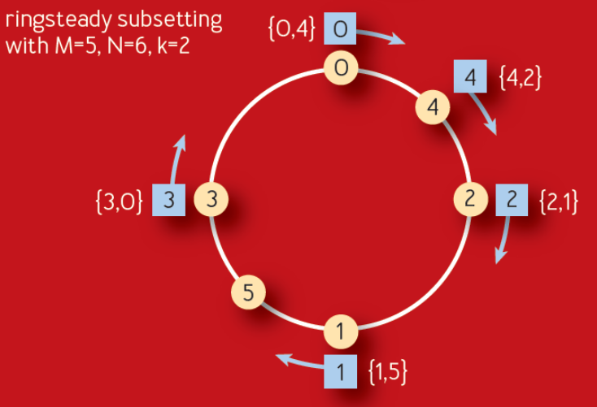
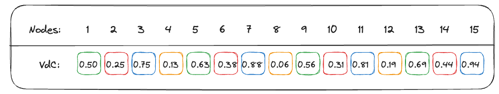

<head>
    
    
</head>

# Table of Contents

1.  [Algorithm](#org74b1ff3)
2.  [Review](#org72a81e3)
    1.  [文字的过去](#org7308dea)
    2.  [固定流](#org88860a9)
    3.  [分治](#org80e6d67)
    4.  [Zuul 中的实现](#orgef4396d)
3.  [Tips](#orgb6186e5)
    1.  [运算符](#orgcc01ec5)
    2.  [流程控制](#org59030b6)
4.  [Share](#org5bcb15d)

# Algorithm

Leetcode 866: [Prime Palindrome](https://leetcode.com/problems/prime-palindrome/description/)

<https://dreamume.medium.com/leetcode-866-prime-palindrome-1eaf3748c375>

# Review

[Curbing Connection Churn in Zuul](https://netflixtechblog.com/curbing-connection-churn-in-zuul-2feb273a3598)

## 文字的过去

当 Zuul 设计开发后，有一个内在的假设连接是高效免费的，给定不使用手工的 TLS（mTLS）。它基于 Netty 构建，使用事件循环非阻塞式执行请求，每个核一个循环。为减少事件循环的竞争，我们对每个循环创造连接池，使它们完全独立。结果是整个请求响应循环发生在同一个线程，显著减少上下文切换

还有一个明显的下行。这意味着如果每个事件循环有一个连接池连接到每个源（后台）服务器，则服务器上 Zuul 实例有多个事件循环。例如，一个 16 核连接到一个 800 服务器源有 12800 个连接。如果 Zuul 簇有 100 个实例，则有 1280000 个连接。这是一个很大的数量且在多数簇上比相关必要的流量要多

当流随着每年增长，更多的 Zuul 和源簇导致数量更大。更精确地说，如果一个流量高峰发生且 Zuul 实例扩展，它将使到源的连接指数级增长。虽然这是一个长期以来的已知问题，它未成为关键痛点直到我们移动大量流应用程序到 mTLS 和我们基于 Envoy 的服务网格

## 固定流

改进过度连接的第一步是实现 HTTP/2 多路复用到源。多路复用允许通过创建每个连接多个流来重用现存的连接，每个可以发送一个请求。与每个请求需要一个连接不同，我们可对许多同时的请求重用相同的连接。我们重用的连接越多，在建立 mTLS 会话需要的来回、握手等就越少

虽然 Zuul 有时有 H2 代理，它不支持多路复用。它只是把 H2 连接当作 HTTP/1（H1）连接。向后兼容现存的 H1 功能，我们修改 H2 连接改进来创建一个流且立即释放连接到池中。后来的请求将可以重使用现存的连接而不需要新创建一个。理想情况下，到每个源服务器的连接应该趋于每事件循环有一个。这看着是一个小改动，但它已无缝集成到我们现在的度量和连接记录中

通过 TLS 初始化 H2 连接的标准化方法是通过 ALPN（应用层协议协商）升级。ALPN 允许我们优雅地降级到 H1 如果源不支持 H2，这样我们可广泛地启动它而不影响客户。服务网格在许多服务上有效使得测试和回滚该特性非常容易因为它默认启动 ALPN。这意味着在服务网格和 mTLS 上的服务不需要任何额外工作

可惜地是，当我们回滚多路复用时我们的计划遇到了一个问题。虽然特性是稳定的且对功能没有影响，我们对过度连接没有得到减少。因为一些源簇太大，且我们从所有事件循环连接它们，没有足够现存的连接复用来触发多路复用。甚至我们现在可用多路复用，我们却不能利用它

## 分治

当对所有现存连接有巨大需求时 H2 多路复用在负载下将改善连接高峰，但在稳定状态下却没有什么帮助。分区整个源为子集将允许我们减少总连接数，平衡多路复用来维持现存的吞吐和空间

我们这些年已讨论过子集多次，但担心干扰对负载均衡算法的有效性。一个流量到源的平均分布对精确的金丝雀分析和防止在源实例上的蜜罐流量是关键

在阅读了最近谷歌发布的 ACM 论文中子集也是最重要的思想。它描述了他们使用多年在他们的长期确定性子集算法上的改进。Ringsteady 算法（如下）创建了一个服务器的平均分布环且在环上游走来配置它们到每个前端任务（蓝色节点）

算法依赖低差异数值序列来创建一个自然平衡分布环的想法比构建一个基于随机的一致性哈希更精确。使用的特殊序列是 Van der Corput 序列的二进制变种。被添加的服务器序列是单调增长的，对每个增加的服务器，分布将在 0 - 1 之间平衡分布。如下是一个二进制 Van der Corput 序列的例子

$ \\frac{1}{2}, \\frac{1}{4}, \\frac{3}{4}, \\frac{1}{8}, \\frac{5}{8}, \\frac{3}{8}, \\frac{7}{8}, \\frac{1}{16}, \\frac{9}{16}, \\frac{5}{16}, \\frac{13}{16}, \\frac{3}{16}, \\frac{11}{16}, \\frac{7}{16}, \\frac{15}{16}, \\ldots $

这个分布的另一个大好处是当服务器添加和删除时它提供环的一致性扩展，平均扩展新的节点到子集上。子集稳定性和无迭代搅拌的这个结果随着源改变。每个节点添加或删除将只影响一个子集，且新节点每次被添加到不同的子集

这儿有对以上序列的更多清晰的展示，以十进制，每个数字在 0 - 1 之间赋值到 4 个子集。在这个例子中，每个子集有 0.25 的用它自己颜色描述的范围

你可看到每个添加的新节点非常平衡地跨过子集。如果 50 个节点被快速添加，它们将平衡地分布。相似地，如果大量节点删除，它将平等地影响所有子集

真正的杀手级特性，是如果一个节点添加或删除，它不需要所有子集打乱且重计算。每次单个改变将一般化地只创建或删除一个连接。对更大的改动也会保持，减少子集中的所有破坏

## Zuul 中的实现

在 Zuul 实现这个，我们的处理是集成 Eureka 服务发现改变和反馈它们到一个分布式环，基于以上我们讨论的想法。当在 Zuul 注册新的源，我们加载它们的实例并创建一个新环，用递增的 delta 管理它。我们也使用额外的步骤在添加到环之前先重排节点的顺序。这帮助防止在 Zuul 实例间意外的蜜罐或重叠

谷歌的任意负载均衡算法的奇怪之处是他们集中式地做负载均衡。他们的中心服务创建子集且在他们整个运行中负载均衡，以一个世界的全局观点。为使用这个算法，关键的洞察力是应用它到事件循环而不是实例上。这允许我们继续去中心化，客户端负载均衡同时也获得精确子集的好处。虽然 Zuul 继续连接所有源服务器，每个事件循环的连接池只是整个的一个小子集。我们以我们能在每个实例控制的一个单一、全局视点的分布结束 - 一个单一的我们可对每个源的环递增的序列号

当一个请求来临时，Netty 把它递给一个事件循环，且它仍然在请求响应生命周期中。在运行输入过滤后，我们决定目标且加载这个事件循环的连接池。这将从一个池到子集的映射拉，给我们一个要寻找的限制集合的节点。我们然后使用一个修改的 2 选择（之前讨论过）负载均衡。如果着看着熟悉，因为这对 Zuul 如何工作没有基本改变。不同只在于我们提供一个循环有边界的节点子集来负载均衡作为决定的开始点

另一个洞察是我们需要在事件循环之间复制子集数。这允许我们对大和小的源维护低连接数。同时，有一个合理的子集大小确保我们可继续提供源的好的平衡和抗阻特性。多数源需要这个因为在每个子集中他们不够大来创建足够的实例

然而，我们也不想要频繁改变这个复制因素因为它会导致整个环的重混淆和引入大量搅动。在多次迭代后，我们通过开始一个理想的子集大小实现这个。我们通过计算获得对一个给定源节点的 cardinality 获得理想复制因素子集大小。我们能通过增长我们的子集直到想要的子集大小被获得来扩展跨源的复制因素，特别当基于流量范型扩展或收缩时。最后，我们基于计算后的子集大小后向分割环为平均的分片

我们理想子集端大约为 25 - 50 个节点，一个 400 个节点的源将有 8 个 50 个节点的子集。在一个 32 核的实例上，我们有一个 4 的复制因子。然而，这也意味着在 200 到 400 节点之间，我们不能完全重混淆子集。这个子集重计算的例子在后面章节有图可查看

一个有趣的挑战是满足 cardinality 一个范围的源节点和持有子集的事件循环数的双重限制。我们的目标是扩展子集作为我们运行在更高事件循环上的实例，在所有连接上半线性增长，且保障高效复制的有效性。上述描述地弹性扩展复制因子帮助我们取得成功

# Tips

Swift 核心技术与实战    张杰

## 运算符

Swift 在支持 C 中大多数标准运算符的同时也增加了一些排除常见代码错误的能力：

-   赋值符号（=）不会返回值，以防它被误用于等于符号（==）
-   算数符号（+，-，\*，/，% 以及其他）可以检测并阻止值溢出

三个支持溢出的运算符：

-   &+
-   &-
-   &\*

类和结构体可以为现有的运算符提供自定义的实现，称为运算符重载

    struct Vector2D {
        var x = 0.0, y = 0.0
    }
    
    extension Vector2D {
        static func + (left: Vector2D, right: Vector2D) -> Vector2D {
            return Vector2D(x: left.x + right.x, y: left.y + right.y)
        }
    }
    
    let vector = Vector2D(x: 3.0, y: 1.0)
    let another = Vector2D(x: 2.0, y: 4.0)
    let combined = vector + another

类与结构体也能提供标准一元运算符的实现，要实现前缀或者后缀运算符，需要在声明运算符函数的时候在 func 关键字之前指定 prefix 或者 postfix 限定符

    extension Vector2D {
        static prefix func - (vector: Vector2D) -> Vector2D {
            return Vector2D(x: -vector.x, y: -vector.y)
        }
    }
    
    let vector = Vector2D(x: 3.0, y: 1.0)
    let negative = -vector

组合赋值运算符将赋值运算符（=）与其他运算符进行结合，在实现的时候，需要把运算符的左参数设置成 inout 类型，因为这个参数的值会在运算符函数内直接被修改

    extension Vector2D {
        static func += (left: inout Vector2D, right: Vector2D) {
            return left = left + right;
        }
    }
    
    var original = Vector2D(x: 1.0, y: 2.0)
    let toAdd = Vector2D(x: 3.0, y: 4.0)
    original += toAdd

自定义类和结构体不接受等价运算符的默认实现，也就是所谓的“等于”运算符（==）和“不等于”运算符（！=），要使用等价运算符来检查你自己类型的等价，需要和其他中缀运算符一样提供一个“等于”运算符重载，并且遵循标准库的 Equatable 协议

    extension Vector2D : Equatable {
        static func == (left: inout Vector2D, right: Vector2D) -> Bool {
            return (left.x == right.x) && (left.y == right.y)
        }
    }

Swift 为以下自定义类型提供等价运算符合成实现：

-   只拥有遵循 Equatable 协议存储属性的结构体
-   只拥有遵循 Equatable 协议关联类型的枚举
-   没有关联类型的枚举

代码如下：

    struct Vector3D : Equatable {
        var x = 0.0, y = 0.0, z = 0.0
    }
    
    let vector = Vector3D(x: 2.0, y: 3.0, z: 4.0)
    let another = Vector3D(x: 2.0, y: 3.0, z: 4.0)
    if (vector == another) {
        print("These two vectors are also equivalent.")
    }

除了实现标准运算符，在 Swift 当中还可以声明和实现自定义运算符（custom operators），新的运算符要在全局作用域中，使用 operator 关键字进行声明，同时还要指定 prefix、infix 或者 postfix 限定符

    prefix operator +++
    extension Vector2D {
        static prefix func +++ (vector: inout Vector2D) -> Vector2D {
            vector += vector
            return vector
        }
    }
    
    let vector = Vector2D(x: 2.0, y: 3.0)
    let afterDoubling = +++vector

自定义的中缀（infix）运算符也可以指定优先级和结合性，每一个自定义的中缀运算符都属于一个优先级组，优先级组指定了自定义中缀运算符和其他中缀运算符的关系

    precedencegroup MyPrecedence {
        associativity: left
        lowerThan: AdditionPrecedence
    }

          infix operator +-: AdditionPrecedence
          extension Vector2D {
              static func +- (left: Vector2D, right: Vector2D) -> Vector2D {
                  return Vector2D(x: left.x + right.x, y: left.y - right.y)
              }
          }
    
    //      infix operator *^: MultiplicationPrecedence
          infix operator *^: MyPrecedence
          precedencegroup MyPrecedence {
              associativity: left
              lowerThan: AdditionPrecedence
          }
    
          extension Vector2D {
              static func *^ (left: Vector2D, right: Vector2D) -> Vector2D {
                  return Vector2D(x: left.x * right.x, y: left.y * left.y + right.y * right.y)
              }
          }
    
          let first = Vector2D(x: 1.0, y: 2.0)
          let second = Vector2D(x: 3.0, y: 7.0)
          let plusMinusVector = first +- second
          let third = Vector2D(x: 2.0, y: 2.0)
          let vector = first +- second *^ third
          print(vector.x)
          print(vector.y)

## 流程控制

使用 stride(from:to:by:) 函数来跳过不想要的标记（开区间），使用 stride(from:through:by:) 跳过不想要的闭区间

    let interval = 5
    for tickMark in stride(from: 0, to: 50, by: interval) {
        print(tickMark)
    }
    
    for tickMark in stride(from: 0, through: 50, by: interval) {
        print(tickMark)
    }

repeat-while 循环

    var count = 0
    repeat {
        print(count)
        count += 1
    } while count < 5

switch 可以用元组匹配

    let somePoint = (1, 1)
    switch somePoint {
    case (0, 0):
        print("(0, 0) is at the origin")
    case (_, 0):
        print("(\(somePoint.0), 0) is on the x-axis")
    case (0, _):
        print("(0, \(somePoint.1)) is on the y-axis")
    case (-2...2, -2...2)
        print("(\(somePoint.0), \(somePoint.1)) is inside the box")
    default:
        print("(\(somePoint.0), \(somePoint.1)) is outside of the box")
    }

switch 的 case 可以将匹配到的值临时绑定为一个常量或变量，来给 case 的函数体使用，对其变量的改变只会在 case 的函数体内有效

    let somePoint = (1, 1)
    switch somePoint {
    case (let x, 0):
        print("on the x-axis with an x value of \(x)")
    case (0, let y):
        print("on the y-axis with an y value of \(y)")
    case let (x, y):
        print("somewhere else at (\(x), \(y))")
    }

switch case 可以使用 where 分句来检查是否符合特定的结果

    let somePoint = (1, 1)
    switch somePoint {
    case let (x, y) where x == y:
        print("(\(x), \(y)) is on the line x == y")
    case let (x, y) where x == -y:
        print("(\(x), \(y)) is on the line x == -y")
    case let (x, y):
        print("(\(x), \(y)) is just some arbitrary point")
    }

复合匹配同样可以包含值绑定，所有复合匹配的模式都必须包含相同的值绑定集合，并且复合情况中的每一个绑定都得有相同的类型格式，这才能确保无论复合匹配的哪部分命中了，接下来的函数体中的代码都能访问到绑定的值并且值的类型也都相同

    let somePoint = (1, 1)
    switch somePoint {
    case (let distance, 0), (0, let distance):
        print("On the axis, \(distance) from the origin")
    default
        print("Not on an axis")
    }

使用 fallthrough 关键字在 switch case 中实现贯穿操作

    let integerToDescribe = 5
    var description = "The number \(integerToDescribe) is"
    switch integerToDescribe {
    case 2, 3, 5, 7, 11, 13, 17, 19:
        description += " a prime number, and also"
        fallthrough
    default:
        description += " an integer."
    }
    print(description)

用语句标签来给循环语句或条件语句做标记，在一个条件语句中，你可以使用一个语句标签配合 break 语句来结束被标记的语句。在循环语句中，你可以使用语句标签来配合 break 或 continue 语句来结束或者继续执行被标记的语句

    var number = 10
    whileLoop: while number > 0 {
        switch number {
        case 9:
            print("9")
        case 10:
            var sum = 0
            for index in 0...10 {
                sum += index
                if index == 9 {
                    print(sum)
                    break whileLoop
                }
            }
        default:
            break
        }
        number -= 1
    }

Swift 拥有内置的对 API 可用性的检查功能，它能够确保你不会悲剧地使用了对部属目标不可用的 API，你可以在 if 或则 guard 语句中使用一个可用性条件来有条件地执行代码，基于在运行时你想用的哪个 API 是可用的

    if #available(platform name version, ..., *) {
        // statements to execute if the APIs are available
    } else {
        // fallback statements to execute if the APIs are unavailable
    }
    
    if #available(iOS 10, macOS 10.12, *) {
        // Use iOS 10 APIs on iOS, and use macOS 10.12 APIs on macOS
    } else {
        // Fail back to earlier iOS and macOS APIs
    }

可选项模式匹配 Optional<Wrapped> 枚举在 some(Wrapped) 中包装的值

    let someOptional: Int? = 42
    if case .some(let x) = someOptional {
        print(x)
    }
    
    if case let x? = someOptional {
        print(x)
    }

可选项目模式为 for-in 语句提供了一种迭代数组的简便方式，只为数组中非 nil 的元素执行循环体

    let arrayOfOptionalInts: [Int?] = [nil, 2, 3, nil, 5]
    for case let number? in arrayOfOptionalInts {
        print("Found a \(number)")
    }

is 和 as 是两种类型转换模式，is 只能用在 switch case 中

    protocol Animal {
        var name: String { get }
    }
    
    struct Dog: Animal {
        var name : String {
            return "dog"
        }
        var runSpeed: Int
    }
    
    struct Bird: Animal {
        var name: String {
            return "bird"
        }
    
        var flightHeight: Int
    }
    
    struct Fish: Animal {
        var name: String {
            return "fish"
        }
        var depth: Int
    }
    
    let animals:[Any] = [Dog(runSpeed: 55), Bird(flightHeight: 2000), Fish(depth: 100)]
    
    for animal in animals {
        switch animal {
        case let dog as Dog:
            print("\(dog.name) can run \(dog.runSpeed)")
        case let fish as Fish:
            print("\(fish.name) can dive depth \(fish.depth)")
        case is Bird:
            print("bird can fly!")
        default:
            print("unknown animal!")
        }
    }

表达式模式代表表达式的值，表达式模式只出现在 switch 语句中的 case 标签中

表达式模式代表的表达式会使用 Swift 标准库中的 ~= 运算符与输入表达式的值进行比较。如果 ~= 运算符返回 true，则匹配成功。默认情况下，~= 运算符使用 == 运算符来比较两个相同类型的值。它也可以将一个整型数值与一个 Range 实例中的一段整数区间做匹配

可以重载 ~= 运算符来提供自定义的表达式匹配行为

    func ~= (pattern: String, value: Int) -> Bool {
        return pattern == "\(value)"
    }
    
    switch point {
    case ("0", "0"):
        print("(0, 0) is at the origin.")
    default:
        print("The point is at \(point.0), \(point.1)).")
    }

自定义类型默认也是无法进行表达式模式匹配的，也需要重载 ~= 运算符

    struct Employee {
        var salary: Float
    }
    let e = Employee(salary: 9999)
    func ~= (lhs: Range<Float>, rhs: Employee) -> Bool {
        return lhs.contains(rhs.salary)
    }
    
    switch e {
    case 0.0..<1000:
        print("艰难生活")
    case 1000..<5000:
        print("小康社会")
    case 5000..<10000:
        print("活得很滋养")
    default:
        break
    }

# Share

