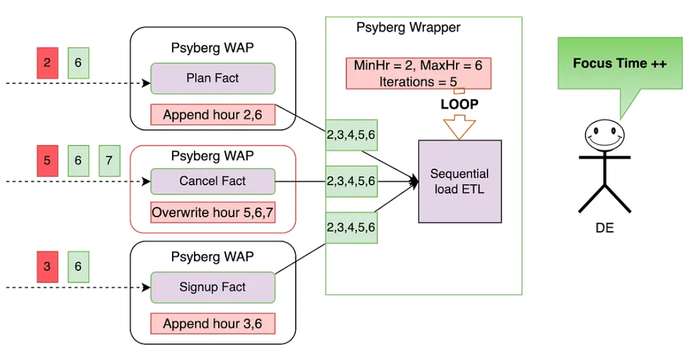

<head>
    
    
</head>

# Table of Contents

1.  [Algorithm](#org9b3888b)
2.  [Review](#org805e930)
    1.  [Psyberg 之后的流水线](#orgad550f7)
    2.  [导航工作流：Psyberg 如何处理后达到的数据](#orge8c1242)
        1.  [1. Psyberg 的初始化](#org58ceeaf)
        2.  [2. 写-审核-发布（WAP）处理](#org9d65f38)
        3.  [3. Psyberg 提交](#org2f3bd58)
    3.  [呼叫](#org80a9e4b)
    4.  [构建：自动端到端捕获](#orgee67f27)
3.  [Tips](#org1a7fad1)
4.  [Share](#org90f2fbb)

# Algorithm

Leetcode 2949: [Count Beautiful Substrings II](https://leetcode.com/problems/count-beautiful-substrings-ii/)

<https://dreamume.medium.com/leetcode-2949-count-beautiful-substrings-ii-95b68fade6b7>

# Review

[Psyberg: Automated end to end catch up](https://netflixtechblog.com/3-psyberg-automated-end-to-end-catch-up-260fbe366fe2)

本文将介绍 Psyberg 帮助自动化不同流水线的端到端捕获，包括多维表

在之前的系列文章中，我们介绍了 Psyberg 和它的核心操作模型演进：无状态和状态数据处理。现在，让我们在合并 Psyberg 之后探讨一下我们流水线的状态

## Psyberg 之后的流水线

让我们探讨一下不同的 Psyberg 模型对多数据流水线的帮助。我们回到采样客户生命周期：

处理需求：

保持账号每小时的跟踪，例如 活跃/更新/降级/取消

解决方案：

一个潜在的处理如下：

1.  创建两个非状态事实表
    1.  注册
    2.  账号计划
2.  创建一个状态事实表
    1.  取消
3.  创建一个状态多维度每小时读取以上事实表且获取最新的账号状态

让我们看看这些如何与 Psyberg 集成来自动处理迟后达到数据和响应端到端捕获

## 导航工作流：Psyberg 如何处理后达到的数据

我们跟随一个 Psyberg 有状态和无状态处理的一般化工作流结构；这帮助维护一致性和调试理解这些流水线更容易。如下是一个包括各个阶段的精确概括；对一个工作流说明的更详细的解释，请回到本系列的第二安装指导文章中

### 1. Psyberg 的初始化

工作流以 Psyberg 初始化步骤开始

-   输入：源表列表和需要的处理模型
-   输出：Psyberg 通过最近的高水印（HWM）和记录它们到会话元表来确定新的事件

会话元表然后读取确定流水线输入

<table border="2" cellspacing="0" cellpadding="6" rules="groups" frame="hsides">

<colgroup>
<col  class="org-left" />

<col  class="org-left" />
</colgroup>
<thead>
<tr>
<th scope="col" class="org-left">Psyberg 模式</th>
<th scope="col" class="org-left">Psyberg 会话元 / 流水线输入</th>
</tr>
</thead>

<tbody>
<tr>
<td class="org-left">无状态</td>
<td class="org-left">处理 URI</td>
</tr>

<tr>
<td class="org-left">有状态</td>
<td class="org-left">日期-小时范围来重处理</td>
</tr>
</tbody>
</table>

### 2. 写-审核-发布（WAP）处理

这是在我们的 ETL 流水线中使用的一般化模型

1.  写

    应用 ETL 业务逻辑到步骤 1 中确认的输入数据且基于 Psyberg 模型写到一个不发布的 iceberg 快照
    
    <table border="2" cellspacing="0" cellpadding="6" rules="groups" frame="hsides">
    
    
    <colgroup>
    <col  class="org-left" />
    
    <col  class="org-left" />
    </colgroup>
    <thead>
    <tr>
    <th scope="col" class="org-left">Psyberg 模型</th>
    <th scope="col" class="org-left">写操作</th>
    </tr>
    </thead>
    
    <tbody>
    <tr>
    <td class="org-left">无状态</td>
    <td class="org-left">添加数据</td>
    </tr>
    
    
    <tr>
    <td class="org-left">有状态</td>
    <td class="org-left">覆盖数据</td>
    </tr>
    </tbody>
    </table>

2.  审核

    在阶段数据上运行各种质量检查。Psyberg 的元会话表用来确定包含批量运行的分区。几个审核，比如检查源和目的统计，执行在这个批量数据上

3.  发布

    如果审核通过，cherry-pick 阶段快照到发布数据到生产环境

### 3. Psyberg 提交

现在数据流水线成功执行，新的高清水印在初始化步骤确认提交到 Psyberg 高清水印元表。这确保工作流的下一个实例将获取更新的更新

## 呼叫

-   Psyberg 步骤从核心数据流水线隔离允许我们维护一个一致范型可被应用于变化的需求的非状态和状态处理流水线
-   这也允许我们更新 Psyberg 层而不接触工作流
-   跟 Python 和 Scala Spark 都兼容
-   调试/指出在每个运行中什么被加载在工作流参数和 Psyberg 元数据的帮助下很容易

## 构建：自动端到端捕获

让我们回到我们客户生命周期的例子。一旦我们集成所有四个组件与 Psyberg，如下是如何构建自动捕获

三个事实表，封装在 Psyberg 无状态模型的注册和计划事实，状态模型的取消事实，作为状态顺序加载 ETL 流水线的输入。这个数据流水线监控客户生命周期里各个阶段

在顺序加载 ETL 中，我们有如下特性：

-   捕获阙值：定义数据读的回顾周期。例如，只考虑最近 12 小时的数据
-   数据加载类型：ETL 可加载未命中/新数据或重加载整个特定范围
-   元数据记录：元数据持久化可追溯

这是这个系统如何自动捕获最近达到事件的数据的管理步骤

前提：所有表最近加载到小时 5，表示从小时 6 的前向任意数据被认为是新的，且在那之前分类的任意事物作为最新的数据（上述红色）

事实水平捕获：

1.  在 Psyberg 初始化阶段，注册和计划事实确定从小时 2 到 3 的最新数据，大多数从小时 6 的最近数据。ETL 然后添加这个数据到事实表对应的分区
2.  Psyberg 初始化取消事实确定从小时 5 的最新数据及从小时 6 到 7 的添加数据。因为这个 ETL 在状态模型下操作，小时 5 到7 目标表的数据将被新数据覆写
3.  为聚焦在更新和避免基于固定回顾窗口重处理数据，无状态和状态数据处理维护一个最小的改变度量。这个处理确保数据处理高效且精确

维度水平捕获：

1.  这个状态 ETL 的 Psyberg 包装查看上流 Psyberg 的更新加强事实表来确定日期-小时范围重处理。这就是它如何计算以上范围：
    
    MinHr = max（每个源表的最小处理小时数）
    
    这确保我们不丢失任意数据，包括最新到达的数据。这样，处理数据的最小小时数为 2
    
    MaxHr = max（每个源表最大处理小时数）
    
    这确保我们不处理部分数据，例如，数据还未加载到所有源表的小时数。这样，最大处理数据小时数是 6

2.  ETL 处理使用这个时间范围来计算目标表中改变分区和覆写的状态。这帮助只在当需求和最小化不必要重处理时覆写数据

如上所示，通过链接这些 Psyberg 工作流，我们可自动化从小时 2 到 6 的最小达到数据的捕获。数据工程师不需要执行任何手动干预且聚焦在更重要的事情上

# Tips

[System Design Interview - Distributed Cache](https://www.youtube.com/watch?v=iuqZvajTOyA)

让我们看一个典型的构建，一个有数据存储的 Web 应用程序。这个数据存储可能是一个数据库或一个 Web 服务。客户端发一个调用到 Web 应用程序，然后会发一个调用到数据存储，且结果返回到客户端。这个构建有几个问题。首先，到数据存储的调用可能花费很长时间来执行或可能使用太多系统资源。在内存中存储一些调用的结果会更好，这样这些结果获取和返回到客户端更快。如果数据存储下线或出现性能降级且调用到数据存储失败，我们的 Web 应用程序会如常处理请求，至少在一段时间内。这样，在内存中存储数据将帮助处理这些问题。当客户端请求到来，我们首先检查内存且尝试从内存获取信息。只有数据无效或脏时，我们调用到数据存储。为什么我们称它为分布式存储？因为数据总量很大不能存储到一个机器内存中且我们需要分割数据且存储到几个机器中

缓存无处不在。当我们设计分布式队列或通知服务或限速器，所有这些设计依赖某种缓存。让我们形式化需求。我们需要实现两个主要的操作：put 和 get。put 存储某个唯一键的对象到缓存，get 基于键从缓存获取对象。为简化，我们考虑键和值都为字符串。对非功能性需求，我们想要设计可扩展，高可用且快速缓存。高扩展性将帮助我们的缓存可处理增长的 put 和 get 请求数量。且能够处理在缓存中我们需要存储的增长数据总量。高有效性将帮助确保缓存中的数据在硬件故障时不丢失和网络分区时可访问。这将最小化缓存缺失和调用到数据存储的数量。高性能是我们对缓存需求的数量。缓存的整个点是对每个请求都很快

第一个提示，在一个面试期间，当我们需要定义需求，功能性需求相对容易。但非功能性需求不容易定义。如果你需要设计一个分布式系统，首先想一下如下 3 个需求：可扩展性，有效性和性能。如果数据持久化很重要想一下持久性。这 4 个将给你和你的面试官大量地讨论空间。如果你重拾 CAP 理论，有效性需求会取代一致性。现在我们简化不在这里深入这个话题

第二个提示，记住面试官是你的朋友且你们都有相同的目标。你的目标是提供尽量多的正面数据观点，面试官的目标是收集尽量多的数据观点。实际上，这意味着你应该以一些简单小的步骤开始处理任意设计问题。并在每个下一步中演进你的解决方案。这是一个双赢局面。你展示进展，能力来处理分歧和简化事情。然而，面试官获得所有必要的数据观点来放入表中并在面试循环中和其他面试官讨论你的方案。基于这些，我们首先以本地缓存开始

我们以一个服务器开始，且需要实现一个基本的内存数据存储，有有限的容量。本地缓存实现是一个算法问题。我们需要数据结构和一个算法来存储获取数据。首先出现在头脑里的数据结构是哈希表。我们添加键值对到哈希表且在常量时间内获取它们。但当我们达到最大哈希表大小且不能添加更多元素时，我们需要在新数据插入前从哈希表中剔除某些旧数据。要剔除什么数据？有很多种不同的处理，所有称为驱逐或替换策略。最简单的其中之一是实现最少最近使用策略，我们首先丢弃最少最近使用的条目。但哈希表不跟踪最近使用的条目。我们需要更多的数据结构来跟踪使用的条目。参考 LRU 算法

现在考虑分布式。我们以一个直接的想法开始，当我们移动最少最近使用缓存到它的主机。这个好处是我们现在能使每个主机存储数据簇，称为切片。因为数据分割到几个主机，我们现在可存储更多数据到内存。服务主机知道所有切片，且它们转发 put 和 get 请求到特定的切片。相同的想法，但一个不同的实现是在服务主机上使用缓存。我们在服务主机上以一个单独进程运行缓存。且数据也分片。和第一种相似的是，当服务需要调用缓存，它获取有存储数据的切片并开始一个调用。让我们称这些选项为分布式缓存簇和共同位置缓存。看一下每个选项的好处。第一种帮助从服务资源隔离缓存资源，缓存和服务不共享内存和 CPU 资源。且自己可扩展。可用于多个服务。且我们可利用相同的簇在我们的团队中跨多个微服务。也给了我们选择硬件的灵活性。我们可选择很多内存和高网络带宽的硬件主机。公有云现在提供各种内存优化硬件。对共同位置缓存，最大的好处是我们不需要一个独立的簇。这帮助节省硬件成本且通常比独立簇更少的密集操作，服务和缓存扩展同时进行。当需要时我们只添加更多的主机到服务簇

缓存客户端如何决定哪个缓存分片来调用？让我们讨论一个简单的处理。基于我们计算哈希的条目键和一些哈希函数。我们通过一些缓存主机来分割这个哈希值。用余数。我们把这个余数作为缓存主机数组的索引。一个更好的选项是使用一致性哈希。一致性哈希基于映射每个对象到圆上一个点。我们取圆上任意一点赋值为 0。我们以顺时针方向赋值。我们用一个缓存主机列表并基于主机唯一识别号对每个主机计算一个哈希，例如 IP 地址或名称。每个主机赋予一个哈希范围段。每次添加一个新主机，只会影响一个主机哈希范围段。删除类似

在服务器端，谁负责运行所有这些哈希值计算且路由请求到选中的缓存主机？它是缓存客户端。它是一个小且轻量的库，集成服务代码，负责缓存主机的选择。缓存客户端知道所有缓存服务器。所有客户端有相同的列表。否则，不同的客户端将有它自己的一致性哈希圆视图且相同的键会路由到不同的缓存主机。客户端存储排好序的缓存主机的列表且使用二进制搜索来找到键所在的缓存服务器。缓存客户端使用 TCP 或 UDP 协议与缓存主机通信。如果缓存主机无效，客户端作为缓存未命中处理。缓存主机列表对客户端最重要。这个列表如何创建、维护和在客户端之间共享？让我们讨论几个选项

第一个选项我们存储缓存主机列表到一个文件且采用这个文件使用连续采用流水线服务主机。我们可使用配置管理工具例如 chef and puppet 对每个服务主机使用文件。这是最简单的选项。但不太灵活。每次列表改变我们需要修改代码且使用它到每个服务主机

如果我们保持这个文件，但简化采用的进程？特别地，我们可把文件放入共享存储且使服务主机定期拉取文件。这是第二个选项。所有服务主机尝试获取共同位置的文件，例如 S3 存储服务。为实现这个选项，我们可引入一个后端进程运行在每个服务主机且每分钟或几分钟拉取存储数据一次。这个处理的缺点是我们还是需要手工维护文件。每次缓存主机死机或新主机加入都需要进行改变并写入到共享存储。如果我们监控缓存服务器健康且一旦缓存服务器上一些不好的事情出现，所有服务主机被通知且停止发送任意请求到无效的缓存服务器。如果一个新缓存服务器添加，所有服务主机也通知且开始发送请求给它。为实现这个处理，我们将需要一个新服务，配置服务，其目的是发现缓存主机和监控它们的健康。每个缓存服务器注册它自身及配置服务且定期发送心跳到配置服务。当心跳到来时，服务器保持在系统中的注册。如果未收到心跳，配置服务反注册不在活跃或无法访问的缓存服务器。每个缓存客户端从配置服务获取注册的缓存服务器列表

第三个选项是最难实现的且它的操作成本更高。但它帮助完全自动化列表维护。之后你将看到对分布式缓存使用配置服务的另一个好处

对热点的处理，及故障需要重新哈希对有效性来说是个问题。为此，可使用数据复制。我们可区分两类数据复制协议。第一类包含一系列概率协议比如 gossip、流行病广播树和双峰多播。这些协议趋于达成最终一致性。第二类包含共识协议，比如 2 或 3 次阶段提交、paxos、raft、链复制。这些协议趋于达成强一致性。让我们简化事情且使用领导者跟随者复制。对每个分片我们设计一个主缓存服务器和几个读复制。复制节点尝试作为主节点的精确复制。每次主服务器和复制节点的连接断开，复制节点尝试自动重新连接主服务器。且复制节点位于不同的数据中心，这样缓存数据当一个数据中心下线后依然有效。所有 put 调用走主节点，get 调用走主和复制节点。因为调用一个缓存切片现在扩散到几个节点，更容易处理热分片。我们可通过添加更多的读复制节点来扩展。当我们谈论到领导者，我们需要提及领导者如何选举。有两个选项：我们可依赖一个独立的组件，我们称之为配置服务，或我们想要避免一个独立组件，我们可实现在缓存簇上进行领导者选举。配置服务负责监控领导者和跟随者，及故障恢复。如果一些领导者没有如期望那样工作，配置服务可晋升跟随者为领导者。如之前我们讨论的，配置服务对客户端来说是源的权威。缓存客户端使用配置服务发现所有缓存服务器。配置服务是一个分布式服务。它通常包含一个奇数数量的节点，节点位于故障独立的机器上（这样配置服务在网络分区时依然有效）且所有节点使用 TCP 协议互相通信。Zookeeper 是配置服务的一个好的替代者，我们可在这里使用它。Redis 也实现 Redis Sentinel

由于会有故障，我们还没有实现高有效性。我们用异步数据复制来获得更好的性能。我们不想当领导者服务器复制数据到所有跟随者时导致等待。如果领导者服务器获得一些数据且在这些数据复制前故障，数据被丢失。这事实上在许多现实生活中是一个可接收的行为，当我们处理缓存时。缓存的第一个优势是快，且如果它在一些罕见的场景下丢失数据，它不会是一个大问题。只是一个缓存未命中且我们应该设计我们的服务使得这样的失败符合期望

让我们看看在面试过程中还有什么其他话题。分布式缓存性能和一致性下的有效性。有一些情况导致不一致。我们异步复制数据来获得好的性能。这样，获得主节点处理的一个同一个键的调用可能返回一个跟复制节点处理的不同的结果。另一个潜在的不一致源是当客户端有不同的缓存列表。缓存服务器可能下线上线，且可能一个客户端写且没有其他客户端读。我们能解决这些问题。引入同步复制。且确保所有客户端共享一个缓存服务器列表的视图。但这会增加延迟和系统复杂度。我强烈建与你的面试官讨论这些妥协

LRU 算法当缓存满时从缓存驱逐数据。但如果缓存未满，一些条目会存在很长一段时间。这样的条目会变脏。为处理这个问题，我们可引入缓存条目的一些元数据且包含活跃时间属性。有两个常见的处理从缓存中清理过期条目。我们可被动地过期一个条目，当一些客户端尝试访问它时，且条目发现为过期。或者我们可积极地过期，当我们创建一个维护线程定期运行且删除过期数据。由于有数十亿条目，我们不能简单迭代所有条目。通常，使用一些概率算法，当一些随机条目在每次运行中被测试

服务使用分布式缓存，经常也使用本地缓存。如果数据在本地缓存中未发现，初始化调用分布式缓存。为使服务团队减轻负担，他们不需要处理所有缓存，我们可实现在缓存客户端支持本地缓存。这样，当缓存客户端实例被创建，我们也构建本地缓存。我们隐藏所有复杂度到缓存客户端组件中。我们可利用之前引入的 LRU 缓存实现作为本地缓存，或使用著名的三方实现，例如 Guava 缓存

缓存向最大性能优化，而不面向安全优化。缓存通常被信任环境下被信任的客户端访问且我们应该不直接暴露缓存服务器到因特网，如果不是绝对需要。这样我们应该使用一个防火墙来限制缓存服务器端口的访问且确保只有适合的客户端可访问缓存。客户端也可在存储数据前加密数据且获取时解密。但我们应该期望不影响性能

我们的缓存需要检测和日志。这对我们启动我们的分布式缓存作为一个服务来说是特别重要的。因为组织中非常多的服务团队会使用我们的缓存，每次这些服务体验性能降级，他们会找到我们作为一个潜在的降级源。我们需要能过回答他们的问题。我们想要检测哪些指标：当调用缓存时出错次数，延迟，命中数和未命中数，缓存主机的 CPU 和内存利用率，网络 I/O。通过日志我们可捕获每个请求到缓存的细节。基本信息如谁和什么时候访问缓存，键是什么，返回状态代码。日志条目要小，但有用。缓存客户端有许多职责：维护一个缓存服务器列表，获取一个分片来路由请求，处理一个远程调用且任何潜在的故障，获取指标

理想情况下，客户端软件应该非常简单。我们可简化缓存客户端。一个想法是引入一个代理，位于缓存客户端和缓存服务器之间，负责获取一个缓存分片。可参看 Twitter 的 twemproxy 工程。另一个想法是缓存服务器负责获取一个分片。客户端发送请求到一个随机缓存服务器且缓存服务器应用一致性哈希重定位请求到一个存储数据的分片。这个想法被 Redis 簇使用。一致性哈希算法是很重要的，简单且高效。但它有两个主要的缺陷：多米诺效应和缓存服务器分割不平均的事实。多米诺效应在缓存服务器死机时出现。所有它的负载转递到下一个服务器。这个转递可能使下一个服务器过载且导致服务器故障，这样导致连锁反应。为理解第二个问题，记住我们如何放置缓存服务器到圆中。一些服务器互相比较靠近一些会较远。导致缓存服务器间不平均的键分布。为处理这个问题，一些修改的哈希一致性算法被引入。一个简单的想法是在圆上添加每个服务器多次。你也可以阅读 Jump 哈希算法（谷歌 2014 年发布的论文）或适合的哈希（雅虎视频平台使用的算法）

# Share

