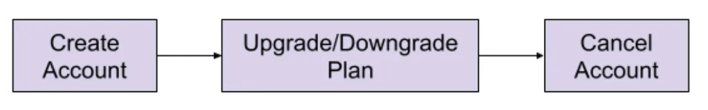

<head>
    
    
</head>

# Table of Contents

1.  [Algorithm](#org9b3888b)
2.  [Review](#org805e930)
    1.  [Psyberg 之后的流水线](#orgad550f7)
    2.  [导航工作流：Psyberg 如何处理后达到的数据](#orge8c1242)
        1.  [1. Psyberg 的初始化](#org58ceeaf)
        2.  [2. 写-审核-发布（WAP）处理](#org9d65f38)
3.  [Tips](#org1a7fad1)
4.  [Share](#org90f2fbb)

# Algorithm

Leetcode 2949: [Count Beautiful Substrings II](https://leetcode.com/problems/count-beautiful-substrings-ii/)

<https://dreamume.medium.com/leetcode-2949-count-beautiful-substrings-ii-95b68fade6b7>

# Review

[Psyberg: Automated end to end catch up](https://netflixtechblog.com/3-psyberg-automated-end-to-end-catch-up-260fbe366fe2)

本文将介绍 Psyberg 帮助自动化不同流水线的端到端捕获，包括多维表

在之前的系列文章中，我们介绍了 Psyberg 和它的核心操作模型演进：无状态和状态数据处理。现在，让我们在合并 Psyberg 之后探讨一下我们流水线的状态

## Psyberg 之后的流水线

让我们探讨一下不同的 Psyberg 模型对多数据流水线的帮助。我们回到采样客户生命周期：

处理需求：

保持账号每小时的跟踪，例如 活跃/更新/降级/取消

解决方案：

一个潜在的处理如下：

1.  创建两个非状态事实表
    1.  注册
    2.  账号计划
2.  创建一个状态事实表
    1.  取消
3.  创建一个状态多维度每小时读取以上事实表且获取最新的账号状态

让我们看看这些如何与 Psyberg 集成来自动处理迟后达到数据和响应端到端捕获

## 导航工作流：Psyberg 如何处理后达到的数据

我们跟随一个 Psyberg 有状态和无状态处理的一般化工作流结构；这帮助维护一致性和调试理解这些流水线更容易。如下是一个包括各个阶段的精确概括；对一个工作流说明的更详细的解释，请回到本系列的第二安装指导文章中

### 1. Psyberg 的初始化

工作流以 Psyberg 初始化步骤开始

-   输入：源表列表和需要的处理模型
-   输出：Psyberg 通过最近的高水印（HWM）和记录它们到会话元表来确定新的事件

会话元表然后读取确定流水线输入

<table border="2" cellspacing="0" cellpadding="6" rules="groups" frame="hsides">

<colgroup>
<col  class="org-left" />

<col  class="org-left" />
</colgroup>
<thead>
<tr>
<th scope="col" class="org-left">Psyberg 模式</th>
<th scope="col" class="org-left">Psyberg 会话元 / 流水线输入</th>
</tr>
</thead>

<tbody>
<tr>
<td class="org-left">无状态</td>
<td class="org-left">处理 URI</td>
</tr>

<tr>
<td class="org-left">有状态</td>
<td class="org-left">日期-小时范围来重处理</td>
</tr>
</tbody>
</table>

### 2. 写-审核-发布（WAP）处理

这是在我们的 ETL 流水线中使用的一般化模型

1.  写

    应用 ETL 业务逻辑到步骤 1 中确认的输入数据且基于 Psyberg 模型写到一个不发布的 iceberg 快照
    
    <table border="2" cellspacing="0" cellpadding="6" rules="groups" frame="hsides">
    
    
    <colgroup>
    <col  class="org-left" />
    
    <col  class="org-left" />
    </colgroup>
    <thead>
    <tr>
    <th scope="col" class="org-left">Psyberg 模型</th>
    <th scope="col" class="org-left">写操作</th>
    </tr>
    </thead>
    
    <tbody>
    <tr>
    <td class="org-left">无状态</td>
    <td class="org-left">添加数据</td>
    </tr>
    
    
    <tr>
    <td class="org-left">有状态</td>
    <td class="org-left">覆盖数据</td>
    </tr>
    </tbody>
    </table>

2.  审核

    在阶段数据上运行各种质量检查。Psyberg 的元会话表用来确定包含批量运行的分区。几个审核，比如检查源和目的统计，执行在这个批量数据上

3.  发布

    如果审核通过，cherry-pick 阶段快照到发布数据到生产环境

# Tips

# Share

