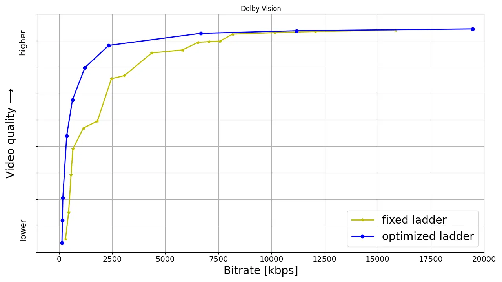

<head>
    
    
</head>

# Table of Contents

1.  [Algorithm](#orgc12e928)
2.  [Review](#org7a4cbf9)
    1.  [比特率和质量比较](#org20e5204)
    2.  [成员收益](#orgd8c5152)
    3.  [HDR-VMAF 会开源吗？](#org2e39934)
    4.  [总结](#org0cc5dc2)
3.  [Tips](#orge9821fc)
4.  [Share](#org9bfc5d5)
    1.  [面试分析](#orgbb1b4a5)
    2.  [你的面试官](#orgdc52c89)
    3.  [处理](#org2b26d1f)
        1.  [理解问题](#org744db3c)
        2.  [定义范围](#org29c8747)
        3.  [确定技术性需求](#org7ca26eb)
        4.  [提出高层设计](#org7582d4b)
        5.  [深入一个组件](#org28d9b46)
        6.  [摘要总结](#org3e721d6)
    4.  [最后的想法](#org1aa3772)
        1.  [一般性建议](#org9a2f365)

# Algorithm

Leetcode 940: [Distinct Subsequences II](https://leetcode.com/problems/distinct-subsequences-ii)

<https://dreamume.medium.com/leetcode-940-distinct-subsequences-ii-cfb43f1ffc6a>

# Review

[All of Netflix’s HDR video streaming is now dynamically optimized](https://netflixtechblog.com/all-of-netflixs-hdr-video-streaming-is-now-dynamically-optimized-e9e0cb15f2ba)

高动态范围成像（HDR）视频带来更广亮度范围和更广的颜色范围，提供更绚丽的视觉体验。我们的动态优化编码发明依赖内容复杂度帮助获取优化的亮度质量

HDR 于 2016 年在 Netflix 出现且发展很快。然而，我们缺失 HDR 的度量感观质量（VMAF）的系统能力，因为 VMAF 受限于标准动态范围（SDR）视频信号

如之前的博客所说，我们开始开发一个 VMAF 的 HDR 变种；让我们称之为 HDR-VMAF。这个开发的一个及其重要的方面是预测 HDR 编码来产出训练数据。对大流行，导向一个方便的实验室 HDR 编码预测测试是唯一的挑战。我们临时起意作为杜比实验室合作效果的一部分且处理在校准条件下创造的参与者房间里使用高端 OLED 的 4K-HDR 内容做预测测试。HDR-VMAF 从属的细节超出了本文的范围且将在后续的博客中发布。现在，HDR-VMAF 的第一个版本在 2021 年内部着陆且我们一直在改进其度量

HDR-VMAF 的出现允许我们应用 DO 创建 HDR 流，例如，HDR-DO 编码。这之前，我们使用一个预定义比特率的固定梯子 - 对 HDR 视频流不管内容特征。我们在 2021 Q3-Q4 时在生产环境用 A/B 测试 HDR-DO 编码，在 2022 年早期改进梯子产生算法。我们从 2022 Q2 开始对现存的标题回填 HDR-DO 编码。在 2023 年 6 月整个 HDR 目录被优化。下图描述从固定比特率到 DO 编码的流量迁移

## 比特率和质量比较

HDR-VMAF 被设计为格式不可知的 - 它无视内容格式度量 HDR 视频信号的感知质量，例如，Dolby 图像或 HDR10。HDR-VMAF 聚焦信号特征（有损编码的结果）而不是显示特征，且它不包含流水线上的显示映射。显示映射是特别的色调映射应用于基于它自己特征的显示 - 峰值亮度、白水平、颜色范围等 - 且在比特流中基于信号的内容特征和/或元数据

HDR10 和杜比图像不同的两处是：1）预处理应用于编码之前的信号 2）元数据通知显示映射到不同的显示。这样，HDR-VMAF 将捕获效果 1）但忽略效果 2）。显示能力在各种各样 HDR 流内容的人口设备上大不同 - 这方面随着时间不同在设备各个因素上有变化比如环境光亮，视图距离，高端算法等。"VMAF 不兼容显示映射“意味着通过视频信号扩展整个颜色范围和呈现整个色彩范围的“理想显示”被计算成分数不需要显示映射。这个背景在查看速度 vs 质量曲线从属到这两个格式是有用的

以下显示从我们的 HDR 类目一对标题速度 vs 质量例子。我们呈现两个集合。每个集合我们显示杜比图像和 HDR10 的曲线。第一个集合对应一个美食烹饪系列节目显示世界上快节奏场景。第二个集合对应一个相对慢的喜剧系列节目；摄像机动作较慢。优化的编码通过各种速度 - 质量点对应不同比特率、空间解决方案和编码结果的凸面形式被选

为简化我们跳过注释梯子点及它们的空间解决方案，但从我们之前 SDR-4K 编码优化文章应用到这里来整体观察。固定梯子在空间解决方案爬升时比较缓慢，这样质量在两个连续 1080p 点或两个连续 4K 点之间大多保持平滑。另一方面，优化的梯子在比特率增加时呈现质量上尖锐地增长

固定梯子预定义 4k 比特率 - 8，10，12 和 16 Mbps - 它决定最大到 16 Mbps。另一方面，优化的梯子目标在比特率梯子运行顶部有非常高的质量水平，甚至如果内容复杂有更高的比特率成本，因此满足多数观看者。为了达到比固定梯子更高质量，HDR-HO 梯子，一般来说，相比较固定比特率梯子只占据 58% 的存储空间。这是通过更多高效空间梯子点获得，特别在高比特率领域。总之，压缩多个高比特率点使其更靠近并没有好处 - 例如，3 QHD（2560x1440）点放在 6 到 7.5 Mbps 范围跟随 4 个 4K 点在 8，10，12 和 16 Mbps，跟在固定梯子一样

注意重要的是固定梯子编码有常量时长 GoPs 且由于影片边界与瞬时解码刷新（IDR）帧不对齐遭遇一些低效。DO 编码基于影片且 IDR 帧与影片边界对齐。对一个给定比率质量操作点，DO 处理帮助分配各种影片间的比特当最大化一个整体对象函数。多亏 DO 框架，在一个给定比率质量操作点，挑战影片可且在该点在比特率上爆发到编码水平限制

## 成员收益

我们用 A/B 测试固定和优化梯子；首先且最重要的确保领域的设备可处理新流和服务新流不导致意外的播放问题。A/B 测试也允许我们获得一个在质量体验（QoE）上改进的读取。总之，改进可总结为：

-   少于 40% 的重新缓存
-   对宽带限制和未限制的会话提供更高的视频质量
-   更低的初始化比特率
-   更高的初始化质量
-   更低的播放延时
-   转发视频质量的更少变动
-   更低的因特网数据使用，特别在移动和平板上

## HDR-VMAF 会开源吗？

是的，我们提交到支持的开源社区。当前的实现，然而，对我们内部流水线有大量裁剪。我们确保它是通用的，稳定的，且对社区来说易用的。另外，当前版本有一些算法限制我们在官方发布之前有改进处理。当我们发布时，HDR-VMAF 将在感知质量预测方面有更高的精确度，且更容易开箱即用

## 总结

感谢 HDR-VMAF，我们能够优化我们的 HDR 编码。固定梯子 HDR 编码被优化的完全替代，缩减存储空间和因特网数据使用 - 且最重要的，改进我们成员的视频质量。改进跨所有设备类别都能看到，从 TV 到移动设备到平板

# Tips

[System Design Interview - Rate Limiting (local and distributed)](https://www.youtube.com/watch?v=FU4WlwfS3G0)

假设有一个 Web 服务，有大量的用户。在网络上有可能导致“邻居噪音问题“，一些客户占用过多资源，另一些客户导致高延迟。解决办法之一是使用限速器。限速器帮助限制客户在给定时间内请求数限制。超过限制的请求要么立即被拒绝或处理被延迟

我们需要一个解决方案使得应用程序服务器可以互相通信且共享有多少客户端请求的信息

功能性需求：

-   对一个请求，我们的限速器需要给定结果，是否需要调节

非功能性需求：

-   我们需要限速器快速反应（快速做决定）
-   精确
-   可扩展（支持簇中任意数量的主机）

限速器必须快速决定，即使发生一些故障。因为许多服务要用到限速器，面试官可能会问到集成问题，这样我们的服务可无缝集成我们的限速器方案

我们首先用一个简单的解决方案开始。限速器间不需要通信，有一些规则，每个规则指定每秒内一个特殊客户端允许的请求数。这些规则由服务拥有者制定且存储在数据库中。规则获取器是一个后台进程定期推规则服务来检查是否有新规则或规则修改。规则获取器存储规则在主机内存中，当请求来时，第一件事是构建一个客户端唯一标识。我们简称它为键。这可能是一个注册的主机或远程 IP 地址或一些唯一确认客户端的属性信息的登录。键然后传递给限速器组件，限速器检查键与缓存中的规则，如果发现匹配，限速器检查最近一秒内客户端请求的数量是否低于规则指定的限制。如果没有超过，请求通过并进一步处理，否则就拒绝。这里还有 3 个选项。我们的服务可能返回一个特别的回复状态码，例如服务无效或太多请求。或者我们可让这个请求进入队列且延后处理。或我们可简单丢弃这个请求

面试官可能对限速器算法感兴趣且要求我们实现一个。或面试官可能对面向对象设计感兴趣且要求我们定义主类和库的接口。或面试官可能聚焦于分布式瓶颈解决方案和讨论服务主机如何互相共享数据

我们先讨论算法。有很多算法，如果感兴趣你可在 Google Guava RateLimiter 类中找。或想想如何应用固定和浮动窗口。但可能最简单的算法是 Token bucket 算法。该算法基于对填充 token 的桶的分析。每个桶有 3 个特征：能保存的最大 token 数值，当前 token 数和一个重填速度。每次请求来临，我们从桶中取出一个 token，如果桶中没有有效的 token，则请求被拒绝。桶以一个常量速度重填 token。bucket token 算法的好处是简单好实现

现在我们来看面向对象设计。让我们定义关键类和接口。JobScheduler 接口负责调度一个任务其每次运行几秒钟且从规则服务中获取规则。RulesCache 接口负责在内存中存储规则。ClientIdentifier 类构建客户的唯一识别码。RateLimiter 类负责决策制定。RetrieveJobScheduler 类实现 JobScheduler 类的接口，它负责实例化、开始和停止调度器，并运行获取规则的任务。对 Java，我们可利用 ScheduledExecutorService 接口作为一个调度器。TokenBucketCache 类存储 token 桶。我们可使用简单的例如字典来存储桶，或利用三方缓存实现，比如 Google Guava 缓存。ClientIdentifierBuilder 负责基于用户唯一信息构建一个键，例如登陆信息。有一些其他实现，比如基于 IP 地址。对 RateLimiter 类接口我们用 TokenBucketRateLimiter 类，负责在对应桶中允许客户端的请求。最后是 RetrieveRulesTask 类，负责获取所有这个服务的规则。我们看一下它们之间的交互。RetrieveJobScheduler 运行 RetrieveRulesTask，对规则服务做一个远程过程调用。它然后创建 token 桶并把它们放入缓存。当客户端请求到了主机，RateLimiter 首先对 ClientIdentifierBuilder 做一个调用来构建客户端的唯一识别码。然后它把这个键传给缓存并获取桶。最后一步是在桶上允许请求调用

簇中各主机实现可如下。在簇中每个主机知道簇中每个其他主机，并它们间共享消息。主机如何相互发现呢？当一个新主机被添加，其他主机如何知道？有一些处理用于主机发现。一个选项是使用一个三方服务监听每个主机的心跳。当心跳到来时，主机保持在系统中的注册。如果心跳没来，服务反注册不再活跃的主机。并且簇中所有主机向这个三方服务请求所有成员的列表。另一个选项是解析一些用户提供的信息。例如，用户指定一个 VIP 且因为 VIP 知道所有它之前的主机，我们可使用这个信息获取所有成员。或我们可依赖一个稍微缺乏灵活度但依然是一个好的选项的，用户通过配置文件提供成员列表。每次这个列表改变时我们需要一个方法在所有簇节点中使用这个文件。全网广播是相对直接的实现。但主要问题是这个处理没有可扩展性。消息的数量相对簇中主机数是二次方地增长。这个处理对小型簇可很好地工作，但我们将不能在大型簇中支持。其他方法的一个选项是使用一个 gossip 协议。这个协议基于流行病扩散的方式。计算机系统典型地用一些随机端点实现这类协议：对一个给定的频率，每个机器随机选择另一个机器且共享数据。这样，Yahoo 的限速解决方案使用这个方法。另一个选项是使用分布式缓存簇。例如，Redis。或我们可实现自定义分布式缓存解决方案。这个处理的优点是分布式缓存簇相对小且我们的服务簇可独立扩展。这个簇可在组织多个不同服务团队中共享。或每个团队可构建他们自己的小簇。另一个方法也依赖一个三方组件。一个协调服务帮助选择一个领导者。选择一个领导者帮助减少簇中消息广播数量。领导者要求每个主机发送它所有的信息。然后它计算并送回最后的结果。这样，每个主机只需要跟一个领导者通信或一系列领导者，每个领导者负责它自己的键范围。共识算法比如 paxos 和 raft 可被用于实现协调服务。但主要的问题是我们需要建立并维护协调服务。协调服务是一个非常典型地复杂组件，非常依赖有且只有一个领导者被选举中。但这对我们的系统真正是一个需求吗？

我们先使用一个简单的算法选举一个领导者。但因为算法简单，它可能不能保证有且只有一个领导者。这样我们会导致多个领导者被选举出来。这是一个问题吗？事实上，不是。每个领导者可计算速度且与其他主机共享。这将导致不必要的消息，但每个领导者将有它自己正确的全局速度视图。对消息广播讨论的最后，我将谈论通信协议。主机如何相互通信？

我们有两个选项：TCP 和 UDP。TCP 协议保证数据转发且保证包将被以相同的顺序转发。UDP 协议不保证你能得到所有的包且顺序不保证。因为 UDP 没有所有的错误检测，所以它速度更快。哪个更好？都是好的选择。如果我们想要限速解决方案更精确，并接受一个小的性能为代价，我们选择 TCP。如果我们可接受一个相对欠精确的解决方案，但更快，选择 UDP

我们如何集成服务中的所有这些解决方案？有两个选项。都非常标准。我们可运行限速器作为服务进程的一部分或用单独的进程。对前者，限速器作为一系列类分布，一个库集成服务代码。第二个选项我们有两个库，一个后端进程和一个客户端，负责在服务进程和后端进程间通信。客户端集成服务代码。对前者的优点，它更快，我们不需要任何进程间调用。后者更有利于编程，限速器后端进程可与服务实现所用的编程语言不同，我们不需要在代码层面进行集成。我们需要限速器客户端代码兼容服务代码用的语言。限速器进程使用它自己的内存空间。这个隔离更好地帮助对服务和后端的行为控制。例如，后端进程可存储许多桶在内存，但服务进程不需要这些桶空间，这使得服务内存分配更可预测。另一个好的原因，你可看到这样的隔离有利于回答集成团队的各种问题

理论上，许多 token 桶在内存中创建和存储是可能的。实际上，我们不需要在内存中保持在一段时间内没有请求的桶。例如，客户端发起第一个请求我们创建一个桶。后续继续有请求发送到该桶，我们继续保持该桶。如果之后的几秒钟内没有到该桶的请求，我们可从内存中移除该桶。当后续有需要时再创建。后端进程会故障，导致簇中其他主机缺失该故障进程的可见性。结果，故障进程的主机离开组且继续限制请求而没有跟其他主机通信。这样导致总体上更少的请求被限制。当网络分区时我们有相似的情形，当簇中一些主机不能广播消息到组中其他主机。对规则管理，我们可能需要引入一个自服务工具，这样服务团队在需要时可创建，更新和删除他们的规则。对同步，我们需要做一些事情。首先，我们在 token 桶中同步。在这样的类中用线程安全的实现是更好的办法，例如使用原子操作。如果有太多的桶存储在缓存中，我们想要删除未使用的并在要使用时再创建，我们需要同步。这样，我们可用并行哈希表

我们服务的什么客户端应该限制调用？有一些选项。客户端可对这样的请求队列处理且之后重发送它们。或可重试限制的请求。一个更聪明的方法是指数回溯和 jitter。该算法对重试的请求添加一个到最大回溯时间的等待时间。即我们重试请求几次，每次重试时间间隔会更长。jitter 添加随机间隔到重试时间中

# Share

[Cracking the Mobile System Design Interview (iOS & Android)](https://themobileinterview.com/cracking-the-mobile-system-design-interview/)

对 FAANG 公司（Facebook/Meta, Amazon, Apple, Netflix, Google），系统设计面试变得流行因为大技术公司已引入数十年。这些面试对多数后端角色是任意面试进程的一个标准部分。现在，轮到移动端工程师了

移动端系统设计面试聚焦于两个话题（设计和架构）。作为一个候选人，你很可能要求一个移动端应用程序或特性的技术设计。如下：

-   设计一个图片共享应用程序（例如，Instagram）
-   设计一个消息应用程序（例如，WhatsApp 或 Messenger）
-   设计一个新闻回馈特性（像在 Twitter 中的）

面试官的目标是观察你如何处理转化一个抽象需求集到一个精确且细节到位的解决方案。它也允许你的面试官通过你做的不同的决策查看到你的知识宽度。当确定不完美时，则有一个明显的好处是对候选人和面试官都能节省时间

在当前的竞争市场雇佣有天赋的候选人，大的技术公司和小的创业公司有规律地用新的方式优化简化它们的雇佣过程。这样，更多的公司采用这类面试。事实上，我在我最新的团队中也使用了。我们缩减我们雇佣时间从平均 3 周多的时间到一周。这种改变对候选人和面试官都有很好的效果

系统设计面试可能看着可怕，特别是当你从未做过或没有太多经验设计大型应用程序服务百万级用户和数十人工程师的团队时。对移动端的系统设计面试网上资料很少，因此我决定分享我的经验作为一个候选人和面试官来处理这些面试

## 面试分析

多数系统设计面试大约在 45 分钟（有时会扩展到 1 小时）且有一个非常相似的结构：

-   6 - 8 分钟：简介和面试官的开场白
-   4 - 5 分钟：问题陈述
-   25 - 30 分钟：设计和讨论你的解决方案
-   5 分钟：向面试官问问题

一个相当典型的错误是你认为有 45 分钟来解决问题。实际上，你只有 30 分钟设计你的解决方案。因此，注意时间。你想要尽可能好的分布这 30 分钟，在这 30 分钟内，还会有打断。因此要有好的计划和练习

## 你的面试官

在描述处理这些面试之前，我们需要理解面试官的观点。他们在查看什么？

开放问题的面试目标是找到你的知识的边界。让你选择你想要的话题且当处理你的解决方案时看到你对问题重要程度的排序。他们这样设计是允许你的面试官评估如下：

-   问对的问题来协调不明确问题的能力，形成固定系列的需求
-   你的思考过程：你如何分解大的问题到更小的部分，保持整个全图的联系和满足所有的需求
-   你的知识，Android 或 iOS 开发者更加熟悉的部分，你也能提出一个服务器的解决方案吗？
-   最后，你的沟通和合作技能。你如何综合你的解决方案？

没有正确错误的答案 - 只是不同的替代。且你的面试官也知道。这样不要聚焦于找到完美的解决方案。而是聚焦于设计一个你平常工作时典型的解决方案，应用你拥有的知识来强调你的力量。一个建议是聚焦在你知道的地方。如果面试官真的关心帮助你成功，他们更感兴趣在理解你所知道的而不是你所不知道的。另外，你快速提出一个解决方案和逐渐改进它通常会获得额外的分数。多数情况下，初始的问题将不是全部的练习，且你的面试官将期望覆盖一些后续。这是为什么一个迭代的处理，开始于一个高层的更简单方案且当新需求添加时演进它，使它能很好工作

在你的练习中自由选择你想要的领域是一柄双刃剑。它给你自由来驱动会话且探索你更舒适的部分，但同时，面试官可能假设你未覆盖的部分是因为你不知道。记住多数面试官（在大公司更多）当写他们的评估时趋于在保守的边界上。因此为什么最投巧地是当深入更多问题相关方面时简洁地覆盖所有相关问题的话题上取一个平衡

很难把握平衡，主要因为你和你的面试官考虑的可能不同。幸运地是，多数面试官会在这时帮忙。当他们认为你缺失一些必要的部分时他们会提示你或者直接问你他们感兴趣的特殊部分来探索。因此，最好你听从你的面试官且使用他的提示来指导你的解决方案。且如果怀疑，不要害怕问他问题

## 处理

如下我描述一个策略来应对移动端系统设计面试。我对这样的面试发展了数年且看到很多成功的候选人很优秀

它包含 6 个直接的步骤：

1.  理解问题
2.  定义范围
3.  确认技术需求
4.  提出高层设计
5.  深入一个组件
6.  简要概述

### 理解问题

我们经常太快跳到结论。放慢你想要开始设计你的解决方案的想法并避免没有完全地理解问题。聚焦于知道面试官想要你聚焦的地方，这类应用程序最相关的挑战，且你之前解决地相似情形

这是面试官给你一个模糊、开放问题的原因，这个步骤是要你精确它。他在评估你分析一个不完整问题的能力，确定灰暗领域，且问对的问题

因此，在这个步骤中，你想要问清晰的问题来更好地理解问题。考虑给定的信息且问相关问题来完整化整个视图

以下是这个阶段有用的一些问题，取决于问题：

-   什么是我们要问来设计的？
-   用户是什么，且他们如何使用我们的系统？
-   初始的用户数是多少？期望的增长是？
-   我们以给定一个初始的设计/框架，或我们应该生产它们？
-   我们设计一个 MVP 还是最终的产品？
-   我们从头构建，还是我们可使用任意现存的组件？我们应该跟随任意现存范型/架构？
-   实现和维护我们的系统的团队有多大？
-   期望我们只设计一个移动端应用程序或还有整个系统的其他部分？
-   只 iOS 或 Android，或跨平台？支持智能手机，平板？

你不需要问所有这些。取决于问题，和提供给你的信息。按重要性排序取任务最相关的

### 定义范围

找到并确认你要设计的应用程序或特性的功能性需求

想想你使用过的相似的著名应用程序或系统且它们如何解决相似的问题。它们提供什么特性且它们的主要功能是什么。你可建议你想到的许多潜在的特性和与你的面试官对你要聚焦在这个特别设计上的何种特性达成一致。这是面试非常要合作的部分

一旦范围已清晰且与你的面试官达成一致，你就可以开始进行下一步骤

### 确定技术性需求

这是真正有趣的开始！一旦功能性需求已确定，你应该开始考虑必要的技术性考量来构建解决方案满足你和你的面试官达成一致想要的用户体验

1.  网络

    现在多数应用程序从后端共享或获取它们的状态。花费一些时间想想后端。多数情况下，用 REST API。这个 API 接口提供吗？如果是，它是怎样的？
    
    有特性需要直播更新这样的低延时吗？如果是，你如何推送这个信息到客户端？你可能需要使用一个比 HTTP 请求更复杂的处理。你可能会使用推送通知，WebSockets，polling 等。每个选项有你需要考虑的妥协

2.  安全

    以上是多数应用程序需要与其他系统通信。则明显我们需要这些通信是安全的。想一下以下话题：
    
    -   验证：你的解决方案如何验证谁是你的应用程序的用户和如何保证提供的正确的访问级别
    -   存储敏感数据：你需要存储用户的资格吗？是的！除非你想要提供非常差的体验，用户每次都要登录。什么资格（例如，访问 Token，刷新 Token）？我们需要处理个人唯一信息吗？你如何安全地存储它们？（例如，keychain，Smart Lock）
    -   安全通信：你如何确保与后端的通信是安全的？所有请求用 HTTPS 且用 TLS 加密，证书 pinning 等

3.  有效性

    应用程序需要支持脱机模式吗？多数情况需要，你不想用户打开时每次从空白状态开始你的应用程序。你可能使用一个本地存储来缓存数据（例如，Core Data，Realm，SQLite，shared preferences 等）。考虑使用哪个且原因
    
    图片（或其他多媒体）怎么处理？如果需要，一旦从网络获取，你可本地缓存它们。这是一个好的选项，但它可能带来一些挑战：同时处理多个请求，取消过期请求，清除策略（例如 LRU），限制并发请求等

4.  扩展性

    在移动端，扩展性挑战典型地跟系统其他部分不同。当后端面试时，你需要设计你的系统支持百万级 QPS 且分区你的 TB 级数据到多个分片。在移动端应用程序中，扩展性通常为增长的代码和团队合作。因此，想想你如何可以准备你的设计支持新的特性，及由多个团队拥有
    
    你应该：
    
    -   分解 UI 为更小的独立组件。每个有它们的栈这样不同的人可高效地在其上工作
    -   通过构建可重用 UI 组件库来标准化你的 UI。它减少代码且确保一致的跨应用程序用户体验
    -   模块化应用程序：用独立的模块分解特性（每个组可持有），且提取可重用组件到共享和核心模块

5.  性能

    现在的移动生态系统，更多的应用程序通过提供圆滑的用户体验而显得不同。为此，你需要面对隐藏需求从网络获取数据的挑战
    
    一些性能相关话题你可能想要探讨：
    
    -   有 UI 紧密操作（例如，无限列表滑动，重的动画或复杂的转场）？你如何支持？例如，你可以预取数据并创建一个缓冲区
    -   应用程序有加载重的数据比如图片，视频，音频？如果是，我们应该想想如何异步操作它，这样我们可保持 UI 平滑，并仍然提供尽可能好的用户体验。例如，有一个独立的服务来异步处理获取媒体数据，当准备好时通知 UI。你的应用程序的瓶颈和挑战是什么？

6.  测试

    你可以简洁地提及你如何计划确保你的应用程序的质量。如今，缺省应该是创建一个可靠的测试套装，但你如何做将通常取决于需求（例如，你构建在 MVP 上？）。你可能想要思考和描述你的测试策略
    
    你可以想要简要讨论如下：
    
    -   解释你的测试策略：你如何应用不同类型测试（单元测试，集成测试和 UI/功能性测试来覆盖端到端的主应用程序）
    -   高亮你的架构力解释如何容易地测试每个特殊的组件
    -   依赖注入的使用来确保写测试更容易

7.  监控

    你通常不想花费太长时间在这个点上除非面试官问了你。考虑你如何计划确保系统的正确性和辅助事情滑坡时快速反应是重要的。多数常见的话题如下：
    
    -   CI/CD 自动发布流水线（例如，Fastlane \_lanes \_to 发送构建到生产环境，QA 和 beta）
    -   杠杆远程特性标志逐步启动首次发布的改变和从审查进程分解发布（例如，确保新特性对市场活动是准备好了的）

8.  其他

    你可以考虑的其他领域，特别对高级角色：
    
    -   实验（支持 A/B 测试）
    -   本地化
    -   Deeplinks
    -   可访问性
    
    但你可能在面试中不需要探讨这些
    
    这已经很多且时间很紧。不要担心。对你的目标是足够提及这些的多数（一或两句话），这样面试官知道你考虑了它。不要深入细节除非对问题很关键，或面试官要求你

### 提出高层设计

1.  作出主流程（如没有提供）

    如果你还没有给定框架，第一步是在你深入开发你的解决方案之前画出它们。这一步很重要。它将允许你和你的面试官在主要的地方达成一致。UI 组件，用户交互和导航流，这些影响你之后的技术决定。你想要确保你得到你的面试官对你如何使得应用程序满足所有给定需求的赞同
    
    如果你跟从如下三个简单步骤则它将成为漂亮直接的：
    
    1.  画主界面，如盒子一样，描述主要的内容
    2.  展示视图流，添加箭头呈现用户体验过程
    3.  添加更多的细节来讨论每个界面的组成：确定主 UI 元素，分割 UI 组件（例如，CollectionView/TableView 上的卡片/单元）。想想可能的可重用元素

2.  画最重要的系统（如需要）

    你应该与你的面试官检查是否他期望你覆盖端到端设计或只聚焦在客户端。多数移动端系统设计面试将只聚焦于应用程序，但依赖于水平，他们要找的工程师类型和团队大小，他们可能想要你至少展示你有对应用程序之外的部分有一个基本的理解
    
    假设你的面试官问你来探讨端到端设计。一些常见的元素你的设计将很可能需要依赖：
    
    -   移动客户端
    -   一个 API 服务（客户端将要通信的层）
    -   后端应用程序（在后端做多数重的工作的应用程序）
    -   数据存储（存储信息到云）
    -   一个通知服务（如果通知需要）

3.  定义基本数据条目

    你应该对你的设计和你的应用程序功能支持有好的想法。它应该容易描述多数重要的数据条目应用到你的问题

4.  描述主要的端点（如果需要）

    依赖于当你早期问面试官时是否你的面试官说 API 是否已给定，你可能是否需要设计端点

5.  提出客户端架构

    回忆你熟悉的标准架构（例如，MVC，MVP，MVVM+C，VIPER，RIBs 等），及多数典型的范型来抽象和封装逻辑在你的系统不同的层（例如，仓库、用户用例、服务等）。考虑这些长处和短处当应用到问题时。哪个将更好地适合你有的需求？为什么？
    
    不幸地是，我不能告诉你最好的架构。这不仅取决于问题也取决于你的经验。选择一个新的时髦架构可能是一个错误如果你不足够了解它。我会鼓励你依赖你更熟悉的。完全理解架构和每个组件是必须的，你可能需要在面试时描述细节
    
    在我的案例中，我趋于缺省使用相对简单且易于分析的清晰架构由以下部分组成：
    
    -   呈现层（UI）：MVVM + 导航器，处理 view 和 controller 或活动及片段和导航逻辑
    -   领域层（业务逻辑）：使用案例，组合用户和仓库的数据
    -   数据层：
        -   仓库，从网络或本地存储获取数据
        -   网络数据：独立端点及典型的 API 客户端
        -   持久化数据：本地存储（如果缓存）
    -   帮助服务：提取可能被不同特性共享的功能，例如
        -   网络服务
        -   会话服务（持有用户会话信息）
        -   认证存储（处理读写用户认证）
    
    当使用标准组件，我发现它对保持架构易分析有帮助。我更喜欢实战且添加问题需要的部分，而不是更固执己见的选项（比如 VIPER）。对偏好，你和你的面试官可能不同是明显的。因此我的建议是在练习中协调，解释你的决定的妥协处

### 深入一个组件

能够在高层解决问题是很好的。你的面试官将期望你也描述一个或多个设计组件的出入

我分享处理如下：

1.  选择最感兴趣的界面并化它的架构：从不同的 UI 组件覆盖所有层，VMs，Repos，端点/Sockets，网络层，本地存储等
2.  跟踪依赖（从调用者画箭头）
3.  从用户的视角走流程：用户体验是什么？在每一步用户看到什么？描述可能的视图状态：加载，错误，无数据，数据
4.  解释数据流：数据转换 网络模型 -> 业务模型 -> 视图状态模型。画箭头显示数据流（跟依赖箭头不同，例如，使用点箭头，其他的颜色）
5.  一旦你覆盖了以上所有，深入一个组件中。思考最有挑战的部分，如果设计有瓶颈等。例如：
    -   实时更新
    -   重用单元（准备 VMs）
    -   缓存数据请求来改进用户体验

### 摘要总结

1.  一个你的设计的快速总结

    审查初始范围和功能性需求且你的设计如何满足所有这些

2.  后续问题/扩展目标

    你的面试官可能已经问到后续问题。听他们说并解释你的设计如何适配来支持。否则，问他是否有其他地方他想要你扩展

3.  进一步提炼和考虑

    简洁覆盖你想做的一些提炼，如果你有更多时间：回顾设计和技术考量和思考是否你用更多细节可扩展这些。思考技术考量你之前遗漏的部分。现在是一个好的时机简洁地提及它们。一些话题的想法你可以覆盖你的测试策略？你如何用崩溃报告和分析验证你的系统的正确性？你如何使得你的应用程序更加易访问？

## 最后的想法

### 一般性建议

我们用以上段落描述了我们处理的不同步骤。你可能注意到一个常见的范本集。让我们快速总结一遍：

-   不要害怕问问题。问题很可能是模糊的，你需要收集需要的信息来确保你解决的问题是你的面试官想要你解决的。只有一种办法：问你的面试官
-   验证你的假设。与你的面试官一起检查你做的任何假设，来确保你是对的
-   知道且使用你的工具。画图并分析你的解决方案。时间很宝贵，且这将提速表达你的解决方案。不管是在白板上还是在线工具，练习使你的结构想法明确且容易懂。学习并使你的图容易修改和扩展
-   分享你的想法。你持续与你的面试官交流来使得面试高效是很重要的。记住他想要理解你是怎么想的
-   使你的选择有效。对你做的每个决定，提及你想到的不同的替代方案，它们的优点缺点和为什么你选择一个且妥协是什么
