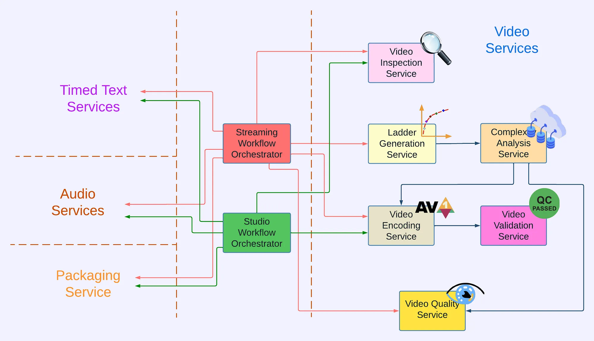
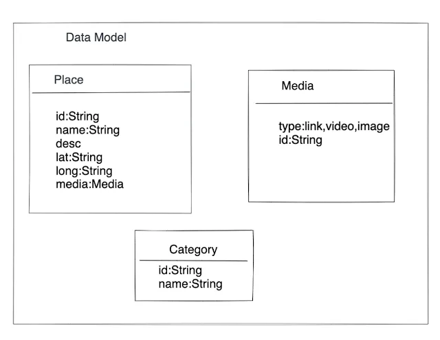
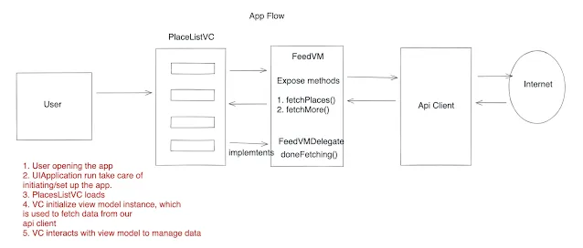

<head>
    
    
</head>

# Table of Contents

1.  [Algorithm](#orga96aa88)
2.  [Review](#org3097946)
    1.  [从 Reloaded 到 Cosmos](#orgb2bb611)
        1.  [重加载](#org8036a36)
        2.  [Cosmos](#org86d4f76)
    2.  [在 Cosmos 中构建视频处理流水线](#orgda1d981)
        1.  [服务边界](#org5a19de7)
        2.  [视频服务](#org9ab6533)
        3.  [服务编排](#org7f7a3c8)
    3.  [我们现在在什么位置](#orge0d7d63)
    4.  [总结](#orgdbbc0a6)
3.  [Tips](#org4edda99)
4.  [Share](#org9f8f036)
    1.  [简介](#org964f119)
    2.  [处理一个系统设计问题](#org42e0524)
    3.  [设计一个应用程序列出你感兴趣的地方列表](#orgfcb819e)
    4.  [总结](#org633211c)

# Algorithm

Leetcode 956: [Tallest Billboard](https://leetcode.com/problems/tallest-billboard/)

<https://dreamume.medium.com/leetcode-956-tallest-billboard-1a37590b7f0c>

# Review

[Rebuilding Netflix Video Processing Pipeline with Microservices](https://netflixtechblog.com/rebuilding-netflix-video-processing-pipeline-with-microservices-4e5e6310e359)

这是 Netflix 如何用微服务重建它的视频处理流水线系列文章的第一篇，所以我们可维护我们小步快速革新和对成员流和视频操作持续改进系统。本篇介绍文章聚焦于整体的概述。后续的文章将提供更深入到每个服务、共享前景和课程学习

Netflix 视频处理流水线从 2007 年在直播中启动我们的流服务。从此，视频流水线的运行有了显著的改进和更广的扩展：

-   在标准定义上从标准动态范围（SDR）开始，我们扩展编码流水线到 4K 和高动态范围（HDR），其启动支持我们的优质提供
-   我们从集中线性编码到分布式块编码。这个架构改动极大地缩减了处理延时和增加了系统适应性
-   从被质量限制的修饰实例移除，我们采用 Netflix 由自动扩展微服务创建内部低点，使得计算弹性和资料利用率有了重要的改进
-   我们首次发布革新比如每标题和每影片优化，对 Netflix 成员提供重要的质量体验（QoE）改进
-   通过集成操作内容系统，我们启动流水线从创新性和创建更紧密成员体验比如交互式故事叙述来杠杆富元数据
-   我们扩展流水线支持来服务我们的操作/内容开发用户事例，其有不同的延时和适应性需求相比较传统的流用户事例

我们最近十多年经验加强了我们的确信，一个高效、灵活的视频处理流水线允许我们革新和支持我们的流服务，和我们的操作合作者，对 Netflix 持续成功是重要的。最后，视频和图像编码团队在编码技术（ET）用最近几年重建了视频处理流水线在我们的下一代基于微服务的技术平台 Cosmos 上

## 从 Reloaded 到 Cosmos

### 重加载

从 2014 年开始，我们在我们的第三代平台 Reloaded 上发展并操作视频处理流水线。Reloaded 是良好架构、提供好的稳定性、扩展性和灵活性的合理水平。它被我们的团队发展作为各种编码革新的基础

当 Reloaded 被设计时，我们聚焦在单个用户用例：转换从操作室接收到的高质量媒体文件压缩为 Netflix 流资产。Reloaded 作为单个单调增长系统被创建，ET 中各个媒体团队开发者和我们的平台合作方内容架构和解决方案（CIS）工作在相同的代码上，构建单个系统处理所有媒体资产。数年后，系统扩展支持各种新的用户用例。这导致系统复杂度显著增长，且 Reloaded 的限制开始显示：

-   耦合的功能：Reloaded 由一组工作模块和一个协作模块组成。新的 Reloaded 模块建立和对写作模块的集成需要化不小的功夫，导致对参数而不是开发新功能创建的偏见。例如，在 Reloaded 中视频质量计算实现在视频编码模块内部。对这个实现，它在不重编码下很难重计算视频质量
-   单调增长结构：因为 Reloaded 模块经常在相同仓库下重定位，它容易忽视代码隔离规则且有跨强边界的不想要重用的代码。这样的重用导致高耦合且减慢开发速度。模块间高耦合进一步使得我们把所有模块弄在一起
-   长发布周期：开发节点意味着对这个开发规模调试和回滚很困难，增长了对不想要的产品出现运行终端的恐惧。这驱使了发布训练处理。每两周，制作一个所有模块的快照，并晋升为发布替补。这个发布替补然后执行全面地测试来尝试覆盖尽可能多的表面问题。这个测试阶段花费两周。这样，取决于代码什么时候合并，它将耗费两到四周来达到发布状态

随着时间和功能的增长，在 Reloaded 中新特性贡献的速度下降。一些承诺的想法由于过大的工作需要克服架构限制而放弃。平台曾经服务很好但现在发展落后了

### Cosmos

作为响应，在 2018 年 CIS 和 ET 团队开始开发下一代平台，Cosmos。对于已经加入 Reloaded 的开发者的扩展性和稳定性，Cosmos 目标是重要增长系统的灵活性和特性开发速度。为达到这些，Cosmos 作为工作流，媒体中心微服务驱动的计算平台来开发

微服务架构在服务之间提供强解偶。每个微服务工作流支持简化实现复杂媒体工作流逻辑。最后，相关抽象允许媒体算法开发者聚焦于音视频信号的操作而不是担心基础架构。一个 Cosmos 提供的好处的可理解列表可在 [博客](https://netflixtechblog.com/the-netflix-cosmos-platform-35c14d9351ad) 中查看

## 在 Cosmos 中构建视频处理流水线

### 服务边界

在微服务架构中，一个系统由一系列服务组成，每个服务聚焦于单个功能。这样第一件事（最重要的）是确定边界和定义服务

在我们的流水线，媒体资产从创建到吸收到转发，经过一些处理步骤比如分析和转换。我们分析这些处理步骤来确定边界和把它们分组到不同的域，这也就变成我们用的微服务的构建块

举一个例子，在 Reloaded，视频编码模块捆绑了 5 个步骤：

1.  分割输入视频为小块
2.  独立编码每个小块
3.  计算每个小块的质量分数（VMAF）
4.  组装所有编码块为一个单独编码视频
5.  总计所有块的质量分数

从一个系统来看，组装编码视频由于存在在内部分块和分割块编码为了填满某种延迟和适应性需求而成为主要忧虑。进一步，包括以上所有的，视频质量计算提供一个总的分离功能作为对编码服务的比较

这样，在 Cosmos，我们创建两个独立微服务：视频编码服务（VES）和视频质量服务（VQS），每个都是清晰解偶的功能。作为实现细节，块编码和组装被抽象放入 VES

### 视频服务

以上处理被应用在视频处理流水线的其他方面来确定功能和服务边界，导致如下视频服务的创建

1.  视频审查服务（VIS）：这个服务有一个夹层作为输入且执行各种审查。它提取夹层不同层的元数据作为下流服务。另外，审查服务会标识有问题如果无效或不期望的元数据被发现且提供有行动能力的反馈给上流团队
2.  复杂分析服务（CAS）：优化的编码诀窍是高度依赖内容的。这个服务有一个夹层作为输入且执行分析来理解内容复杂度。它调用视频编码服务来预编码和视频质量服务来评估质量。结果保存到数据库以便重使用
3.  梯子生成服务（LGS）：这个服务创建给定编码家族（H.264，AV1 等）一整个比特率梯子。它从 CAS 获取复杂度数据和运行优化算法来创建编码步骤。CAS 和 LGS 覆盖了在之前技术博客（每标题，移动编码，每影片，优化 4K 编码 等）中呈现的很多革新。通过包装梯子生成到独立微服务（LGS），我们从复杂分析数据（在 CAS 中）的创建和管理中解偶梯子优化算法。我们期望这给我们带来实验和更快速度革新的更大自由度
4.  视频编码服务（VES）：这个服务有一个夹层且一个编码步骤和创建一个编码视频。步骤包括想要的编码格式和输出属性，比如清晰度，比特率等。服务也提供允许良好延时、吞吐等选项，这取决于用例
5.  视频验证服务（VVS）：这个服务有一个加密视频和编码期望列表。这些期望包括在编码步骤中特殊的属性也就是编解码说明中的舒适需求。VVS 分析编码后的视频和比较结果与显示的期望。任何差异将标示在响应中警告调用者
6.  视频质量服务（VQS）：这个服务有一个夹层且把编码后的视频作为输入，计算编码后的视频质量分数（VMAF）

### 服务编排

每个视频服务提供一个专门的功能且它们一起工作来产生需要的视频资产。当前，Netflix 视频流水线的两个主要的用例是生产成员流资产和工作室操作。对每个用例，我们创建一个专门的工作流编排这样服务编排可自定义来最好地匹配对应的业务需要

对流用例，生成的视频被用于我们 Netflix 成员的内容转发网络（CDN）来消费。这些视频可轻易地被数百万次观看。流工作流编排利用几乎所有视频服务来创建一个有完美成员体验的流。它平衡 VIS 来检测且拒绝不符合说明或低质量的携带物，调用 LGS 来质量度量，质量数据进一步给到 Netflix 的数据流水线来分析和监控。另外对视频服务，流工作流编排使用音频和时间化的文本服务来产生音频和文本资产，且打包服务到装运流资产

对工作室用例，一些例子视频资产有市场性裁剪和每日产品编辑代理。从工作室来的这些需求一般对延时敏感。例如，产品团队的一些人可能等待视频审核这样他们可决定第二天的上映计划。因此，工作室工作流编排对快速改变优化和聚焦在核心媒体处理服务上。这次，工作室工作流编排调用 VIS 来提取吸收资产的元数据且用预定义技巧调用 VES。和成员流相比，工作室操作对视频处理有不同且唯一的需求。因此，工作室工作流编排排除用户一些编码特性比如有法律效应的水印和内建的时间代码/文本

## 我们现在在什么位置

我们有新视频流水线在生产环境和 Reloaded 一起运行数年了。在这个时间过程中，我们完成了所有从 Reloaded 必要的功能迁移，开始每次一个用例的迁移流量，且在 2023 年 9 月完成转换

虽然还是在早期，我们已看到新平台的好处，特别是特性转发的简易性。特别是，Netflix 在 2022 年 11 月启动了广告支持计划。处理广告创新有一些新的挑战：广告的媒体格式非常不同于团队所熟悉的电影和 TV，且一个相关业务的新媒体处理需求系列需要广告。对 Cosmos 的模块化和开发者产品利益，我们能够快速迭代流水线来保持需求改变和支持一个成功的产品启动

## 总结

重建视频流水线对团队来说是一个巨大的任务。我们非常骄傲我们取得的成果，且也渴望在技术社区分享我们的旅行。这个博客聚焦于提供一个概览：我们的流水线和平台的简史，为什么必须重构，新服务是什么，它们如何在 Netflix 业务中被使用。下个博客，我们将深入视频编码服务（VES）的细节，一步步解释服务的创建，且分享课程学习

# Tips

[System Design Interview - Notification Service](https://www.youtube.com/watch?v=bBTPZ9NdSk8)

功能性需求：

-   createTopic(topicName)
-   publish(topicName, message)
-   subscribe(topicName, endpoint)

非功能性需求：

-   可扩展
-   高可用
-   高性能
-   耐用性

对于高层架构，请求要平均分布到服务器，处理这个初始请求的组件是前端服务。我们将使用数据库存储话题和订阅信息。我们将把数据库隐藏在另一个微服务之后，元数据服务。这样做的原因有几个：首先，考虑隔离，一个设计原则告诉我们提供接口访问到数据库，这极大简化将来维护和进行改变的能力。其次，元数据服务将作为数据库和其他组件之间的一个缓存层。我们不想要每个消息发布到系统时连接数据库。我们想要从缓存中提取话题元数据。其次，我们需要存储一定时间的消息。这个时间段将很短如果所有订阅者有效且消息成功发送到所有节点。或我们可需要存储消息稍微长点时间（几天），这样消息可之后被提取如果一些订阅者当前无效。我们需要的另一个组件是从消息存储中提取消息并发送到订阅者。发送者也需要调用元数据服务来提取订阅者的信息。当创建话题和订阅 API 被调用，我们需要存储所有这些信息到数据库

前端服务：

-   一个轻量级 Web 服务
-   跨几个数据中心采用的无状态服务

动作：

-   请求有效性
-   验证/授权
-   TLS（SSL）终止
-   服务端加密
-   缓存
-   限速
-   请求分发
-   请求去重
-   使用数据收集

前端服务的第一个组件是反向代理，其是一个轻量级服务器。其作用比如 SSL 终结，当 HTTPS 请求过来时解密且发送非加密的形式。同时，代理负责加密发送到客户端的响应。第二个职责是压缩（例如用 gzip），代理压缩要返回给客户端的响应。另一个代理的功能是处理服务下降，我们可返回 503 HTTP 状态码（服务无效）如果前端服务变慢或完全不可用。反向代理然后传递请求到前端 Web 服务。对每个已发布的消息，前端服务需要调用元数据服务来获得消息话题的信息。为减少对元数据服务的调用，前端服务可使用本地缓存。我们可使用一些有名的缓存实现（比如 Google Guava）或创建我们自己的 LRU 缓存实现。前端服务也写一堆不同的日志。我们必须记录服务健康信息，记录服务发生的异常，记录度量信息。这是一种键值对之后会总计用来监控服务健康和统计。例如，请求数，故障，调用延时，我们将需要所有这样的信息来监控系统。我们可能也需要写信息用来审查，例如记录谁和什么时候生成请求到系统中一个特殊的 API。实际的日志数据处理由其他组件管理，通常称为代理。代理负责数据聚集和传输日志到其他系统，为后处理和存储。这个职责的分离使得前端服务简化，更快和更健壮

通知系统的另一个组件是元数据服务，负责存储话题和订阅信息到数据库：

-   在前端服务和持久化存储之间一个分布式缓存层
    
    每个前端主机计算一个哈希，例如 MD5 哈希，使用一些键，例如话题名和话题所有者唯一识别码的组合。基于这个哈希前端主机拿到对应的元数据服务主机。这里一个选项是引入一个组件负责协调。这个组件知道所有元数据服务主机，这些主机发送心跳到该组件。每个前端主机向配置服务询问哪个元数据服务主机包含特殊的哈希值。每次我们扩展且添加更多元数据服务主机，配置服务知道这个改变并重映射哈希键范围。另一个选项是我们不使用任何协调器。我们确保每个前端主机可包含所有元数据服务主机的信息。当更多元数据服务主机添加或由于硬件故障死亡时每个前端主机都会被通知。存在不同的机制帮助前端主机发现元数据服务主机。比如可用 Gossip 协议
-   多读少写

前端服务处理完之后，会传递给一个临时存储服务。因为消息在这个存储中只存在很短的时间，很快我们可转发消息到订阅者，除非话题被以某个延迟来转发。对于临时存储服务：

-   快速、高可用且可扩展的 Web 服务
-   存储消息几天时间来处理订阅者无效的情况
    
    一些选项可考虑，尝试引导面试官和你之间的谈话。你可讨论数据库，SQL 和 NoSQL 的优缺点，评估不同 NoSQL 数据库类型且给出特别的数据库产品名称到面试官。例如，当我们考虑用 SQL 或 NoSQL 存储消息时，我们可提及我们不需要 ACID 交易，我们不需要运行复杂动态查询，我们不计划使用这个存储来分析或做数据仓库。我们需要数据库对读写易扩展。应该高可用且容忍网络分区。因此，NoSQL 是好的选择。如果我们需要选择一个特别的 NoSQL 数据库类型，我们需要提及消息有有限的大小（我们假设不超过 1 MB），意味着我们不需要文档存储。且消息间没有特别的关系。这样，我们可以排除图类型。这样只剩下列或键值对数据库类型。例如，你可以提及 Apache Cassandra 和 Amazon DynamoDB
    
    另一个我们可评估的选项是内存存储。我们最好选择一个内存存储支持持久化，这样消息可在丢弃之前存活几天。也可以提及一些好的内存存储解决方案比如 Redis
    
    还有一个可考虑的选项是消息队列。分布式消息队列有所有我们需要的特征且可以讨论更多一些细节
    
    如果你想让面试官对你印象深刻，你可以提及一些进一步的选项，比如流处理平台。讨论优缺点并比较这个选项和分布式队列解决方案。当然，不要忘记提及一些有名的方案，比如 Apache Kafka 和 Amazon Kinesis

当消息存储了之后，就可以发送出去。现在我们看一下发送者组件

发送者做的第一件事是获取消息。这通过线程池达成，每个线程尝试读取临时存储中的数据。我们可实现一个本地处理且总是开始一个预定数量消息的获取线程。这个处理的问题是有些线程可能是空闲的，它们可能没有足够的消息来获取。或一个极端的例子，所有的线程都被占据，只有通过添加新的更多的发送者主机解决。一个更好点的处理是跟踪空闲线程，动态挑战获取消息的线程数。如果我们有太多空闲线程，则没法创建新线程。如果所有线程都忙，池中更多的线程可以开始读消息。这不只帮助扩展发送者服务，它也保护临时存储服务被发送者服务所轰炸。当临时存储服务体验性能降级时这非常有帮助，且发送者服务可降低消息读取速度来帮助临时存储服务来快速恢复。我们如何实现这个自动扩展解决方案？信号量是一个好办法。一个信号量维护一系列许可。在获取下一个消息前，线程必须从信号量获取一个许可。当线程完成读取消息后，一个许可返回给信号量，允许池中另一个线程开始读取消息。我们能做的是动态调整许可数量，基于存在和想要的消息读取速度

在消息被读取后，我们需要调用元数据服务来获得订阅者信息。可能，一些人可能疑问为什么这里需要调用元数据服务，如果我们已经在前端服务调用，且已经传递订阅者信息及消息。一个主要原因是消息本身不传递这个信息，订阅者列表可能相对较大。例如，几千个 HTTP 端点，或邮件地址的一个长列表。我们将需要存储所有这个信息及每个进来的消息，我们的临时存储服务将需要支付这个价格。不是所有键值对和列存储可存储大消息，可能需要我们使用文档数据库

在我们获得订阅者列表之后，我们可开始发送消息到所有订阅者。我们迭代订阅者列表且对每个发起一个远程调用吗？如果消息转发到某个订阅者失败我们应该怎么办？如果一个订阅者很慢且转发给其他订阅者被这个影响？一个更高的选项是分割消息转发到任务。每个任务负责转发一个订阅者。这样我们可并行转发所有消息且隔绝任何不好的订阅者。这样，让我们引入两个新的组件 - 任务创建和执行。这两个组件负责创建和调度单个消息转发任务。我们如何实现这两个组件？任务可代理实际的转发到其他微服务。例如，一个微服务负责发送电子邮件或 SMS 消息

其他一些重要的点：

-   我们要对垃圾邮件发送者构建一个解决方案吗？
-   重复的消息
-   重试转发尝试
-   消息顺序
-   安全

# Share

[System Design Interview For Mobile Engineers](https://medium.com/geekculture/system-design-interview-for-mobile-engineers-ce712d6ac2c1)

## 简介

当你在软件工程获得资历时，系统设计面试变成最重要的面试。这个面试聚焦于你的能力作为一个工程师在整体上看到和理解应用程序设计。你被期望从高视点看到且深入到独立的组件

在本文中，我分享我的诀窍用例子处理系统设计面试问题

我发现系统设计面试很有趣因为它们最注重实际、整体论且包含很好的交流技巧

## 处理一个系统设计问题

我看了不同的系统设计面试指南且做了我自己的脚注来适合像我这样的移动开发者。这是一个全面的列表，一些对我有用的。所以这里是我用来追踪系统设计问题的不同阶段的概述

1.  功能性需求 - 定义用例和一些应用程序特性
2.  非功能性需求 - 定义性能，经验和可扩展需求
3.  假设 - 定义问题边界，任何扩展限制，特性等
4.  客户端服务器通信 - 定义连接选项比如 HTTP 请求，polling，服务端侧事件
5.  API 设计 - 定义你构建的特性端点
6.  数据模型 - 定义对象的数据模型字段
7.  应用程序流（用例流） - 定义且遍历你设计的特性的用户流
8.  性能 & 工具 - 定义你将如何收集数据和测量来看到应用程序如何执行 - 内存使用率，CPU 使用率
9.  ADA - 确保你定义残疾人特性且应用程序将如何被使用
10. 国际化 - 你将如何处理应用程序的国际化增长
11. 安全 - 定义你将如何使应用程序安全

现在，让我们处理一个系统设计问题例子来解释如何学习这个结构

## 设计一个应用程序列出你感兴趣的地方列表

1.  功能性需求
    -   显示你感兴趣的地方列表
    
    -   当滑动时加载更多

2.  非功能性需求
    -   列表应该加载很快或有很低的延迟
    
    -   列表不应该抖动
    
    -   应该滑动平滑

3.  假设
    -   每日活跃用户多少？
    
    -   API 是有效的，我们需要谨慎使用它们

4.  客户端服务器通信
    
    以下是客户端跟服务器通信主要的方法/协议。向面试官定义这些，你准备使用哪个。对我们的用例常规的 http 请求即可，但我们分享所有选项且为什么你想要使用一个服务器
    
    -   常规 HTTP 请求 - 这是最常见的一般用例场景，一个客户端从服务器请求数据/资源。例如，获取订阅列表中订阅项
    
    -   Polling - 这种通信方式有如下一些特色
    
    -   常规 Polling - 客户端可保持发送请求到服务器来获取最新但大多数时候服务器可能没有任何更新。这不仅导致大多数时得到空的响应也浪费了资源多次启动 HTTP 连接
    
    -   长 Polling - 如果我们有一个用例我们知道我们不会频繁从服务器更新。这种情况下，我们可使用长 polling。客户端将建立一个到服务器的 HTTP 连接，且保持连接到服务器是打开的这样服务器可推送更新到客户端。这种方式我们节省无用的与服务器的打开和关闭连接。这种长连接也可能超时，这样我们需要重新初始化连接
    
    -   WebSockets - 客户端和服务器都可初始化通信且我们可使用 WebSockets 在服务器和客户端之间通信。一个好的例子即为聊天应用程序
    
    -   服务端侧事件（SSE） - 客户端建立与服务器的持久性长连接。这个连接被用于服务器发送数据。客户端在监听模式只有服务器可与客户端通信。如果客户端请求通信服务器，它需要使用一个不同的协议。这样的用例可认为，我们有一个社交媒体应用程序列出我们的朋友列表。但现在如果有一个升级且只发生在应用程序使用中，客户端可用服务端侧事件（SSE）协议来获得更新

5.  API 设计
    
    API 通过协议相互通信。常见的协议有 SOAP, REST, 和 GraphQL。对我们这里的用例，REST 应该是一个好的选择且它是多数用例的选择。基于我们的如下需求可知：
    
    1.  我们需要一个地方的列表
    
    2.  因为我们列出附近的地方，首先想到的是 API 调用需要一些位置排序来返回数据。这可以是我们的查询参数
    
    3.  考虑这是一个移动应用程序且我们没有无限的资源如计算/连接和性能如桌面或笔记本，我们需要小心我们要获取的数据总数。这样只获取部分资源且当我们需要时再获取更多。这样我们需要请求数据片段的能力，这就是为什么要有页码的原因。偏移，键集合和游标是服务器支持的不同页码类型
        
        对我们的用例，我们可使用其中一个，但确保你理解页码如何工作。我们将使用偏移页码。这样我们将有一个页号和页面限制来确定资源数。我们的 API 如下：
        
            GET - /places?lat={}&long={}&page={}&pageLimit={}

6.  数据模型
    
    在本节，我们将用潜在的数据模型来对应我们的用例。考虑我们获得一个地方的列表我们的数据模型如下：
    
    

7.  应用程序流
    
    在本节，我们谈论我们的应用程序流。我们可使用任意适合我们需要的设计模式。它可以是 MVC，MVVM，MVP，VIPER 等。对我们的简单用例，我使用 MVVM
    
    

8.  性能
    
    本节处理非功能性需求和任何其他性能相关事项。在本节，我们谈论我们可使我们的应用程序性能更好的所有方法
    
    1.  显示概要 - 感知注意到一些事情在加载使得用户感觉数据加载更快。显示一些概要块当当数据加载对用户的感知体验有大的影响时
    
    2.  用合适的尺寸显示图片。如果 API 支持高度和宽度作为查询参数则你可获取适合你移动设备的资源。用户的眼镜察觉不到不同图像大小的不同但它对应用程序的性能有大的影响因为你加载的数据少了
    
    3.  对静态图像缓存使用 CDN 会更快。在我们的用例中使用对图像和静态内容使用 CDN，这将缓存位置信息和图像
    
    4.  在后台线程加载数据，这样主线程不会阻塞且 UI 使用平滑
        
        这些是一些好的性能练习，还有其他一些你可在面试时深入

9.  Accessibility
    
    我们总是想要每个人都使用我们的应用程序。以下是一些事情用来处理 accessibility
    
    1.  使用库的自动检查，例如：GTXilib 使得他们可确保每个 UI 元素有一个标签，适合的特征，标签不是冗余的
    
    2.  确保颜色差异是对的
    
    3.  每个目标大小至少 44pt
    
    4.  对 accessibility 上门服务添加自定义呼叫
    
    5.  使用适合的颜色方案
    
    6.  支持动态字体类型
        
        以上我提及的练习可应用到任意移动应用程序

10. 国际化/本地化
    
    应用程序的国际化对长期使用和适用应用程序的用户一个本地和私人的体验。通常，我们可通过应用程序中不同的本地化字符串文件来支持。你也可使用高级技术比如你发送你的设备本地信息到服务器且服务器返回本地文件。取决于你的需求，你可用不同的路由来实现本地化

11. 安全
    
    作为移动开发者，对安全有一些技巧。可查看这个链接：[关于安全](https://www.shashankthakur.dev/2020/09/how-to-make-ios-app-secure.html)

## 总结

系统设计聚焦作为一个工程师从整体上理解应用程序设计的能力而不是基于个人的经验。当处理一个系统设计问题时没有对错。更重要的是知道方法和实现一个确定集合的需求
