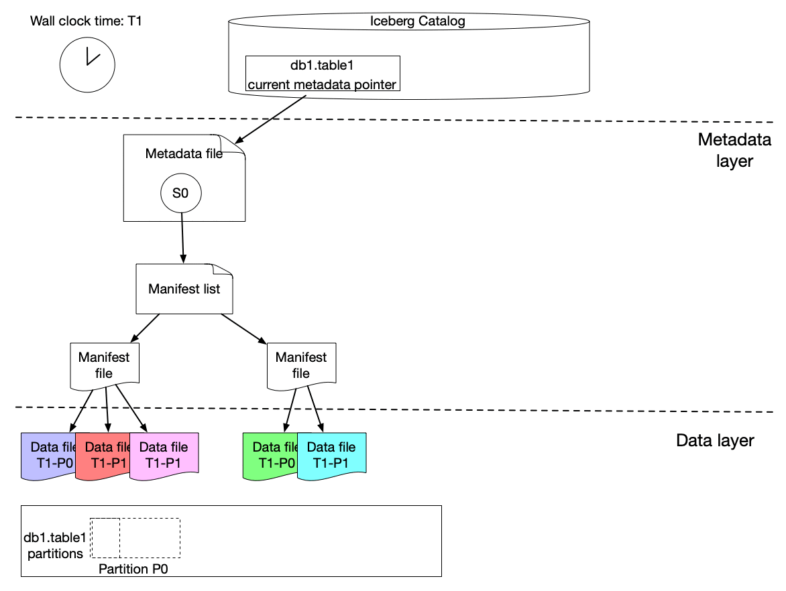
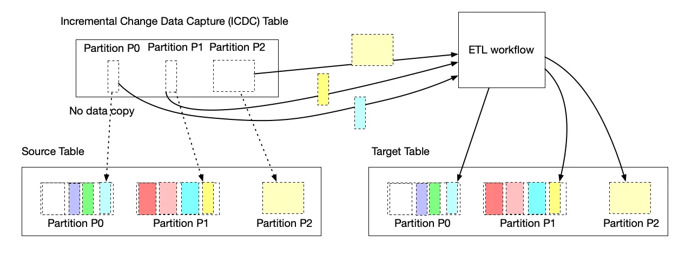
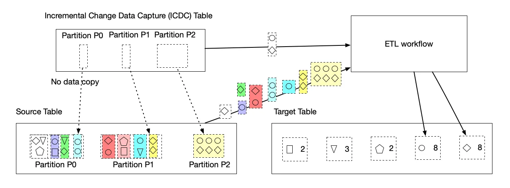

<head>
    
    
</head>

# Table of Contents

1.  [Algorithm](#org8b04544)
2.  [Review](#orgfe0cd1c)
    1.  [简介](#org69e9911)
    2.  [处理概述](#orgb554c4a)
        1.  [一般概念](#orgd1b8c32)
        2.  [Netflix Maestro](#org967d0b9)
        3.  [Apache Iceberg](#orgc5e0818)
        4.  [递增改变捕获设计](#org3670db8)
        5.  [主要优势](#orgb2a804b)
    3.  [合并递增处理范型](#orgb748596)
        1.  [递增处理捕获的递增改变数据和直接添加它们到目标表](#orgf990b93)
        2.  [使用捕获递增改变数据作为底层过滤列表来删除不需要的转换](#org272faa1)
3.  [Tips](#org071414d)
4.  [Share](#org2b6c6f4)

# Algorithm

Leetcode 3017: [Count the Number of House at a Certain Distance II](https://leetcode.com/problems/count-the-number-of-houses-at-a-certain-distance-ii/)

<https://dreamume.medium.com/leetcode-3017-count-the-number-of-house-at-a-certain-distance-ii-5ca5a363e2e4>

# Review

[Incremental Processing using Netflix Maestro and Apache Iceberg](https://netflixtechblog.com/incremental-processing-using-netflix-maestro-and-apache-iceberg-b8ba072ddeeb)

递增地进程是在工作流中处理新或改变的数据一种处理。关键的优势是它只递增地处理新添加或更新到一个数据集的数据，而不是重处理完整的数据集。这不只减少了计算资源的成本但也以显著的方式缩减了执行时间。当工作流执行有更短的时长，失败的机会和手工干预都会减少。它也通过简化现有的工作流和解锁新的范型来改进了工程生产率

本博客中，我们谈论在 Netflix 中工作流的落地和挑战。我们将显示我们如何通过使用 Netflix Maestro 和 Apache Iceberg 构建一个清晰和高效的递增处理解决方案（IPS）。IPS 提供数据精度、数据刷新和在工作流中回填用户和处理许多挑战的递增处理支持。IPS 启动用户用最小的改变继续使用数据处理范型

## 简介

Netflix 在所有阶段都依赖数据来强化它的业务。是否在分析 A/B 测试，优化工作室产品，训练算法，在内容获取，检测安全缺陷或优化支付，结构化和精确数据上都是基础的。当我们的业务全球扩展，数据需求地增长和可扩展地递增处理低延时开始并在一起。数据集拥有者通常面对三个常见的问题：

-   数据新鲜：iceberg 表中的大数据集需要快速处理和精确产生洞察来启动更快的产品决策。小时级的处理语法及通过数据平台工具提供的时间戳验证有效性的水印或数据信号显著满足很多用例，但对低延时批处理不是最好的。在 IPS 之前，数据平台没有追踪状态和数据集进度作为一个解决方案易于使用。这导致了一些内部解决方案比如 Psyberg。这些内部库通过捕获改变的分区处理数据，其只工作在特殊的用例上。另外，库跟用户业务逻辑紧密耦合，常常导致更高的迁移成本，维护成本和需要数据平台团队更重的协调工作
-   数据精确度：迟到的数据导致数据集处理在过去的时候，使得数据变得不完整和结果不精确。为补偿，ETL 工作流常常使用一个回看窗口，基于在某个时间窗口上重处理数据。例如，一个工作重处理过去 3 天聚集的数据因为它假设有迟到的数据，但 3 天之前的数据不值得重处理
-   回填：回填数据集在大数据处理时是一个常见的操作。这需要在调度处理前重产生一个历史时间段的数据。回填需要由各种因素导致，例如（1）上流数据集由于业务逻辑它的数据流水线改变导致重生成（2）数据流水线中业务逻辑改变（3）一个新的度量被创建需要产生一段历史时间范围数据（4）历史数据被发现丢失 等

这些挑战当前作为子优化处理且通过独立本地团队以更少成本高效的方式填满需求，比如

-   回看：这是一个一般化且简单的处理，数据工程师用来解决数据精度问题。用户配置工作流来读窗口中的数据（例如，过去 3 小时或 10 天）。窗口基于用户域知识设置以便用户有高自信使得迟到的数据将被包含或没关系（例如，数据太晚到达很有用）。它确保时间和技术资源的正确性
-   每范型：用户构建使用 Maestro 支持的回填工作流。对单个工作流产生的回填数据工作很好。如果流水线有多个阶段或多个下流工作流，用户不得不对每个手工创建回填工作流且需要重要的手工操作

这里的递增处理解决方案（IPS）描述为被设计处理以上的问题。设计目标是提供一个清晰且容易采用的解决方案来处理递增处理来确保数据新鲜度，数据精确度和提供容易的回填支持

-   数据新鲜度：在微批处理方式（例如，15 分钟间隔）及带状态追踪功能下提供对调度工作流的支持
-   数据精确度：提供处理所有迟到数据的支持来获得多模时间和成本高效下有显著改进性能的业务需要的数据精确度
-   回填：提供被管理的回填支持来构建，监控和有效化回填，包括自动从上流到下流工作流中繁殖变动，来极大地改进工程产品化（例如，几天或几周的工程工作来构建回填工作流 vs 被管理的回填的一个点击）

## 处理概述

### 一般概念

递增过程是批处理数据的方法 - 但只针对新和修改的数据。为支持递增过程，我们不只需要捕获递增数据改变的处理也需要跟踪它们的状态（例如，是否一个改变被一个工作流处理或未处理）。它必须知晓改变且从源表中捕获改变且然后保持追踪这些改变。这里，改变意味着比新数据本身更多。例如，在聚集目标表上的一行需要从源表与聚集行相关的所有行。同样，如果有多个源表，通常从所有输入表的改变数据的联合给出了完整的改变数据集。这样，改变信息的捕获必须包括在源表中未改变行的所有相关数据。由于之前提及的复杂度，改变追踪不能简单通过使用一个单一水印获得。IPS 必须以很好的粒度追踪这些捕获的改变

从源表中的改变可能影响各种方式下目标表的转换结果

-   如果目标表中的一行源于源表中的一行，新捕获数据的改变将完整化工作流流水线的输入数据集
-   如果目标表中一行源于源表的多行，捕获新数据将只告诉我们行不得不重处理。但需要 ETL 的数据集超过改变数据本身。例如，一个基于账号 ID 的聚集需要源表中关于该账号 ID 的所有行。改变数据集将告诉我们哪个账号 ID 被改变且然后用户业务逻辑需要在改变数据中加载那些账号 ID 相关的所有数据
-   如果目标表中的一行源于数据超过了改变数据集，例如，源表和其他表的集合，新的捕获数据依然有用且可显示一段范围数据被影响。然后工作流将基于范围重处理数据。例如，假设我们有一个表保持被该天对给定账号分区的聚集的时间的视图。如果视图时间是 3 天前由于迟到而现在才更新，则对接下来两天的视图时间必须重计算这个账号。这种情况下，迟到捕获的数据将告诉我们开始重计算，其比通过猜测估计过去 X 天的重计算所有更精确，X 是通过业务域知识决定的一个截断回看窗口

一旦改变信息（数据或范围）被捕获，一个工作流不得不用一个更复杂的方式写数据到目标表因为简单的插入覆写方式不起作用。有两个替代方案：

-   合并范型：在一些计算框架，例如，Spark 3，支持 MERGE INTO 来允许新数据被合并到现存的数据集。对递增处理能解决写的问题。注意工作流/步骤当使用 MERGE INTO 时可安全重启不用担心重复数据被插入
-   追加范型：用户可只使用追加写（例如，INSERT INTO）来添加新数据到现存的数据集。一旦处理完成，追加的数据被提交到表。如果用户想要重跑或重构建数据集，它们将跑一个回填工作流来完成覆写目标数据集（例如，INSERT OVERWRITE）

另外，IPS 在很多用例下将自然地支持回填。下流工作流（如果没有业务逻辑改变）将由于回填而触发数据改变。这启动在多阶段下流水线的回填数据的自动广播。注意回填支持在本博客中不会谈及，这将放在另一个博客中

### Netflix Maestro

Maestro 是 Netflix 数据工作流编排平台，构建来满足当前和未来 Netflix 的需要。它是一般化目的工作流编排器在 Netflix 提供一个完全管理工作流作为服务（WAAS）到数据平台用户。它服务数千用户，包括数据科学家，数据工程师，机器学习工程师，软件工程师，内容生产者和业务分析师，在各种用例中，Maestro 是一个高可扩展和可扩充来支持现存和新的用例和提供加强的使用能力给终端用户

自从上个博客 [Maestro](https://netflixtechblog.com/orchestrating-data-ml-workflows-at-scale-with-netflix-maestro-aaa2b41b800c)，我们已迁移所有工作流到它上面且只给用户最小的干扰。Maestro 在生产线上完全使用了 100% 的工作负载

IPS 通过添加两个构建块构建在 Maestro 上作为一个扩展，例如，一个新的触发机制和步骤任务类型，来启动所有工作流的递增处理。它以最小的成本无缝集成整个 Maestro 生态系统

### Apache Iceberg

Iceberg 是巨型分析表的一个高性能格式。Iceberg 带来可靠性和对大数据 SQL 表的简化，同时使得它可能同时对引擎如 Spark，trino，Flink，Presto，Hive 和 Impala 相同表的安全地工作。它支持表达式 SQL，全 schema 演绎，隐藏分区，数据压缩和时间旅行 & 回滚。在 IPS 中，我们平衡 Apache Iceberg 提供的丰富的特性来开发一个轻量级的处理来捕获表的改变

### 递增改变捕获设计

使用 Netflix Maestro 和 Apache Iceberg，我们创建了一个新颖的解决方案来递增处理，在不拷贝任何数据的情况下以一种超轻量的方式提供递增改变（数据和范围）捕获。在我们的探索中，我们看到一个巨大的机会高效改进成本且使用递增处理工程化产品

这里是我们构建在 Apache Iceberg 特性之上的解决方案获得递增改变捕获。我们知道，一个 Iceberg 表包含一个元数据集合快照的列表快照包含引用到实践的不可改变数据文件。一个快照可包含不同分区的数据文件

上图显示 s0 包含 T1 中分区 P0 和 P1 的数据。然后在 T2，一个新的快照 s1 被提交到表，带了一些新的数据文件列表，包括分区 P0 和 P1 后达到的数据和 P2 分区的数据

我们实现一个轻量级的处理来创建一个 Iceberg 表（被称为 ICDC 表），有它自己的快照但只包含从源表中新的数据文件引用而不是拷贝数据文件。它只有一个低的成本很高效。然后工作流流水线可只加载 ICDC 表来只处理 P0、P1、P2 分区中的改变数据，而不处理 P0 和 P1 中未改变的数据。同时，改变范围也从特别数据领域捕获作为 Iceberg 表元数据包含每个数据文件每个数据领域的上下界信息。更多地是，IPS 将跟踪每个工作流以数据文件为粒度的改变

这个轻量级处理无缝集成 Maestro 来允许所有调度者用户来使用这个新构建块（例如，递增处理）在他们的上万个工作流中。每个工作流使用 IPS 将被注入一个表参数，为轻量级 ICDC 表中表名。ICDC 表只包含改变数据。另外，如果工作流需要改变范围，一个参数列表将被注入到用户工作流来包含改变范围信息。递增处理可通过一个新的步骤任务类型（ICDC）和/或一个新的递增触发机制启动。用户可以和所有现存的 Maestro 特性一起使用它们，例如，每个范型，步骤依赖基于通过时间戳有效的水印，写审查发布模版范型，等等

### 主要优势

对于这个设计，用户工作流可以很小的成本采用递增处理。用户业务逻辑也从 IPS 实现中解偶。多阶段流水线也可混合递增处理工作流与现存的正常工作流。我们也发现用户工作流通过使用 IPS 删除额外步骤可被简化来处理回看窗口的复杂度或调用一些内部库

添加递增处理特性到 Netflix Maestro 作为用户新的特性/构建块将启动用户构建他们的工作流以一个更高效的方式且连接差异来以更简单的方法解决许多挑战性问题（例如，处理后达数据）

## 合并递增处理范型

当把用户流水线上到 IPS，我们发现一些递增处理范型：

### 递增处理捕获的递增改变数据和直接添加它们到目标表

这是直接递增处理用例，改变数据携带数据处理所有需要的信息。上流改变（通常从一个单个源表）被广播到下流（通常另一个目标表）且工作流流水线只需要处理改变数据（可以和其他维度表 join）且然后合并到（通常添加）目标表。这个范型将替代回看窗口范型来照看后达数据。而不是使用一个回看窗口范型覆盖过去 X 天完整数据，用户工作流只需要通过处理 IDCT 表合并改变数据（包括后达数据）到目标表

### 使用捕获递增改变数据作为底层过滤列表来删除不需要的转换

ETL 任务通常需要基于某个 group-by 键聚集数据。改变数据由于从源表新加载数据将需要一个重聚集披露所有 group-by 的键。然后 ETL 任务可通过使用 ICDC 作为一个过滤器用那些 group-by 键 join 源表和 ICDC 表来加速处理启动一个更小数据集合的计算。没有业务转换逻辑的改变和 ETL 工作流的重设计。ETL 流水线保持了批量工作流的所有好处

# Tips

[System Design Interview - Distributed Message Queue](https://www.youtube.com/watch?v=iJLL-KPqBpM)

有两个 Web 服务被称作生产者和消费者，且它们需要相互通信。一个选项是建立一个异步通信，当生产者发起一个调用到消费者且等待回复。这个处理有它的优点和缺点。同步通信简单且更快能实现。同时同步通信很难处理消费者故障。我们需要思考什么时候和怎么合适地重试失败的请求，如何不被过多请求过载消费者服务且如何处理一个慢的消费者服务主机。另一个选项是引入一个新的组件帮助建立异步通信。生产者发送数据到那个组件且只有一个消费者之后获得这个数据。这样的组件被称为队列。且它是分布式的，因为数据存储在跨多个机器上。队列中消息只能发给一个消费者处理

功能性需求：

-   sendMessage(messageBody)
-   receiveMessage()

非功能性需求：

-   可扩展性（处理增长地负载，更多的队列和消息）
-   高可用（容忍硬件/网络故障）
-   高性能（对主要的操作有低延迟）
-   耐久性（一旦提交，数据不会丢失）

高层架构

首先，我们需要一个虚拟 IP，VIP 代表一个主机名（例如 myWebService.domain.com）解析为一个负载均衡系统。接下来，我们有一个负载均衡器。接着，我们有一个前端 Web 服务，其负责初始化请求处理，比如验证，鉴权等。队列元信息比如它的名字，创建日期和时间，拥有者和其他配置设置可存储在数据库中。在数据库之前有一个 Web 服务负责调用到数据库。且我们需要一个地方存储队列消息。这样让我们引入一个后端 Web 服务，负责消息持久化和处理

我们将解释负载均衡器如何获得高吞吐和有效性。当命中域名时，请求被传输到 DNS 注册的一个 VIP 中，VIP 被解析为一个负载均衡设备，其知道前端主机的信息。为处理高有效性，负载均衡器利用一个主和副节点的概念。主节点接受连接且服务请求当第二节点监控主节点。如果主节点不能接受连接，则副节点接管。对可扩展性，多 VIP 的概念（VIP 分区）可使用。在 DNS 中我们对服务赋值多个 A 记录到相同的 DNS 名。结果，请求分区跨几个加载均衡器。通过扩展负载均衡器到多个数据中心，我们改进了有效性和性能

前端 Web 服务：

-   一个轻量级 Web 服务
-   跨多个数据中心使用无状态服务

前端 Web 服务行为：

-   请求有效性
    
    确保请求中有所有需要的参数且参数值符合限制
-   验证/鉴权
    
    验证消息发送者是我们的分布式队列服务中注册过的用户。检查用户可以发送消息到队列
-   TLS（SSL）终止
    
    解密请求且传送解密的请求到后端服务。我们在这里做解密是因为在负载均衡上做负担很重。这个处理通常不被前端服务本身处理，而是交给一个独立的 HTTP 代理，其作为一个进程运行在相同的主机上
-   服务端加密
    
    因为我们想要在后端主机安全地存储消息，消息在前端服务一接受到之后就被加密。消息被以加密形式存储且前端解密它们当要发送回用户时
-   缓冲
    
    存储最活跃使用队列中的元数据信息。用户唯一信息
-   限速
    
    限制给定时间段内提交到一个给定操作的数量。保护 Web 服务不被请求过载。Leaky Bucket 算法是最著名的一个
-   请求分派
    
    负载所有涉及到发送请求到后端服务的活动，服务独立隔离，互不影响
-   请求去重
    
    缓存被用来存储之前看到的请求 ID 来避免重复
-   使用数据收集
    
    收集实时信息用来审查和用于发票

元数据服务

-   在前端和持久化存储之间的一个缓冲层
-   多读少写
-   强一致性存储更好但不是必要的

让我们看一下组织缓存簇的不同处理。第一个选项是当缓存相对小且我们可存储整个数据集在每个簇节点上。前端主机调用一个随机选择的元数据服务主机，因为所有缓存簇节点有相同的信息。第二个处理是分区数据为小块，称为切片。因为数据集太大且不能放入单个主机内存中。这样，我们存储每个这样的块数据在簇中单独的主机上。前端知道哪个切片存储的数据且直接调用该切片。第三个选项跟第二个相似。我们也分区数据为切片，但前端不知道在哪个切片存储，前端调用一个随机元数据服务主机且主机本身知道请求怎么转发。在第一个选项中，我们可在前端和元数据服务之间引入一个负载均衡器。在后两个选项中，元数据主机呈现一个一致哈希环

后端服务

-   我们如何和在哪里存储消息？
    
    后端主机的内存和本地磁盘
-   我们如何复制数据？
    
    复制到一组主机
-   前端如何选择一个后端主机来发送数据？前端如何知道从哪里获取数据？
    
    元数据服务

后端服务

第一个选项是用领导者跟随者模式。当请求发送到前端，前端查询元数据服务来获得领导者主机，然后请求转发给领导者主机，其再广播给其他跟随者。这里涉及到领导者选举问题。簇管理者负责配置队列，领导者及跟随者。簇管理者是一个复杂的组件，它必须可靠、可扩展和有好的性能。第二个选项，我们有一系列小簇，每个簇包含 3 - 4 个机器分布跨几个数据中心。当请求到了前端，前端调用元数据服务来确定哪个簇负责存储来自队列 1 的消息。然后我们随机选中簇中一个实例调用，该实例负责复制数据到簇中其他节点。这样我们不需要一个领导者选举组件，但我们仍然需要一些帮助我们管理队列到簇的组件。让我们称之为簇管理者。该组件需要维护队列到簇的信息

其他一些重要的点：

-   队列创建和删除
    
    队列可自动创建，例如当队列的第一个消息到达前端时，或我们可定义 API 来创建队列。API 是更好的选项，因为我们对队列配置参数有更多地控制。删除队列是有争议的，因为它可能导致有害且必须小心执行。这样，你可能很多著名的分布式队列不暴露删除队列 API，而是这个操作通过一个命令行工具暴露，这样只有管理员可调用它

-   消息删除
    
    这有一些选项。

# Share

[How to make an iOS App Secure?](https://www.shashankthakur.dev/2020/09/how-to-make-ios-app-secure.html)

这是移动的时代且在我们的智能手机上每天会有很多事情发生。感谢数百万个 app 帮助我们实现我们想要的任意事情。是否它在维持你的日程来管理金融信息，所有事情可用 app 完成。因为这些 app 能访问如此多机密信息，作为开发者当我们制作 app 时我们需要跟随最高的安全标准这样信息不会被人误访问

在日常中有超过十亿活跃设备。当开发 app 时我们要知道不同的安全练习

1.  启动 ATS
    
    强制 app 连接使用 HTTPS 和 TLS1.2

2.  SSL Cert Pinning
    
    这个技术非常高效地处理 MITM（中间人）攻击。SSL 工作于信任链。当 app 连接到服务器，客户端检查是否接收到的服务器 SSL 证书被任意 SSL 证书机构信任

3.  存储信息到 KeyChain 而不是 NSUserDefaults
    
    NSUserDefaults 里的信息没有加密，如果我们需要加密的形式，我们需要使用 KeyChain

4.  避免机密信息作为代码仓库的一部分
    
    任何机密信息不能是代码的一部分，我们应该使用配置文件或环境变量在构建应用程序时注入。一个好的选项是 Xcode 配置文件维护信息到一个特别的目标。一个用例是 API 键，我们不应该把 API 键作为代码的一部分。我们可以使用一个配置文件包含 API 键。这个文件可被内部放置于公司网络且可在 app 构建时读取且作为构建过程一部分注入

5.  Jailbreak 检测

    应用程序行为和逻辑容易被黑客用越狱设备容易获取。作为开发者，我们需要确保让黑客获得 app 内部细节变得困难。我们应该添加逻辑在 app 启动时检测越狱设备。且之后通知用户，可能会杀死 app

6.  只调试模式日志
    
    开发者使用调试消息来记录 app 行为。当 app 在开发时非常有用。当 app 在开发时我们趋于记录一些信息来帮助开发者构建特性。但，如果对于黑客它会暴露机密信息和 app 内部细节。为了确保我们在我们提交到 appStore 的版本没有日志消息我们用一个基本的检测让 app 只在调试模式启动
    
        #if DEBUG
        pring("log")
        #endif

7.  三方库的使用
    
    三方库有注入危险代码到代码库的风险。我们应该总是通过 Github 链接，license 和代码/安全 审查后集成

8.  文件数据保护
    
    当我们在我们的 app 中保存文件时，我们应该使用以下选项安全地保存信息
    
    -   完全保护（NSFileProtectionComplete）
    
    -   保护除非打开（NSFileProtectionCompleteUnlessOpen）
    
    -   保护直到首次用户验证（NSFileProtectionCompleteUntilFirstUserAuthentication）
    
    -   无保护（NSFileProtectionNone）
    
    NSFileProtectionNone 使用上最容易但安全风险最高。我们应该总是使用 NSFileProtectionCompleteUnlessOpen 或 NSFileProtectionCompleteUntilFirstUserAuthentication 作为文件保护默认级别

9.  屏幕录制 & 捕获
    
    通过 app 的屏幕录制或捕获很多敏感的信息会暴露。这个安全检查在银行应用程序时是非常重要的，在屏幕录制或捕获时会影响安全交易细节。我们可监听比如 userDidScreenShotNotification 等通知来确认

最后，作为一个开发者我们应该总是尝试尽量保护我们 app 中的数据和信息
