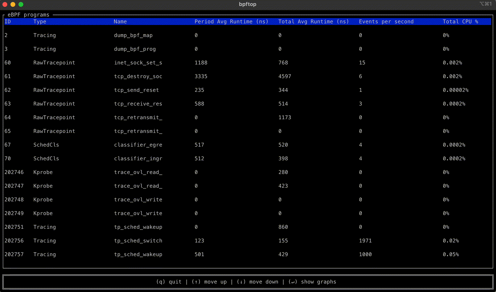

<head>
    
    
</head>

# Table of Contents

1.  [Algorithm](#org8757156)
2.  [Review](#org1c162af)
    1.  [介绍 bpftop](#org06ee038)
    2.  [它如何工作](#org5e8d36f)
    3.  [开始](#orga8f726b)
3.  [Tips](#orge8631ad)
    1.  [理解 Swift 协议](#orgd3adc19)
    2.  [介绍参数化协议](#org427821d)
4.  [Share](#orge448f16)

# Algorithm

Leetcode 968: [Binary Tree Cameras](https://leetcode.com/problems/binary-tree-cameras/)

<https://dreamume.medium.com/leetcode-968-binary-tree-cameras-f0faa54161e1>

# Review

[Announcing bpftop: Streamlining eBPF performance optimization](https://netflixtechblog.com/announcing-bpftop-streamlining-ebpf-performance-optimization-6a727c1ae2e5)

今天，我们兴奋地宣布 bpftop 发布了，一个命令行工具设计用来更好地性能优化和监控 eBPF 程序。随着 Netflix 递增地适应 eBPF，应用相同的严格要求到这些应用程序如同我们对其他管理服务一样是及其重要的。在 BPF 的利益和系统负载之间取得平衡是很重要的，确保它加强而不是妨碍了我们的操作效率。这个工具启动 Netflix 拥抱 eBPF 的潜力

## 介绍 bpftop

bpftop 提供一个动态实时运行 eBPF 程序的视图。它显示平均执行时间，每秒事件数和估计每个程序总 CPU 耗时百分比。这个工具通过只在激活时启动性能统计来最小化过载

bpftop 通过启动一个评测的高效循环，代码提炼和立即反馈来简化 eBPF 程序的性能优化进程。没有 bpftop，优化效果需要手动计算，增加进程的不必要的复杂度。对 bpftop，用户可快速建立一个基线，实现改进和检查加强，提高进程的效率

这个工具一个非常好的特性是以时间序列图显示统计。这个处理可揭露范型和趋势

## 它如何工作

bpftop 使用 BPFENABLESTATS 系统调用命令来启动全局 eBPF 运行时统计收集，其默认禁止来减少性能过载。它每秒收集这些统计，计算平均运行时间，每秒事件数和估计采样时间内每个 eBPF 程序的 CPU 利用率。这个信息在一个 10 秒移动窗口上以 top 图表形式显示或一个时间序列图。一旦 bpftop 终止，它关闭统计收集函数。该工具用 Rust 编写，在 libbpf-rs 和 ratatui 之间做了装箱平衡

## 开始

访问工程的 [GitHub 主页](https://github.com/Netflix/bpftop) 来学习更多关于这个工具的东西。我们以 Apache 2 的许可证开源了 bpftop 且期待社区的贡献

# Tips

[Demystifying Parameterized Protocols in Swift](https://medium.com/mobile-app-development-publication/demystifying-parameterized-protocols-in-swift-0b4f744fd19d)

苹果的编程语言 Swift 持续演进，每次更新引入新的特性和加强。一个这样的提供灵活性和重用性的特性是参数化协议。在本文中，我们将探讨 Swift 中参数化协议的概念，探讨它们是什么，如何工作和你如何平衡它们来写更模块化和自定义的代码

## 理解 Swift 协议

在我们深入参数化协议之前，让我们简单介绍一些 Swfit 中的协议。一个协议定义一个方法、属性和其他需求满足一个特殊任务或功能片段的企划。在你的类、结构、枚举中适应一个协议意味着你提供一个那个协议里定义的需求功能的实现

## 介绍参数化协议

参数化协议，也因关联类型而熟知，通过允许你引入类型的一般化使得协议的概念再前进了一步。这使得你可以创建协议与各种类型工作而不需要指定明确的类型直到协议适配时

    protocol MyParameterizedProtocol {
        associatedtype MyType
        func performAction(with value: MyType)
    }

这个例子 MyParameterizedProtocol 引入一个关联类型 MyType。协议定义一个方法 performAction(with:) 带一个关联类型的参数。然而，实际的类型 MyType 在协议里是不指定的，它将在类或结构适配的时候被定义

# Share

