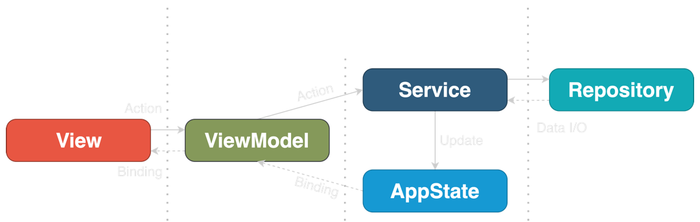
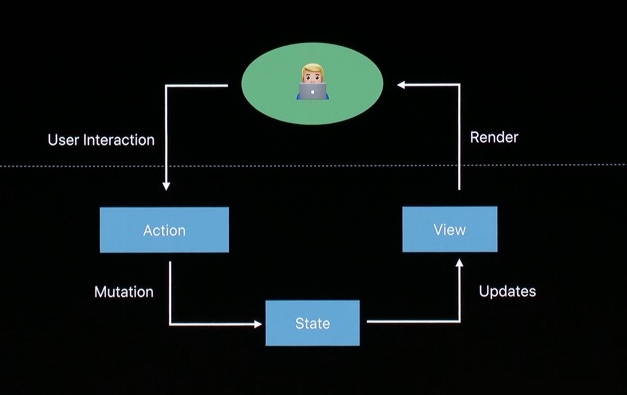
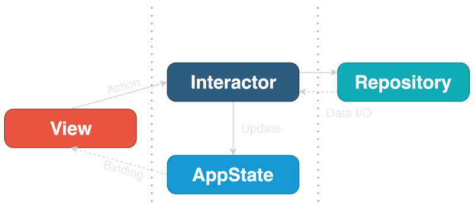

<head>
    
    
</head>

# Table of Contents

1.  [Algorithm](#org18e94a4)
2.  [Review](#org39e2860)
    1.  [概念的变化是什么？](#org2677b21)
    2.  [MVVM 是新的标准架构](#org798d7bb)
    3.  [在保护罩下，SwiftUI 基于 ELM](#org57902c1)
    4.  [协调器是 SwiftUI](#orgfd06dbc)
    5.  [VIPER、RIBs 和 VIP 可适配 SwiftUI 吗？](#org43fac57)
    6.  [整洁架构](#org86d4b2d)
    7.  [AppState](#org94d771f)
    8.  [视图](#orgf3c271a)
    9.  [Interator](#orgf361541)
    10. [Repository](#orgcbaa589)
3.  [Tips](#org67f3979)
    1.  [学习目标](#org199387e)
    2.  [距离度量是什么？](#org0662294)
    3.  [机器学习中距离度量的类型](#org9861dc9)
    4.  [Euclidean 距离](#org3791136)
    5.  [Manhattan 距离](#org119b9f2)
    6.  [Minkowski 距离](#orgf176e33)
    7.  [Hamming 距离](#orga5d7de4)
4.  [Share](#org30228c3)

# Algorithm

Leetcode 3102: [Minimize Manhattan Distances](https://leetcode.com/problems/minimize-manhattan-distances/)

<https://dreamume.medium.com/leetcode-3102-minimize-manhattan-distances-8150679c86ae>

# Review

[Clean Architecture for SwiftUI](https://nalexn.github.io/clean-architecture-swiftui/?utm_source=nalexn_github)

## 概念的变化是什么？

UIKit 是一个必须使用的，事件驱动库。我们可以在层级中引用每个视图，当试图加载或响应一个事件时更新它的显示。我们使用回调，代理，target-actions 处理这些事件

现在，可以不用这样了。SwiftUI 是一个声明式，状态驱动库。我们不能在层级中引用任意视图，当事件需要响应时我们也不能直接修改视图。而是，我们修改绑定到视图的状态。代理、target-actions、响应链、KVO - 所有回调技术被闭包和绑定取代

SwiftUI 中的每个视图是一个结构，可比类似的 UIView 子类的创建快很多倍。这个结构保持状态和反馈到 UI 渲染的函数体的引用

这样 SwiftUI 里的一个视图只是一个编程函数。你提供输入（状态）- 它绘制输出。且唯一改变输出的方法是改变输入：我们不能通过添加或删除子视图来触碰算法（函数体） - 所有显示 UI 的可能改变在函数体里已经定义且运行时不能改变

在 SwiftUI 中我们不能添加或删除子视图，而是启动或禁止在预定义算法中 UI 的不同片段

## MVVM 是新的标准架构

SwiftUI 内建 MVVM

在最简单的例子中，视图不依赖外部状态，它的本地 @State 变量担当 ViewModel 的角色，提供订阅机制（绑定）当状态改变时刷新 UI

对更复杂的场景，视图可引用一个外部 ObservableObject，在这个事例中可为一个不同的 ViewModel

SwiftUI 视图和状态非常像典型的 MVVM（除非我们引入一个更复杂的编程条目图像）

且你不需要一个 ViewController

让我们考虑这个 MVVM 模块 SwiftUI app 的快速例子

Model: 一个数据容器

    struct Country {
        let name: String
    }

视图：一个 SwiftUI 视图

    struct CountriesList: View {
        @ObservedObject var viewModel: ViewModel
    
        var body: some View {
            List(viewModel.countries) { country in
                Text(country.name)
            }.onAppear {
                self.viewModel.loadCountries()
            }
        }
    }

ViewModel: 一个 ObservableObject 封装业务逻辑和允许视图监控状态改变

    extension CountriesList {
        class ViewModel: ObservableObject {
            @Published private(set) var countries: [Country] = []
    
            private let service: WebService
    
            func loudCountries() {
                service.getCountries { [weak self] result in 
                    self?.countries = result.value ?? []
                }
            }
        }
    }

在这个简化例子中，当视图出现在屏幕上，onAppear 回调 ViewModel 的 loadCountries()，触发 WebService 的网络调用来加载数据。ViewModel 在回调中接收数据且通过 @Published 变量 countries 推数据到监控的视图

## 在保护罩下，SwiftUI 基于 ELM

[MCE 2017: Yasuhiro Inami, Elm Architecture in Swift](https://youtu.be/U805TqsDIV8) 这个视频在 2017 年讲了 SwiftUI 的工作原型

SwiftUI 基于和 ELM 相同的要件：

-   Model - 你的应用程序的状态
-   View - 把你的状态变成 HTML 的方法
-   Update - 基于信息更新你的状态

我们已经有了 Model，View 从 Model 自动生成，我们可改变的唯一事情是 Update。我们可像 REDUX 那样使用 Command 范型修改状态而不是让 SwiftUI 的 Views 和其他模块直接写状态

## 协调器是 SwiftUI

Cooridnator 对 VIPER、RIBs 和 MVVM-R 架构是必要的部分。屏幕导航的独立模块的分配器在 UIKit 应用程序中是经常包含的 - 从一个 ViewController 直接路由到另一个使得它们紧耦合，更不必说 ViewController 层级里的深度链接到深度链接的代码地狱

在 UIKit 中添加一个协调器非常简单因为 UIView（UIViewController）是环境独立实例，你可在任意时刻从层级中添加/删除它们

对于 SwiftUI，这样的动态机制设计上是不可能的：层级是静态的且所有可能的导航在编译期已定义且固定。没有方法在运行期在层级结构中做连接：而是，导航通过绑定被状态改变完全控制：看 NavigationView、TableView 或 .sheet()，每次你会看到 init 为路由绑定参数

“Views 是一个状态函数“，这里关键词是函数。转换状态数据到一个渲染图像的算法

这解释了为什么从 SwiftUI 视图提取路有是非常有挑战性的：路由是绘制算法的集成部分

协调器目标是解决两个问题：

1.  解偶 ViewController
2.  编程导航

SwiftUI 通过前面提及的绑定对编程导航有一个内建的机制

为解偶 SwiftUI 里的视图，这很容易实现。如果你不想要视图 A 直接引用视图 B，你可简单地把 B 作为一个一般化参数给 A

你也可以使用相同的处理抽象方法使视图 A 可打开 B（使用 TabView、NavigationView 等）。你可很容易地改变路由模型如果你需要的话，而不用接触视图 B

不要忘了 @ViewBuilder 和 AnyView - 另两种方法使得 B 类型变成 A 类型

结合以上，我相信 SwiftUI 使得协调器是不需要的：我们可使用一般化参数或 @ViewBuilder 隔离视图且用标准工具获得编程导航

## VIPER、RIBs 和 VIP 可适配 SwiftUI 吗？

我们可从这些架构中借鉴很多好的想法和概念，但最终没有一个的移植实现可用于 SwiftUI 的应用程序

首先，没有必要有一个协调器

其次，在 SwiftUI 中用本地支持的视图-状态绑定解偶的完全新数据流设计回避了构建代码

在范型中模块数量的减少，我们也不需要 Builder 了。所以基本上，整个范型散架了，它针对要解决的问题不再存在了

SwiftUI 在系统设计中引入了它自己的挑战，这样对 UIKit 的范型必须重新设计

## 整洁架构

让我们引用 Uncle Bob 的《整洁架构》，VIP 的先驱:

通过分割软件为层级，并确认依赖规则，你将创建一个本质上可测试的系统

整洁架构对我们应该引入的层数非常自由，因为这依赖应用程序领域

但对一个移动应用程序最通常的场景我们需要有三层：

-   表示层
-   业务逻辑层
-   数据访问层

我们通过 SwiftUI 的特殊性深入整洁架构的需求，我们得到如下：

## AppState

AppState 是范型中唯一的条目需要为一个对象，特别地，一个 ObservableObject。或者，它可以是从 Combine 中一个用 CurrentValueSubject 封装的结构

跟 Redux 一样，AppState 作为真实的单个源工作并在整个 app 期间持有状态，包括用户的数据，鉴权 token，屏幕导航状态（选中的 tab，呈现的页面）和系统状态（是否活跃、是否在后台等）

AppState 不知道其他层且不包含任何业务逻辑

Countries demo 工程的一个 AppState 例子：

    class AppState: ObservableObject, Equatable {
        @Published var userData = UserData()
        @Published var routing = ViewRouting()
        @Published var system = System()
    }

## 视图

通常的 SwiftUI 视图，可能是无状态的或有本地 @State 变量

其他层不知道视图层的存在，这样不需要在协议中隐藏

当视图被初始化，它通过 SwiftUI 的标准依赖注入变量属性 @Environment, @EnvironmentObject 或 @ObservableObject 接收 AppState 和 Interator

通过用户行为（比如按钮点击）或视图生命周期事件 OnAppear 触发作用转发到 Iterator

    struct CountriesList: View {
        @EnvironmentObject var appState: AppState
        @Environment(\.interators) var interators: InteratorsContainer
    
        var body: some View {
            ...
            .onAppear {
                self.interators.countriesInteractor.loadCountries()
            }
        }
    }

## Interator

Interator 为视图或一组视图封装业务逻辑。与 AppState 一起形成业务逻辑层，是完全独立的表示和外部资源

它是完全无状态的且只引用 AppState 对象，作为一个构建参数注入

Interator 应该适配一个协议这样视图可在测试时与一个模拟的 Interator 通信

Interator 接收请求来执行任务，比如从一个外部源获取数据或执行计算，但它们不会直接返回数据

它们转发结果到 AppState 或通过视图提供的绑定

绑定用于当任务结果（数据）被一个视图本地拥有且不属于集中的 AppState，即，它不需要被持久化或与 app 的其他屏幕共享

下面是一个示例工程的 CountriesInteractor

    protocol CountriesInterator {
        func loadCountries()
        func load(countryDetails: Binding<Loadable<Country.Details>>, country: Country)
    }
    
    // MARK: - Implementation
    
    struct RealCountriesInterator: CountriesInterator {
        let webRepository: CountriesWebRepository
        let appState: AppState
    
        init(webRepository: CountriesWebRepository, appState: AppState) {
            self.webRepository = webRepository
            self.appState = appState
        }
    
        func loadCountries() {
            appState.userData.countries = .isLoading(last: appState.userData.countries.value)
            weak var weakAppState = appState
            _ = webRepository.loadCountries().sinkToLoadable {
                weakAppState?.userData.countries = $0
            }
        }
    
        func load(countryDetails: Binding<Loadable<Country.Details>>, country: Country) {
            countryDetails.wrappedValue = .isLoading(last: countryDetails.wrappedValue.value)
            _ = webRepository.loadCountryDetails(country: country).sinkToLoadable {
                countryDetails.wrappedValue = $0 
            }
        }
    }

## Repository

Repository 是一个抽象网关读写数据。提供到一个单数据服务的访问，可以是一个 Web 服务器或一个本地数据库

例如，如果 app 用它的后端，Google 地图 API 和写一些数据到一个本地数据库，则有三个 Repositories：两个不同的 Web API 提供者和一个数据库 IO 操作

repository 也是无状态的，不需要写到 AppState，只包含业务相关工作数据。它不知道视图或 Interactor

实际的 Repository 应该隐藏于一个协议这样 Interactor 可以在测试时与一个模拟的 Repository 通信

示例工程中的 CountriesWebRepository 如下：

    protocol CountriesWebRepository: WebRepository {
        func loadCountries() -> AnyPublisher<[Country], Error>
        func loadCountryDetails(country: Country) -> AnyPublisher<Country.Details.Intermediate, Error>
    }
    
    // MARK: - Implementation
    
    struct RealCountriesWebRepository: CountriesWebRepository {
        let session: URLSession
        let baseURL: String
        let bgQueue = DispatchQueue(label: "bg_parse_queue")
    
        init(session: URLSession, baseURL: String) {
            self.session = session
            self.baseURL = baseURL
        }
    
        func loadCountries() -> AnyPublisher<[Country], Error> {
            return call(endpoint: API.allCountries)
        }
    
        func loadCountryDetails(country: Country) -> AnyPublisher<Country.Details, Error> {
            return call(endpoint: API.countryDetails(country))
        }
    }
    
    // MARK: - API
    
    extension RealCountriesWebRepository {
        enum API: APICall {
            case allCountries
            case countryDetails(Country)
    
            var path: String { ... }
            var httpMethod: String { ... }
            var headers: [String: String]? { ... }
        }
    }

因为 WebRepository 把一个 URLSession 作为构造参数，很容易通过带一个自定义 URLProtocol 的模拟网络调用来测试

# Tips

[Understanding Distance Metrics Used in Machine Learning](https://www.analyticsvidhya.com/blog/2020/02/4-types-of-distance-metrics-in-machine-learning/)

聚集是数据清理的重要部分，用于人工智能，深度学习和数据科学。今天我们将讨论距离度量，其是聚集的主心骨。距离度量基本上是处理找到估计或数据点之间的距离且决定是否它们可一起被聚集。在本文中，我们将探讨机器学习上 4 种距离度量和理解它们用 Python 如何工作

## 学习目标

-   你将学习各种距离度量的用例
-   你也将学习学习度量的不同类型
-   最后，你将学习数据挖掘中距离度量扮演的重要角色

## 距离度量是什么？

距离度量是几种机器学习算法的关键部分。这些距离度量用于监管和非监管的学习，一般是用来计算数据点之间的相似性。一个高效的距离度量改进我们机器学习模型的性能，不管是典型的任务或聚集

假设你需要用一个聚集算法比如 K-Means 聚集或 K-nearest 邻居算法（knn）来创建聚集，knn 使用最近邻居来解决一个经典或回归问题。你如何定义不同观察之间的相似性？我们如何说两个点相互是相似的？如果它们的特性是相似的，对吗？当我们画这些点，它们将在距离上靠近彼此

因此，我们可计算点之间的距离且然后定义它们的相似性。这儿有一百万美元问题 - 我们如何计算这个距离，且机器学习中不同距离度量是什么？对不同的学习问题这些度量是不同的吗？我们有用特别的理论吗？这些问题在本文中将给出答案

## 机器学习中距离度量的类型

1.  Euclidean 距离
2.  Manhattan 距离
3.  Minkowski 距离
4.  Hamming 距离

让我们从最常见的距离度量 - Euclidean 距离开始

## Euclidean 距离

Euclidean 距离代表两个向量间最短距离。它是对应元素间平方差的和的平方根

Euclidean 距离度量对应向量和向量空间之间 L2-规范的不同。余弦相似跟两个向量的点乘成比例，和它们的大小的乘积成反比

大多数机器学习算法，包括 K-Means 使用这个距离度量来测量观察间的相似性。假设有两个点 $ A(p_ {1}, p_ {2}) $ 和 $ B(q_ {1}, q_ {2}) $，Euclidean 距离公式为

$ d = ((p_ {1} - q_ {1})^{2} + (p_ {2} - q_ {2})^{2})^{\\frac{1}{2}} $

我们可一般化这个公式到 n 维空间：

$ D_ {e} = \\left( \\sum^{n}_ {i=1} (p_ {i} - q_ {j})^{2} \\right)^{\\frac{1}{2}} $

-   n 是维度
-   $ p_ {i}, q_ {i} $ 是数据点

让我们用 Python 来写 Euclidean 距离代码。我们将首先导入需要的库。我将使用 sciPy 库：

    # importing the library
    from scipy.spatial import distance
    
    # defining the points
    point_1 = (1, 2, 3)
    piont_2 = (4, 5, 6)
    point_1, point_2
    
    # computing the euclidean distance
    euclidean_distance = distance.euclidean(point_1, point_2)
    print('Euclidean Distance b/w', point_1, 'and', point_2, 'is: ', euclidean_distance)

## Manhattan 距离

Manhattan 距离是点之间所有维度上差的绝对值之和

公式如下：

$ d = \| p_ {1} - q_ {1} \| + \| p_ {2} - q_ {2} \| $

一般化到 n 维为：

$ D_ {m} = sum^{n}_ {i=1} \| p_ {i} - q_ {i} \| $

-   n 为维度
-   $ p_ {i}, q_ {i} $ 为数据点

Python 代码如下

    # computing the manhattan distance
    manhattan_distance = distance.cityblock(point_1, point_2)
    print('Manhattan Distance b/w', point_1, 'and', point_2, 'is: ', manhattan_distance)

## Minkowski 距离

Minkowski 距离是 Euclidean 距离和 Manhattan 距离的一般化形式，公式为

$ D = \\left( \\sum^{n}_ {i=1} \| p_ {i} - q_ {i} \|^{p} \\right)^{\\frac{1}{p}} $

Python 代码如下

    # computing the minkowski distance
    minkowski_distance = distance.minkowski(point_1, point_2)
    print('Minkowski Distance b/w', point_1, 'and', point_2, 'is: ', minkowski_distance)

当 p 为 1 时，是 Manhattan 距离，p 为 2 时是 Euclidean 距离

## Hamming 距离

Hamming 距离测量相同长度字符串之间的相似性。两个相同长度字符串之间的 Hamming 距离是对应字符不同的位置数

例如这里有两个字符串 "euclidean" 和 "manhattan"

前面 7 个位置上对应的字符不同，则 Hamming 距离为 7。Python 代码如下

    #defing two strings
    string_1 = 'euclidean'
    string_2 = 'manhattan'
    
    # computing the hamming distance
    hamming_distance = distance.hamming(list(string_1), list(string_2)) * len(string_1)
    print('Hamming Distance b/w', string_1, 'and', string_2, 'is: ', hamming_distance)

# Share

