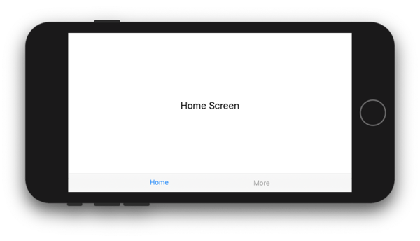
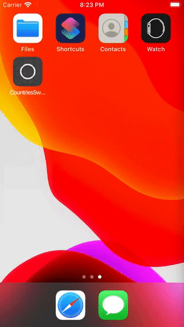

<head>
    
    
</head>

# Table of Contents

1.  [Algorithm](#org9b1537e)
2.  [Review](#org035db36)
    1.  [编程函数的 SoC](#org2eac7b9)
    2.  [模块的 SoC](#orgf167c35)
    3.  [内聚和耦合](#orgcde6525)
    4.  [松耦合和高内聚的好处](#org7efb7cd)
    5.  [系统设计的 SoC](#orgaa1179f)
    6.  [仓库](#org98e3f59)
    7.  [结论](#org0a4bba2)
3.  [Tips](#orgf2996b6)
    1.  [在中心的 AppState 存储导航变量](#orgb7f66f9)
    2.  [通过外部发布广播导航参数](#org41eefd9)
    3.  [通过多个 view 导航](#org60ad80f)
    4.  [List 不能正确地支持编程导航](#org366ef05)
4.  [Share](#org8a1d4a3)

# Algorithm

Leetcode 3102: [Two city Scheduling](https://leetcode.com/problems/two-city-scheduling/)

<https://dreamume.medium.com/leetcode-1029-two-city-scheduling-25e01e1ad4fe>

# Review

[Separation of Concerns in Software Design](https://nalexn.github.io/separation-of-concerns/)

担忧隔离（SoC）在软件开发中是最基础的原则之一

5 个 SOLID 原则的两个（单一原则和接口隔离）直接源于这个概念

原则非常简单：不要把你的程序写成固定一块，而是，分离代码为块，每个系统小块能完成一个简单不同的任务

在本文中，我特意应用这个原则在抽象的所有层级：从每个函数内部的编程代码和整个应用程序架构的模块设计，所有都为了获得高质量软件的特性

## 编程函数的 SoC

如果我们看最底层（实际的编码），SoC 指导我们避免写长并复杂的函数。当函数大小变得巨大，则表明函数可能包含了太多东西

这时 SoC 让我们重构它，转换成更简洁和可描述的版本。在这个过程中，原始算法的部分以私有访问级别导出并封装成几个更小的函数。我们获得清晰的代码，并算法块最终变得可重用于其他地方，甚至如果我们开始并没有想到这些

## 模块的 SoC

在更高的层级，这个原则告诉我们组织函数到自包含模块，每个负责单个任务集，其有清晰的逻辑关系

该过程跟我们对函数做的非常相似：分离不紧密关联的功能并组织特性服务相同的不同的目的

## 内聚和耦合

应用程序的担忧隔离包含两个过程：减少耦合和增加内聚

内聚是职责集合、细节层级和本地性的相似性度量。例如，drawCircle 和 drawTriangle 函数足够内聚属于负责绘制的相同模块，且它自然且把这两个函数在代码上互相接近（高相似性 ～ 高内聚）

上面提及的 drawCircle 和 drawTriangle 可被其他函数 DrawCybertruck 使用。我们可尝试把这个函数也放入绘制模块，但 drawCybertruck 可能依赖物理引擎和外部状态。这样这将使得整个绘制模块和其他组件减少了重可用性和更加耦合

你可告诉原始的绘制函数和 drawCybertruck 属于不同层级的抽象和逻辑复杂度，这样它们需要位于不同的模块

且如果在一些点上我们决定在其他工程中使用绘制模块 - 则不需要依赖物理引擎，这样我们将更容易利用它

一个快速的方式记住什么属性应该增加或减少：

-   解偶是好的 - 这样我们需要目标朝向一个松散的耦合
-   内聚代码是好的 - 我们需要目标朝向一个高的内聚

高内聚代码的一个好的例子是使用闭包回调而不是代理方法。考虑发送网络请求的代码：

    // configuring and sending the request
    session.send(request: URLRequest) { response in
        // handling the response
    }

想象如果 URLSession 有一个基于代理的 API 发送请求：所有的响应需要转发到一个函数 handle(response: URLResponse, for request: URLRequest)

这将使得网络更容易出错和单调乏味，因为处理所有响应的逻辑需要绑定到一个函数

用基于回调的 API，行为和行为的结果在一个地方处理，使得更容易跟踪处理流程

如果我们需要在函数或模块之间跟随算法逻辑跳跃，这意味着代码有低内聚

## 松耦合和高内聚的好处

遵循隔离担忧的原则帮助改进代码的很多特性

1.  代码更加清晰。更容易理解程序当每个模块有一个简洁和清晰的逻辑范围方法集合的 API
2.  代码更重用。重用主要的好处是减少维护成本。无论你需要扩展功能或修复 Bug，由于代码只有一份更容易修复
3.  更容易测试。适合范围功能的独立模块和更应用程序其他部分的隔离使得测试更容易。你不需要设立整个环境来看你的模块怎么工作 - 可以有效的用模拟假数据源替换实际模块。这个方法你可测试模块作为黑盒验证输出，或作为白盒也能看到哪个模块在连接的模块上被调用
4.  快速工程演进。无论一个新特性或一个现有功能的升级，模块隔离帮助确定应用程序被影响的范围，加速开发
5.  多个开发者之间更容易组织同时开发。他们只需要在他们工作的模块上一致并确保它们不相互干扰。只有更新一个模块的 API 需要直接通知其他开发者，大多数修改可被添加而不需要其他人的立即注意。当耦合用好的测试覆盖，并行开发变得高效

## 系统设计的 SoC

对一大堆不同责任和清晰目的的模块，我们还需要提领出一个全局的策略来表示模块应该如何互相引用

如果我们不引入这个策略我们可导致系统有一个缠绕的关系和难以跟踪的数据流

系统设计的主要目的是总结明了模块之间的边界

每个现存的架构范型提供这个策略。例如，MVC 我们看到 View 不允许和 Model 直接交互且应该用 Controller 作为中介

这些策略经常来自于一般的想法即容忍是不好的。我的观点，导致要么过度工程化的解决方案或相反地低解偶责任的系统

我趋于认为系统的设计需要更多清晰度量和动机的形式化处理

我们已经看到 SoC，当应用到函数和模块，总是导致更加可重用，可测试和可维护的代码。这样为什么不考虑用内聚和耦合作为度量并应用 SoC 在应用程序层？

那就是为什么我们隔离模块为层。这不是一个具体的结构范型，但对我谈论的那个策略来说是一个高层级的指导说明

模块分组为层，相同的方法我们从不同函数集形成模块

一层的模块结果集在系统中基于相似的职责有高内聚和相同层级的抽象，而层之间通信和环境意识是非常受限来获得松耦合

我们不只限制通信 - 底部更高环境指导说明的层（仓库，比如数据库封装或一个网络服务）被禁止直接引用定义在更高的层级（业务逻辑或 UI）

这样如果我们用网络服务跟后端通信，它应该不知道系统其他部分且只提供 API 发送请求

业务逻辑层将知晓并使用仓库，但它应该不知道任何系统 UI 

UI 层知晓业务逻辑模块且使用它们的 API 来读取更新数据和触发行为，但同时，它不知道仓库，业务逻辑隐藏实际的底层基础设施

这个方法我们可保证本质的整个系统的测试性，每层要么不知道其他层要么解偶到一个高度其可容易被测试模拟

## 仓库

虽然解偶业务逻辑和 UI 是一个标准，我发现大多数流行的 iOS 范型不强调从数据门户解偶业务逻辑的重要性，比如一个网络层

我多次看到请求从 view controller 或其他业务逻辑模块发送。及数据库请求，UserDefaults 和其他本地或远程数据存储

你可以猜测，我不喜欢紧耦合。但它不只是在模块间耦合，这还是多少能容忍的

我们谈论算法和算法之间的紧耦合。这样的代码几乎不可能测试或演进

有很多原因为什么你不想要嵌入直接读写操作在你的业务逻辑里，这样不能轻易地用模拟方法替换实际的调用：

1.  你可能意外地有出错的有价值数据当你运行一个未完成的算法时
2.  访问真实数据可能很慢（本地资源的超大文件，慢的网络/测试服务器当访问远程资源时）
3.  外部数据可能不有效（本地数据库为空且需要预占据，服务器宕机或一个网络连接运行中断）
4.  后端可能突然改变响应格式当你不希望的时候

最后的情况是恶劣的。当然，在理想世界中，这不应该发生，但它会，且比你想象的要多

应用程序可能停止工作，且负责的第一人会是你，移动工程师。你的应用程序中断了。且你将提供借口并看着可怜的在被揭露的第一分钟

想象你公司的 CEO 在重要时刻比如会见投资人时展示应用程序，而这发生了

理想的方法是：应用程序不会崩溃，但优雅地显示一个用户友好的错误信息。我们用上司的另一台设备构建并用模拟数据运行在脱机模式，且展示继续

脱机模拟模式？听起来要做大量工作！但如果你解偶并从数据门户抽象出来后工作量并不大

当我们有一个业务逻辑模块从其他地方查询数据，我们需要注意访问的忧虑，外部数据资源在一个独立的模块且隐藏了不必要的查询细节

这就是仓库怎么形成的

让我们看一个例子。我们有一个 ViewController 加载并显示一些条目列表

    class ListViewController: UIViewController {
        var items: [Item] = []
        var tableView: UITableView?
    
        override func viewDidLoad() {
            let url = URL(string: "https://api.service.com/list")!
            let request = URLRequest(url: url)
            URLRession.shared.dataTask(with: request) { [weak self] (data, response, error) in
                if let list = try? JSONDecoder().decode([Item].self, from: data ?? Data()) {
                    self?.items = list
                    self?.tableView?.reloadData()
                }
        }
    }

要做的第一件事是引入 ListRepository 协议并重构 ViewController 来使用它

    protocol ListRepository {
        func loadList(completion: @escaping ([Item], Error?) -> Void)
    }

    class ListViewController: UIViewController {
        var items: [Item] = []
        var tableView: UITableView?
        var repository: ListRepository
    
        override func viewDidLoad() {
            repository.loadList { [weak self] (list, error) in
                self?.items = list
                self?.tableView?.reloadData()
            }
        }
    }

现在我们自由订阅工作在后端的实现：

    struct RealListRepository: ListRepository {
        func loadList(completion: @escaping ([Item], Error?) -> Void) {
            // networking code
        }
    }

或一个假的仓库在脱机模式下服务示例数据：

    struct DummyListRepository: ListRepository {
        func loadList(completion: @escaping ([Item], Error?) -> Void) {
            DispatchQueue.main.asyc {
                let list = [
                    Item(id: "1", name: "First item"),
                    Item(id: "2", name: "Second item")
                ]
                completion(list, nil)
            }
        }
    }

这样，应用程序可被配置工作在真实的网络 API 或一个模拟的数据，其也可以保存在捆绑资源下而不是硬代码

对以上的例子我们也应该注意当我们实现一个异步 API 调用的桩，我们应该也维护它的异步性（从内部的 DispatchQueue.main.asyc 触发调用）。否则，我们将发布 Zalgo

你可看到仓库在整洁架构变种中是一个本质的部分

## 结论

隔离忧虑是一个巨人，其肩膀站着许多我们现在知道的流行范型。仅该规则提供在所有层级戏剧性地改进软件质量的指导

当写代码或设计架构时不要忽略它。松耦合和高内聚是你的朋友！

从输入输出隔离算法为更好的测试性，且你的软件将像岩石一样坚固

# Tips

[Programmatic navigation in SwiftUI project](https://nalexn.github.io/swiftui-deep-linking/)

在这个高速竞争的市场，开发者尽可能的努力在移动应用程序中获得一个引人入胜的用户体验。这包括不只在他们的应用程序中构建神奇的特性，也包括 iOS 系统中本地的集成

在这些集成中很少有技术允许用一个指令启动应用程序显示一个特殊的应用程序页面而不是缺省页面：

-   Universal Links 或 自定义 URL Scheme 的深度链接
-   本地和远程通知
-   Siri 快捷键
-   Spotlight 搜索
-   主页快速动作
-   Handoff

当你可以轻松地找到以上任意一个指导说明，有一个话题我发现没有考虑：

跟随这些深入链接指令，我们如何编程导航到一个 SwiftUI 应用程序的自定义内容页面？

在 UIKit 中有许多方法来实现，但 SwiftUI 带来一个新的范例来构建 UI 用它自己的方式做屏幕导航

在 SwiftUI 应用程序中 AppDelegate 的一个功能性替代者是 sceneDelegate，其继承提供应用程序导航指令的两个方法：

    func scene(_ scene: UIScene, continue userActivity: NSUserActivity)
    func scene(_ scene: UIScene, openURLContexts URLContexts: Set<UIOpenURLContext>)

这里的挑战是转发这个指令到 SwiftUI 的视图层显示正确的内容

我们缺省有的是 ContentView 在 scene(\_:, willConnectTo:, options:) 创建而不用访问其下的 view

唯一的方法是我们拖拽改变绑定到 view 的状态来获得显示

view 有两种不同类型的状态可被绑定：

-   本地 @State 变量
-   定义在外部 ObservableObject 的变量（带或不带 @Published 属性）

让我们用一个 TabView 作为一个实验对象且构建一个简单的应用程序如下：

拖拽 Tab 页的 view 状态绑定可用 @State 构建：

    struct ContentView: View {
        @State var selectedTab: Tab = .home
    
        var body: some View {
            TabView(selection: $selectedTab) {
                Text("Home Screen").tabItem { Text("Home") }.tag(Tab.home)
                Text("More Screen").tabItem { Text("More") }.tag(Tab.more)
            }
        }
    }
    
    extension ContentView {
        enum Tab: Hashable {
            case home
            case more
        }
    }

和使用 ObservableObject：

    struct ContentView: View {
        @ObservedObject var viewModel: ViewModel
        // Alternatively
        // @EnvironmentObject var viewModel: ViewModel
    
        var body: some View {
            TabView(selection: $viewModel.selectedTab) {
                Text("First Screen").tabItem { Text("First") }.tag(Tab.home)
                Text("Second Screen").tabItem { Text("Second") }.tag(Tab.favorites)
            }
        }
    }
    
    extension ContentView {
        class ViewModel: ObservedObject {
            var selectedTab: ContentView.Tab = .home {
                willSet { objectWillChange.send() }
            }
            // Alternatively:
            // @Published var selectedTab: ContentView.Tab = .home
        }
    }
    
    extension CountriesList {
        enum Tab: Hashable {
            case home
            case favorites
        }
    }

当我们在带属性 @State、@ObservedObject、@EnvironmentObject 的变量名之前使用 $ 时，我们获得一个特殊的绑定条目类型 Binding

Binding 是访问 token 你可传递提供直接值的读和写访问而不用获得所有者允许（引用类型）或拷贝（值类型）

当用户在 TabView 上选择一个 Tab 页，它通过绑定单向改变值且赋值相关的 .tag(&#x2026;) 到 selectedTab 变量。这对 @State 和 ObservedObject 都可以

程序员也可以赋值一个值到 selectedTab 变量 - TabView 将立即拖拽显示的 Tab 页

这是在 SwiftUI 中编程导航的关键

每个 view 拖拽显示等级，为 TabView、NavigationViwe 或 .sheet()，现在使用绑定来控制显示

这样如果我们在 SceneDelegate 中访问绑定，我们将可以告诉 SwiftUI view 显示我们想要的屏幕而不是默认

有两种办法处理这个问题

## 在中心的 AppState 存储导航变量

第一个处理意味着创建一个共享的应用程序状态通过 .environmentObject(&#x2026;) 方法在根 view 上注入到 view 层级：

    class AppState: ObservableObject {
        @Published var selectedTab: ContentView.Tab = .home
        @Published var showActionSheet: Bool = false
    }
    
    class SceneDelegate: UIResponder, UIWindowSceneDelegate {
        lazy var appState: AppState()
    
        func scene(_ scene: UIScene, willConnectTo session: UISceneSession, options connectionOptions: UIScene.ConnectionOptions) {
            let contentView = ContentView().environmentObject(appState)
            ...
        }
    
        func scene(_ scene: UIScene, openURLContexts URLContexts: Set<UIOpenURLContext>) {
            // Parse the deep link
            if /* Deep link leads to the More tab */ {
                appState.selectedTab = .more
                appState.showActionSheet = true;
            }
        }
    }
    
    struct ContentView: View {
        @EnvironmentObject var appState: AppState
    
        var body: some View {
            TabView(selection: $appState.selectedTab) {
                MoreTabView().tag(ContentView.Tab.more)
                ...
            }
        }
    }
    
    struct MoreTabView: View {
        @EnvironmentObject var appstate: AppState
    
        var body: some View {
            Text("More Tab").actionSheet(isPresented: $appState.showActionSheet) {
                ActionSheet(title: ...)
            }
        }
    }

## 通过外部发布广播导航参数

第二种处理是使用一个 Combine 的 Publisher 转发导航状态更新：

    struct NavigationCoordinator: EnvironmentKey {
        let selectedTab = PassthroughSubject<ContentView.Tab, Never>()
        let showActionSheet = PassthroughSubject<Bool, Never>()
    }
    
    class SceneDelegate: UIResponder, UIWindowSceneDelegate {
        lazy var navigation = NavigationCoordinator()
    
        func scene(_ scene: UIScene, willConnectTo session: UISceneSession, options connectionOptions: UIScene.ConnectionOptions) {
            let contentView = ContentView().environment(\.navigationCoordinator, navigation)
            ...
        }
    
        func scene(_ scene: UIScene, openURLContexts URLContexts: Set<UIOpenURLContext>) {
            // Parse the deep link
            if /* Deep link leads to the More tab */ {
                navigation.selectedTab.send(.more)
                navigation.showActionSheet.send(true)
            }
        }
    }
    
    struct ContentView: View {
        @Environment(\.navigationCoordinator) var navigation: NavigationCoordinator
        @State var selectedTab: Tab = .home
    
        var body: some View {
            TabView(selection: $selectedTab) {
                MoreTabView().tag(ContentView.Tab.more)
                ...
            }
        }
    }
    
    struct MoreTabView: View {
        @Environment(\.navigationCoordinator) var navigation: NavigationCoordinator
        @State var showActionSheet: Bool = false
    
        var body: some View {
            Text("More Tab").actionSheet(isPresented: $appState.showActionSheet) {
                ActionSheet(title: ...)
            }.onReceive(navigation.showActionSheet) {
                self.showActionSheet = $0
            }
        }
    }

第一个处理确保选中的导航参数仍然是选中的甚至内容 view 还不能装载。一些 view 可能会先显示一个加载进度条，但一旦完成且呈现最终的子 view 层级，子 view 中的一个最终会使用导航参数并相应做出行为

这在第二种处理中不行，除非你把 PassthroughSubject 改成 CurrentValueSubject 来总是持有导航状态。但在这个例子中，一旦导航完成你需要手工重设值

在第一个处理中你不需要重设导航状态，因为 AppState，持有导航参数，是整个应用程序的单一源且 SwiftUI 将更新这些值当用户继续在应用程序导航时

## 通过多个 view 导航

使用上述处理之一你可编程导航到一个屏幕的任意深度

唯一的需求：对每个可导航 view 到深度链接的目标 view，你需要分配一个独立的导航参数在 AppState 或在广播消息里

然后，在 scene(\_ scene: openURLContexts:)，你需要拖拽所有导航参数，且 SwiftUI view 层级将在一个步骤中转换到目标屏幕

## List 不能正确地支持编程导航

当我在一些工程中实现深度链接，我发现用 List 编程导航的一个隐蔽缺陷

考虑这个简单的设置：

    struct Item: Identifiable {
        let id: String
        let name: String
    }
    
    struct ContentView: View {
        @State var items: [Item] = /* An array of 100 items */
        @EnvironmentObject var appState: AppState
    
        var body: some View {
            NavigationView {
                List(items) { item in
                    NavigationLink(
                        destination: ItemDetailsView(item: item),
                        tag: item.id
                        selection: self.$appState.selectedItemId) {
                        Text(item.name)
                    }
                }
                .navigationBarTitle("Items")
            }
        }
    }

应用程序简单显示 100 个文本条目的列表。让我们假设，我们实现一个深度链接打开 ItemDetailsView 带特定的 id。我们尝试用 URL 如下：

    https://www.100items.com/details?id=5

这是可以的。应用程序启动并解析 URL 赋值 appState.selectedItemId 为 5 并立即显示 ItemDetailsView 推送到 List 的顶部

但一旦你尝试另一个 id，比如 75:

    https://www.100items.com/details?id=75

List 不推送 ItemDetailsView

我们知道 id 为 75 的条目在列表中，但一些原因，该详细页面不能被推送出来

为了编程导航工作，已证明我们推送的列表条目在 List 上必须在当前显示

一旦你滚动列表来使目标条目可见，你将看到一个无趣的效应：滚动突然停止并详细页面在无动画效果的情况下显示在导航栈：

List 和 UITableView 一样被优化过，这样它跟踪显示的条目并懒加载需要的内容

因此，List 不知道 id 为 75 的条目，这样它不做任何事情直到它知道它事实上已在数组中

这个 bug 可修复如果我们已访问 List 的滚动偏移来调整这个边界问题，但我们不行，没有 API 改变 List 的偏移

现在我看到的一个热修复是移动目标条目到数组第一个位置这样 List 可正确的处理 NavigationLink。或则我们简单不依赖编程导航处理 List

# Share

目前在看一些公开课视频，对于想要学习某方面系统的知识，看公开课可对该方面整体上有一个全面概括的认识。博客文章一般只将某一个点的内容，没法系统性介绍

但公开课一般学完至少要 5、6 周时间，如果要把练习和作业也完成，则更长。且一般不太好整理成博客文章

一般国外名校的公开课质量都很高，可按照自己的需要选择性的看一些
