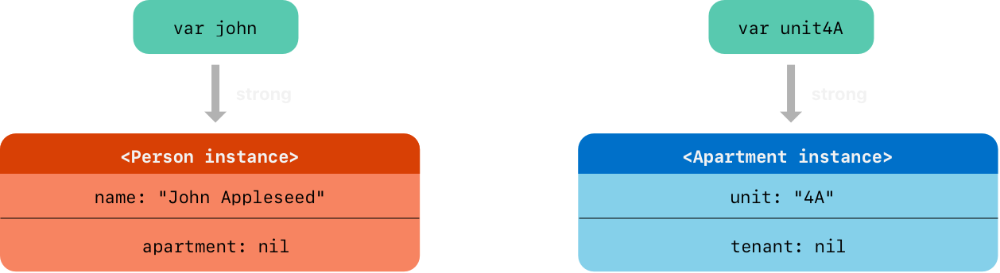
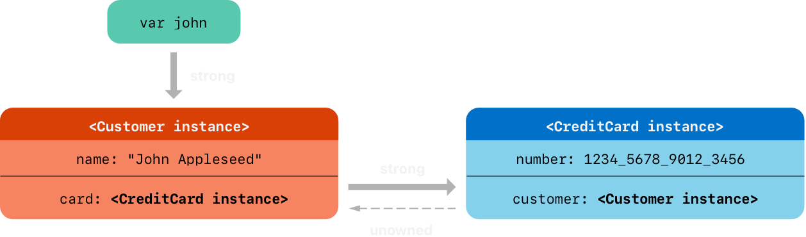
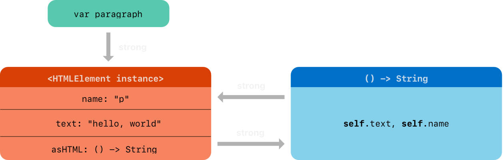
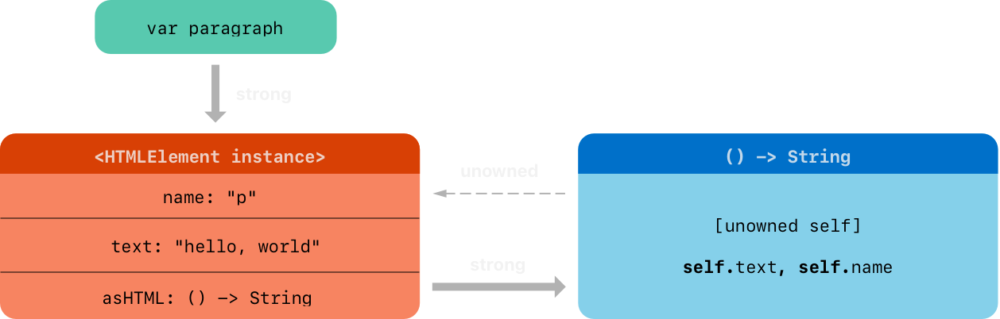
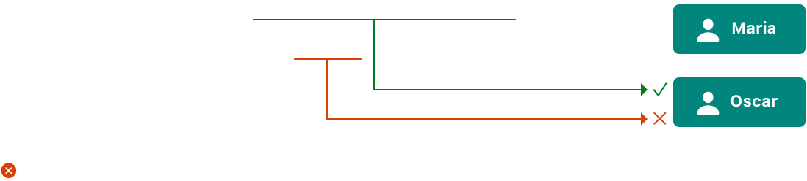

<head>
    
    
</head>

# Table of Contents

1.  [Algorithm](#orgc53577a)
2.  [Review](#orge87ec67)
    1.  [ARC 如何工作](#orgec48772)
    2.  [Action 中的 ARC](#org78768ef)
    3.  [类实例之间的强引用循环](#org076890e)
    4.  [解决类实例之间强引用循环](#orgd29afa8)
    5.  [弱引用](#orgafcf68c)
    6.  [无持有者引用](#org7fd0a49)
    7.  [无持有者可选引用](#org8647c08)
    8.  [无持有者引用和间接无封装可选属性](#org12abc51)
    9.  [闭包的强引用循环](#org225d16b)
    10. [解决闭包的强引用循环](#orgf8a0e55)
    11. [定义一个捕获列表](#org7f4e4e0)
    12. [弱引用和无持有者引用](#org7b2edcc)
3.  [Tips](#org5ce489c)
    1.  [理解内存的冲突访问](#org8866d67)
    2.  [内存访问的特征](#org2138885)
    3.  [In-Out 参数的冲突访问](#orged4f93b)
    4.  [方法中的 self 冲突访问](#orgcb331b2)
    5.  [属性的冲突访问](#orge7ee11d)
4.  [Share](#org74c18b8)
    1.  [描述](#org581113f)
    2.  [实现细节](#orgff8d8e7)
    3.  [可索引的跳表](#org1b27c0a)

# Algorithm

Leetcode 1224: [Maximum Equal Frequency](https://leetcode.com/problems/maximum-equal-frequency/)

<https://dreamume.medium.com/leetcode-1224-maximum-equal-frequency-24c98de8393b>

# Review

[Automatic Reference Counting](https://docs.swift.org/swift-book/documentation/the-swift-programming-language/automaticreferencecounting/)

Swift 使用 ARC 来追踪和管理你的应用程序的内存使用。在多数情况下，这意味着内存管理在 Swift 中工作，且你不需要考虑内存管理。当实例不再需要时 ARC 自动释放类实例占据的内存

然而，在一些情况下 ARC 需要你的代码部分间更多的关系来管理内存。本章描述这些情形且显示你如何启动 ARC 管理所有你的应用程序内存。在 Swift 中使用 ARC 跟在 Objective-C 语言中使用 ARC 相似

引用计数只应用于类实例。结构和枚举是值类型，不是引用类型，且不用引用存储和传递

## ARC 如何工作

每次你创建一个新的类实例，ARC 分配一块内存来存储该实例的信息。这个内存持有关于实例类型、该实例任何存储属性的值等信息

另外，当一个实例不再需要，ARC 释放该实例这样内存可被用于其他目的。这确保类实例在不再需要时不占据内存空间

然而，如果 ARC 销毁一个还在使用中的实例，它将不能再访问实例的属性，或调用实例的方法。实际上，如果你尝试访问实例，你的应用程序能可能会崩溃

为确保当还在需要时实例不会消失，ARC 跟踪每个类实例引用的有多少个属性、常量和变量。ARC 在至少有一个活跃引用存在时不会销毁实例

为使这成为可能，不管你赋值一个类实例到一个属性，常量，或变量，该属性，常量，或变量有一个强引用到该实例。引用被称为强引用因为它对该实例有一个持有，且不允许该强引用还在时它被销毁

## Action 中的 ARC

这里有一个 ARC 如何工作的例子。这个例子有一个 Person 的简单类，定义了一个叫 name 的存储属性

    class Person {
        let name: String
        init(name: String) {
            self.name = name
            print("\(name) is being initialized")
        }
        deinit {
            print("\(name) is being deinitialized")
        }
    }

Person 类有一个初始化函数设置实例的 name 属性并打印一个信息显示初始化已经开始。Person 类也定义了一个析构函数当类实例析构时打印一个信息

下面的代码片段定义三个 Person? 类型变量，用来在代码中建立多个对新的 Person 实例的引用。因为这些变量是可选属性，它们自动初始化为 nil，且当前不引用到一个 Person 实例

    var reference1: Person?
    var reference2: Person?
    var reference3: Person?

你现在可以创建一个新的 Person 实例并赋值到这三个变量之一

    reference1 = Person(name: "John Appleseed")
    // Prints "John Appleseed is being initialized"

注意消息 "John Appleseed is being initialized" 在你调用 Person 类的初始化函数时打印。这确定了初始化函数已被执行

因为新的 Person 实例被赋值到 reference1 变量，现在有一个从 reference1 到新的 Person 实例的强引用。因为有至少一个强引用，ARC 确定这个 Person 应该保持在内存中且不能被析构

如果你赋值相同的 Person 实例到另两个变量，将有新的两个强引用

    reference2 = reference1
    reference3 = reference1

现在有三个到这个 Person 实例的强引用

如果你切断两个强引用，赋值 nil 到两个变量，剩下一个强引用，且 Person 实例不会析构

    reference1 = nil
    reference2 = nil

直到最后一个强引用被切断之前 ARC 不析构 Person 实例

    reference3 = nil
    // Prints "John Appleseed is being deinitialized"

## 类实例之间的强引用循环

在上述的例子中，ARC 能够追踪新的 Person 实例的引用数并当 Person 实例不再需要时析构

然而，有可能代码对于一个类实例永远不会得到 0 强引用的情况。这在如果两个类实例互相有一个强引用时会发生，这样每个实例使得另一个活跃。这被称为强引用循环

你通过定义类之间一个弱或未知引用而不是强引用来解决强引用循环。然而，在你学习如何解决一个强引用循环之前，理解这样的循环如何引起是很有用的

这里有一个强引用循环被创建的例子。这个例子定义两个类为 Person 和 Apartment：

    class Person {
        let name: String
        init(name: String) { self.name = name }
        var apartment: Apartment?
        deinit { print("\(name) is being deinitialized") }
    }
    
    
    class Apartment {
        let unit: String
        init(unit: String) { self.unit = unit }
        var tenant: Person?
        deinit { print("Apartment \(unit) is being deinitialized") }
    }

每个 Person 实例有一个 String 类型的 name 属性和一个可选的 apartment 属性初始化为 nil。apartment 属性是可选的，因为一个人可能没有公寓

相似的，每个 Apartment 实例有一个 String 类型的 unit 属性和一个可选的 tenant 属性初始化为 nil。tenant 属性可选因为一个公寓可能没有一个租主

这两个类都定义了一个析构函数，打印该类实例正在被析构。这使得你能看到是否它们的实例如期望那样被析构

下面的代码片段定义两个可选类型变量称为 john 和 unit4A，其可被设置为一个特殊的 Apartment 和 Person 实例。这两个变量有一个初始值为 nil

    var john: Person?
    var unit4A: Apartment?

现在创建一个特殊的 Person 实例和 Apartment 实例并赋值给 john 和 unit4A 变量

    john = Person(name: "John Appleseed")
    unit4A = Apartment(unit: "4A")

下面图显示在创建和赋值这两个实例之后强引用的情况。john 变量现在有一个强引用到新的 Person 实例，unit4A 变量有一个强引用到新的 Apartment 实例

现在互相链接两个实例使得 person 有一个 apartment，apartment 有一个 tenant。注意一个叹号用来解封和访问存储在 john 和 unit4A 可选变量里的实例，这样这些变量属性可被设置为

    john!.apartment = unit4A
    unit4A!.tenant = john

下面这是链接之后的图

不幸地是，链接这两个实例创建了一个强引用循环。Person 实例现在有一个到 Apartment 实例的强引用，且 Apartment 实例有一个到 Person 实例的强引用。因此，当你切断 john 和 unit4A 变量持有的强引用时，引用计数不能下降到零，且实例不能被 ARC 析构

    john = nil
    unit4A = nil

注意两个析构函数都没有被调用当你设置这两个变量为 nil 的时候。强引用循环防止 Person 和 Apartment 实例被析构，引起内存泄漏

下面是你设置 john 和 unit4A 变量为 nil 后的强引用情况

Person 和 Apartment 实例之间的强引用还在且不能被切断

## 解决类实例之间强引用循环

Swift 提供两种方式解决强引用循环：弱引用和无所有者引用

弱引用和无所有者引用使得一个实例在引用循环中引用另一个实例但不是一个强持有。实例可相互引用而不创建出一个强引用循环

当另一个实例有一个更短的生命周期时使用一个弱引用 - 即当另一个实例可先被析构。在上述 Apartment 例子中，对一个 apartment 来说在它的生命周期某个点有可能没有 tenant，且这样一个弱引用在这个情况中是一个合适的方法来切断引用循环，当另一个实例有相同的生命周期或一个更长的生命周期时使用一个无所有者引用

## 弱引用

一个弱引用是一个不强持有它引用的实例的引用，且这样不停止 ARC 析构引用实例。这个行为防止引用变成一个强引用循环的一部分。把 weak 关键字放在一个属性或变量定义前表示一个弱引用

因为一个弱引用不持有它引用的实例的强持有，可能当实例被析构后弱引用还引用它。因此，ARC 在实例被析构后自动设置弱引用为 nil。且因为弱引用需要允许它们的值在运行时被改变为 nil，它们总是定义为可选变量，而不是常量

你可检查弱引用中值的存在，和任何其他可选值一样，你不会导致引用到一个不存在的无效实例

注意：属性观察在 ARC 设置一个弱引用为 nil 时不会被调用

下面这个例子更上面的例子相似，只是 Apartment 类型的 tenant 属性被定义为一个弱引用

    class Person {
        let name: String
        init(name: String) { self.name = name }
        var apartment: Apartment?
        deinit { print("\(name) is being deinitialized") }
    }
    
    
    class Apartment {
        let unit: String
        init(unit: String) { self.unit = unit }
        weak var tenant: Person?
        deinit { print("Apartment \(unit) is being deinitialized") }
    }

两个变量的强引用和两个实例间的链接被创建为如下

    var john: Person?
    var unit4A: Apartment?
    
    john = Person(name: "John Appleseed")
    unit4A = Apartment(unit: "4A")
    
    john!.apartment = unit4A
    unit4A!.tenant = john

下图是引用情况：

Person 实例还是有一个到 Apartment 实例的强引用，但 Apartment 实例现在是有一个到 Person 实例的弱引用。这意味着当你通过设置 john 变量为 nil 切断持有的强引用，则没有到 Person 实例的强引用了

    john = nil
    // Prints "John Appleseed is being deinitialized"

因为没有到 Person 实例的强引用，它被析构且 tenant 属性被设置为 nil

唯一还在的到 Apartment 实例的强引用来自 unit4A 变量。如果你切断这个强引用，则没有到 Apartment 实例的强引用

    unit4A = nil
    // Prints "Apartment 4A is being deinitialized"

因为没有到 Apartment 实例的强引用，它也被析构了

## 无持有者引用

和弱引用很像，一个无持有者引用不会保持到它引用实例的强持有。不同的是，无持有者引用在其他实例有相同或更长的生命周期时使用。无持有者引用要在一个属性或变量定义前加 unowned 关键字

跟弱引用不同，一个无持有者引用总是期望有一个值。这样，一个无持有者不能是可选的，且 ARC 不会设置一个无持有者引用值为 nil

重点：使用一个无持有者引用只当你确定引用总是引用到一个未析构的实例

如果你尝试访问一个无持有者引用的值，其引用的实例已经被析构，你将得到一个运行时错误

下面代码定义两个类，Customer 和 CreditCard，模拟一个银行客户和一个可能的该客户的信用卡。这两个类每个存储另一个类的实例作为一个属性。这个关系潜在的创建一个强引用循环

Customer 和 CreditCard 之间的关系跟上述 Apartment 和 Person 之间的关系不同。在这个数据模型中，一个客户可能有或没有一个信用卡，但一个信用卡总是有一个客户。一个 CreditCard 实例不会在它引用的 Customer 之外存活。为表达这个，Customer 类有一个可选 card 属性，但 CreditCard 类有一个无持有者 customer 属性

更进一步，一个新的 CreditCard 实例只能在传递一个数字值和一个客户实例来创建一个客户 CreditCard 初始化函数。这确保一个 CreditCard 实例总是有一个客户实例

因为一个信用卡总是有一个客户，你定义它的 customer 属性为一个无持有者引用，为避免一个强引用循环：

    class Customer {
        let name: String
        var card: CreditCard?
        init(name: String) {
            self.name = name
        }
        deinit { print("\(name) is being deinitialized") }
    }
    
    
    class CreditCard {
        let number: UInt64
        unowned let customer: Customer
        init(number: UInt64, customer: Customer) {
            self.number = number
            self.customer = customer
        }
        deinit { print("Card #\(number) is being deinitialized") }
    }

注意：CreditCard 类的 number 属性用 UInt64 类型定义而不是 UInt，确保 number 属性在 32 位和 64 位系统中能存储 16 数字卡号

下面的代码片段定义一个可选的 Customer 变量称为 john，其用来存储一个特殊客户的引用。这个变量有一个初始值为 nil

    var john: Customer?

现在创建一个 Customer 实例，用它来初始化和赋值一个新的 CreditCard 实例作为 customer 的 card 属性

    john = Customer(name: "John Appleseed")
    john!.card = CreditCard(number: 1234_5678_9012_3456, customer: john!)

下面是引用的情况图

注意：上述例子显示如何使用一个安全的无持有者引用。Swift 也提供不安全的无持有者引用当你需要禁止运行时安全检查时 - 例如，为性能原因。对所有不安全操作，你负责检查代码的安全性

用 unowned(unsafe) 表示一个不安全无持有者引用。如果你尝试访问一个不安全无持有者引用在实例被销毁之后，你的应用程序将尝试访问实例使用的内存位置，这是一个不安全的操作

## 无持有者可选引用

你可标记一个类的可选引用为无持有者。在 ARC 持有者模型中，一个无持有者可选引用和一个弱引用都可用在相同的上下文中。不同的是当你使用一个无持有者可选引用，你负责确保它总是引用一个有效对象或设置为 nil

这里有一个例子跟踪学校中一个特别的部门提供的课程

    class Department {
        var name: String
        var courses: [Course]
        init(name: String) {
            self.name = name
            self.courses = []
        }
    }
    
    
    class Course {
        var name: String
        unowned var department: Department
        unowned var nextCourse: Course?
        init(name: String, in department: Department) {
            self.name = name
            self.department = department
            self.nextCourse = nil
        }
    }

Department 维护一个强引用到它提供的每个课程。在 ARC 持有者关系模型中，一个部门持有它的课程。Course 有两个无持有者引用，一个到部门和一个学生应该有的下一个课程；一个课程不持有这些对象。每个课程是一些部门的一部分这样部门属性不是可选的。然而，因为一些课程没有推荐的下一个课程，nextCourse 属性是可选的

这里是使用这些类的一个例子

    let department = Department(name: "Horticulture")
    
    
    let intro = Course(name: "Survey of Plants", in: department)
    let intermediate = Course(name: "Growing Common Herbs", in: department)
    let advanced = Course(name: "Caring for Tropical Plants", in: department)
    
    
    intro.nextCourse = intermediate
    intermediate.nextCourse = advanced
    department.courses = [intro, intermediate, advanced]

上述代码创建一个部门和它的三个课程。intro 和 intermediate 课程都有一个建议的下一个课程存储在它们的 nextCourse 属性中，其维持一个无持有者可选引用到一个学生完成该课程后应该参加的课程

一个无持有者可选引用不维持一个强持有它封装的类实例，且这样它不防止 ARC 销毁该实例。它的行为和一个无持有者引用一样，除了一个无持有者可选引用可为 nil

可非可选无持有者引用一样，你负责确保 nextCourse 总是引用到一个未销毁的课程。在这个情况，例如，当你从 department.course 删除一个课程你也需要移除其他课程对它的引用

注意：一个可选值的底层类型是可选型，其在 Swift 标准库中是一个枚举。然而，可选型有一个例外规则是值类型不能标记为 unowned

可选型封装类不使用引用计数，这样你不需要维护到可选型的一个强引用

## 无持有者引用和间接无封装可选属性

上述弱引用和吴持有者引用的例子覆盖了两种需要切断强引用循环的更常见场景

Person 和 Apartment 例子显示当两个属性，都可以为 nil，有潜在导致强引用循环的情形。这个情况下最好用弱引用解决

Customer 和 CreditCard 例子显示当一个属性允许为 nil 而另一个属性不能为 nil 时有潜在导致强引用循环的可能。这个场景下可以用一个无持有者引用解决

然而，有第三个场景，两个属性总是有一个值，且一旦初始化以后不会为 nil。在这个场景下，用一个不持有者属性和一个间接解封可选属性组组合来解决

这使得两个属性一旦初始化之后可直接访问（没有可选解封），且还能避免引用循环

下面例子定义两个类，Country 和 City，都存储另一个类的实例作为属性。在这个数据模型中，每个国家必须有一个首都，且每个城市必须属于一个国家。为表达这个，Country 类有一个 capitalCity 属性，City 类有一个 country 属性

    class Country {
        let name: String
        var capitalCity: City!
        init(name: String, capitalName: String) {
            self.name = name
            self.capitalCity = City(name: capitalName, country: self)
        }
    }
    
    
    class City {
        let name: String
        unowned let country: Country
        init(name: String, country: Country) {
            self.name = name
            self.country = country
        }
    }

为覆盖这个需求，你定义 Country 类的 capitalCity 属性为直接解封可选属性，在它的类型后有一个叹号。这意味着 capitalCity 属性有一个缺省值 nil，但访问不需要解封它的值

因为 capitalCity 有一个缺省的 nil 值，一个新的 Country 实例在它的初始化函数中设置它的 name 属性后被认为已完全初始化。这意味着 Country 初始化函数在设置 name 属性后可开始引用和传递直接的 self 属性。当 Country 初始化函数设置它的 capitalCity 属性时 Country 初始化函数因此传递 self 作为 City 初始化函数的一个参数

即你可创建 Country 和 City 实例在一个语句中，而不会创建出强引用循环，且 capitalCity 属性可直接访问，不需要解封它的可选值

    var country = Country(name: "Canada", capitalName: "Ottawa")
    print("\(country.name)'s capital city is called \(country.capitalCity.name)")
    // Prints "Canada's capital city is called Ottawa"

上面例子中，直接解封可选的使用意味着所有两阶段类初始化函数需求满足。capitalCity 属性可用且初始化一旦完成可像一个非可选值一样访问，且还避免强引用循环

## 闭包的强引用循环

当你赋值一个闭包作为类实例的一个属性时也可导致一个强引用循环，且闭包体捕获了实例。这个捕获会发生因为闭包体访问了实例的一个属性，比如 self.someProperty，或因为闭包调用实例的一个方法，比如 self.someMethod()。这样的情况下，这些访问导致闭包捕获 self，创建了一个强引用循环

因为闭包是引用类型。当你赋值一个闭包到一个属性，你赋值一个引用到那个闭包。这就跟两个强引用互相保活一样了

Swift 提供了一个优雅的解决方案，被称为闭包捕获列表。然而，在你学习如何用闭包捕获列表切断强引用之前，理解循环如何导致的是很有用的

下面例子显示你如何用闭包创建一个强引用循环。这个例子定义一个类称为 HTMLElement，其对 HTML 文档中一个独立元素提供一个式样模型

    class HTMLElement {
    
        let name: String
        let text: String?
    
        lazy var asHTML: () -> String = {
            if let text = self.text {
                return "<\(self.name)>\(text)</\(self.name)>"
            } else {
                return "<\(self.name) />"
            }
        }
    
        init(name: String, text: String? = nil) {
            self.name = name
            self.text = text
        }
    
        deinit {
            print("\(name) is being deinitialized")
        }
    }

HTMLElement 类定义一个 name 属性，显示元素的名字，比如 "h1" 对应一个标题元素，"p" 对应一个段落元素或 "br" 对应一个换行元素。HTMLElement 也定义一个可选文本属性，你可设置一个字符串表示 HTML 元素要渲染的文本

另外，HTMLElement 类定义一个延迟属性称为 asHTML。这个属性引用一个闭包组合名字和文本到一个 HTML 字符串片段。asHTML 属性类型为 () -> String，或“一个无参数函数，返回一个字符串值“

缺省情况下，asHTML 属性赋值一个闭包返回一个字符串表示一个 HTML tag。这个 tag 包含可选的文本值，或无文本内容。对一个段落元素，闭包应该返回 "
some text
" 或 "
"

asHTML 属性像一个实例方法。然而，因为 asHTML 是一个闭包属性而不是一个实例方法，你可用一个自定义闭包替换默认的闭包值

例如，asHTML 属性当文本属性为 nil 时可设置为一个闭包缺省为某种文本，为了避免返回一个空的 HTML tag

    let heading = HTMLElement(name: "h1")
    let defaultText = "some default text"
    heading.asHTML = {
        return "<\(heading.name)>\(heading.text ?? defaultText)</\(heading.name)>"
    }
    print(heading.asHTML())
    // Prints "<h1>some default text</h1>"

注意：asHTML 属性定义为延迟属性，因为它只在当元素事实上需要被渲染为一个字符串值作为 HTML 输出目标时。事实上 asHTML 是一个延迟属性意味着你可引用缺省闭包的 self，因为延迟属性在初始化完成之后且 self 存在之前不能访问

HTMLElement 类提供一个初始化函数，带一个 name 参数和一个文本参数。也定义了一个析构函数，打印一个消息显示一个 HTMLElement 实例什么时候被析构了

下面代码显示使用一个 HTMLElement 类来创建并打印一个实例

    var paragraph: HTMLElement? = HTMLElement(name: "p", text: "hello, world")
    print(paragraph!.asHTML())
    // Prints "
hello, world
"

不幸的事，HTMLElement 类在实例和用于缺省值的闭包之间创建了一个强引用循环。如下图：

实例的 asHTML 属性持有一个强引用到它的闭包。然而，因为闭包在包体中引用到 self，闭包捕获了 self，意味着它持有一个到 HTMLElement 实例的强引用

如果你设置 paragraph 变量为 nil并切断到 HTMLElement 实例的强引用，强引用循环会防止 HTMLElement 实例和闭包的析构

    paragraph = nil

## 解决闭包的强引用循环

通过定义一个捕获列表作为闭包定义的一部分解决闭包和类之间的强引用循环。一个捕获列表定义在包体内捕获一个或多个引用类型时使用的规则。如同在两个类实例之间的其强引用循环，你声明每个捕获引用为弱引用或无持有者引用而不是强引用。弱引用或无持有者引用的选择取决于代码不同部分之间的关系

## 定义一个捕获列表

在捕获列表中的每个条目是一对引用的弱或无持有者关键字到一个类实例或一个带某个值的变量（例如 delegate = self.delegate）。这些对写在方括号里，用逗号隔开

把捕获列表放在闭包的参数列表和返回类型之前

    lazy var someClosure = {
            [unowned self, weak delegate = self.delegate]
            (index: Int, stringToProcess: String) -> String in
        // closure body goes here
    }

如果一个闭包没有指定一个参数列表或返回类型，把捕获列表放在闭包的开头，在 in 关键字之前

    lazy var someClosure = {
            [unowned self, weak delegate = self.delegate] in
        // closure body goes here
    }

## 弱引用和无持有者引用

在一个闭包里定义一个捕获为无持有者引用在闭包和它捕获的实例总是互相引用，且总是在同时析构

相反地，当捕获的引用在未来某个时刻可能变成 nil 时用弱引用。弱引用总是一个可选类型，且当引用的实例析构时自动变成 nil。这使得你在闭包体内检查它们的存在

注意：如果捕获引用不会为 nil，它应该总是用无持有者引用，而不是弱引用

一个无持有者引用是一个适合的捕获方法来解决 HTMLElement 例子里的强引用循环问题。代码如下

    class HTMLElement {
        let name: String
        let text: String?
    
        lazy var asHTML: () -> String = {
                [unowned self] in
            if let text = self.text {
                return "<\(self.name)>\(text)</\(self.name)>"
            } else {
                return "<\(self.name) />"
            }
        }
    
        init(name: String, text: String? = nil) {
            self.name = name
            self.text = text
        }
    
        deinit {
            print("\(name) is being deinitialized")
        }
    }

引用情况如下图：

# Tips

[Memory Safety](https://docs.swift.org/swift-book/documentation/the-swift-programming-language/memorysafety)

Swift 缺省情况下防止不安全的行为在代码中发生。例如，Swift 确保变量在使用之前初始化，内存在析构之后不能访问，且数组下标检查越界错误

Swift 也确保多次访问相同区域内存不冲突，通过请求代码修改一个内存位置需要排他访问该内存。因为 Swift 自动管理内存，多数情况下你不需要考虑内存问题。然而，理解哪里会发生潜在的冲突是很重要的，这样你可避免写出内存冲突的代码。如果你的代码包含冲突，你会得到一个编译器时间或运行时错误

## 理解内存的冲突访问

在你的代码中访问内存发生在当你做一些事情比如设置一个变量的值或传递一个参数到一个函数。例如，下面代码包含一个读访问和一个写访问

    // A write access to the memory where one is stored.
    var one = 1
    
    // A read access from the memory where one is stored.
    print("We're number \(one)!")

一个内存冲突访问发生在当你的代码不同部分尝试同时访问相同位置内存时。同时多次访问一个内存位置可产生无法预测或不一致的行为。在 Swift 中，修改一个值可扩展到多行代码，使得它可能尝试在修改过程中访问一个值

你可通过思考你如何更新写在一张纸上的预算来看待相似的问题。更新预算是一个两阶段处理：首先你添加条目的名字和价格，且然后你改变总数来反映当前列表的条目。在更新之前和之后，你可从预算读取任意信息和获得正确答案，如下图：

当你添加条目到预算，它处于临时状态中，因为总数没有更新来反映新添加的条目所以是无效状态。在添加条目过程中读取总数会获得不正确信息

这个例子也展示了当修复内存访问冲突时你会遇到的挑战：多个修复冲突的方法产生不同的答案，且当答案是正确时这总是不明显的。在这个例子中，取决于是否你想要原始的总数或更新后的总数，$5 或 $320 都是正确的答案。在你修复冲突访问前，你需要决定它打算做什么

注意：如果你写并行或多线程代码，内存冲突访问可能是一个熟悉的问题。然而，这里讨论的访问冲突可发生在一个线程中且不包含并行或多线程代码

如果你在一个线程中有访问冲突，Swift 保证你会获得一个编译时间错误或一个运行时错误。对多线程代码，使用 Thread Sanitizer 来帮助检测线程间冲突访问

## 内存访问的特征

有三种内存访问特征在冲突访问上下文中可考虑：是否访问是一个读或一个写，访问的时长和访问的内存位置。特别地，一个冲突发生在是否你有两个访问遇到所有下面的条件：

-   至少一个是写访问或非原子访问
-   它们访问内存的相同位置
-   它们的访问期有重叠

读和写访问的不同通常很明显：一个写访问改变内存位置值，而读不会。内存位置指明什么被访问 - 例如，一个变量，常量或属性。内存访问期间要么是瞬时的要么是长期的

一个操作是原子的如果它只使用 C 语言原子操作；否则它是非原子的

一个访问是瞬时的如果它对其他代码来说不可能运行在访问之后且访问结束之前。自然地，两个瞬时访问不可能同时发生。多数内存访问是瞬时的。例如，下面代码的读写操作是瞬时的

    func oneMore(than number: Int) -> Int {
        return number + 1
    }
    
    var myNumber = 1
    myNumber = oneMore(than: myNumber)
    print(myNumber)
    // Prints "2"

然而，有一些方法访问内存，被称为长期的，扩展到其他代码的执行。瞬时访问和长期访问的不同是其他代码可能运行在一个长期访问开始之后且在它结束之前，称为覆盖。一个长期访问可覆盖另一个长期访问和瞬时访问

覆盖访问主要出现在函数和方法或结构的修改方法中使用 in-out 参数。这种特别的 Swift 代码使用长期访问我们将在下面章节讨论

## In-Out 参数的冲突访问

一个函数有长期写访问到所有它的 in-out 参数。一个 in-out 参数写访问开始在所有非 in-out 参数被评估之后且持续函数调用的整个过程。如果有多个 in-out 参数，写访问开始于参数出现的相同顺序

这个长期写访问的一个结果是你不能访问作为 in-out 传递的原始变量值，甚至如果范围规则且访问控制会允许它 - 任何访问到原始值会创建一个冲突，例如

    var stepSize = 1
    
    func increment(_ number: inout Int) {
        number += stepSize
    }
    
    increment(&stepSize)
    // Error: conflicting accesses to stepSize

上述代码中，stepSize 是一个全局变量，且在 increment(\_:) 中正常可访问。然而，stepSize 的读访问与 number 的写访问覆盖。如下图，number 和 stepSize 指向同一内存地址。相同地址的读写访问覆盖，产生一个冲突：

解决这个冲突的一个方法是对 stepSize 做一个直接拷贝

    // Make an explicit copy.
    var copyOfStepSize = stepSize
    increment(&copyOfStepSize)
    
    // Update the original.
    stepSize = copyOfStepSize
    // stepSize is now 2

in-out 参数长期写访问的另一个结果是传递单个参数给相同函数的多个 in-out 参数会产生一个冲突。例如

    func balance(_ x: inout Int, _ y: inout Int) {
        let sum = x + y
        x = sum / 2
        y = sum - x
    }
    var playerOneScore = 42
    var playerTwoScore = 30
    balance(&playerOneScore, &playerTwoScore)  // OK
    balance(&playerOneScore, &playerOneScore)
    // Error: conflicting accesses to playerOneScore

## 方法中的 self 冲突访问

一个结构上的修改方法在函数调用期间对 self 有写访问。例如，考虑一个游戏其每个玩家有一个健康值，当受损伤时减少，且一个能量值，当使用特殊能力时减少

    struct Player {
        var name: String
        var health: Int
        var energy: Int
    
        static let maxHealth = 10
        mutating func restoreHealth() {
            health = Player.maxHealth
        }
    }

在上述 restoreHealth() 函数中，一个到 self 的写访问在函数开头开始且持续到函数返回之前。在这个例子中，restoreHealth() 内部没有其他代码对一个 Player 实例有一个覆盖访问。下面的 shareHealth(with:) 方法带另一个 Player 实例作为 in-out 参数，创造了覆盖访问的可能性

    extension Player {
        mutating func shareHealth(with teammate: inout Player) {
            balance(&teammate.health, &health)
        }
    }
    
    var oscar = Player(name: "Oscar", health: 10, energy: 10)
    var maria = Player(name: "Maria", health: 5, energy: 10)
    oscar.shareHealth(with: &maria)  // OK

上述例子，对 Oscar 的 player 调用 shareHealth(with:) 方法来共享 Maria 的 player 的健康不会引起冲突。在方法调用中有一个对 oscar 的写访问因为 oscar 在修改方法中是 self 的值，且在相同的期间有一个对 maria 的写访问因为 maria 作为 in-out 参数被传递进来。如下图所示，它们访问内存的不同位置。即使两个写访问在时间上重叠，它们不冲突

然而，如果你传递 oscar 作为 shareHealth(with:) 的参数，则出现冲突

    oscar.shareHealth(with: &oscar)
    // Error: conflicting accesses to oscar

在方法调用期间修改方法需要写访问，且 in-out 参数在相同的期间需要写访问 teammate。在方法里，self 和 teammate 引用的内存中相同的位置 - 如下图。两个写访问到相同的内存且它们覆盖，产生一个冲突u

## 属性的冲突访问

结构、元组和枚举由独立的成员值组成，比如一个结构的属性或元组的成员。因为它们是值类型，修改值的任意片段会修改整个值，意味着读写访问一个属性需要读写访问整个值。例如，覆盖写访问到元组元素产生一个冲突：

    var playerInformation = (health: 10, energy: 20)
    balance(&playerInformation.health, &playerInformation.energy)
    // Error: conflicting access to properties of playerInformation

上述例子中，在元组成员上调用 balance(\_: \_:) 方法产生一个冲突因为对 playerInformation 写访问被覆盖

以下代码显示作为一个全家变量，写覆盖到一个结构的属性产生相同的错误

    var holly = Player(name: "Holly", health: 10, energy: 10)
    balance(&holly.health, &holly.energy)  // Error

实际上，多数情况下对结构属性的访问可安全覆盖。例如，如果上述例子中变量 holly 为一个本地变量而不是全家变量，编译器可保证对结构的存储属性覆盖访问是安全的：

    func someFunction() {
        var oscar = Player(name: "Oscar", health: 10, energy: 10)
        balance(&oscar.health, &oscar.energy)  // OK
    }

上述例子中，Oscar 的 health 和 energy 作为两个 in-out 参数传递给 balance(\_: \_:)。编译器可保证内存安全因为两个存储属性不以任何方式交互

对结构属性的覆盖访问的限制来保护内存安全不总是必要的。内存安全是想要的保障，但排他访问是比内存安全更严格的要求 - 其意味着一些代码保留内存安全，甚至它违反内存排他访问。Swift 允许这种内存安全代码如果编译器可保证非排他访问内存仍是安全的。特别地，它可保证结构属性的覆盖访问是安全的如果下面条件满足：

-   你只访问实例的存储属性，而不是计算属性或类属性
-   结构是本地变量值，不是全局值
-   结构不被任意闭包捕获，或它只被非逃逸闭包捕获

如果编译器不能保证访问是安全的，它不允许访问

# Share

[Skip list](https://en.wikipedia.org/wiki/Skip_list)

在计算机科学中，一个跳表是一个概率的数据结构对一个 n 元素的有序序列允许 $ O(\\log{n}) $ 搜索平均时间复杂度及 $ O(\\log{n}) $ 的插入平均时间复杂度。它对一个有序数组（搜索）可获得最好的特性当维护一个链表结构允许插入，这对一个静态数组是不可能的。通过维护一个子序列的链接层使得快速搜索成为可能，每个后续子序列比之前的跳过一些元素。搜索在最稀疏的子序列查找直到两个连续的元素被发现，相比要搜索的一个更小的和一个更大的或相等的元素。通过链接层，这两个元素链接下一个稀疏子序列的元素，搜索继续直到最终在全序列中搜索。跳过的元素被概率性地选择或确定，比之前更常见

## 描述

一个跳表分层构建。最底的 1 层是一个普通的有序链表。每个更高层视为下面的链表的一个表达小路径，i 层的元素以一个固定概率 p（两个常见使用的值为 1/2 或 1/4）出现在 i+1 层。一般的，每个元素出现在 1/(1-p) 个列表中，且最高的元素（通常在跳表最前头的一个特殊头元素）出现在所有列表中。跳表包含 $ \\log\_ {1/p}{n} $ 个列表

对目标元素的搜索开始于最顶上列表的头元素，且横向处理直到当前元素大于等于目标。如果当前元素等于目标，则被发现。如果当前元素大于目标，或搜索到达链表结尾，处理返回上一个元素且纵向进入更低一层列表。在每个链表期望的步骤数最多为 1/p，可从目标回溯跟踪搜索路径直到到达一个出现在下一高层或到达当前列表开头的元素为止可看到。因此，总的搜索期望成本是 $ \\frac{1}{p} \\log\_ {1/n}{n} $ 其为 $ O(\\log{n}) $，p 是一个常量。通过选择不同的 p 值，可以在搜索成本和存储成本上做妥协

## 实现细节

跳表使用的元素可包含多个指针因为它们可参与多个列表

插入和删除实现跟链表操作很像，除了头元素必须插入或删除多个列表

O(n) 操作，强制我们以升序访问每个节点（比如整个列表），提供一个机会以一个优化的方式用跳表层结构前向场景去随机来得到跳表的 $ O( \\log{n} ) $ 的搜索时间复杂度（选择第 i 层有限元素为 1 加上在它变成奇数之前可能被 2 除的次数。也就是，i = 0 对负无穷头作为一个通常的特殊例子对负或正无穷节点选择最高可能）。然而这也允许一些人知道高过 1 层节点的所有位置并删除它们

层结构可通过如下方式以类似随机的方式制成

    make all nodes level 1
    j ← 1
    while the number of nodes at level j > 1 do
        for each i'th node at level j do
            if i is odd and i is not the last node at level j
                randomly choose whether to promote it to level j+1
            else if i is even and node i-1 was not promoted
                promote it to level j+1
            end if
        repeat
        j ← j + 1
    repeat

更去随机版本很像，类随机只在当一些其他原因时才运行于 O(n) 操作

类随机版本的优点是相比去随机版几乎不会丧失太多层结构信息。这是值得的因为对方用户可以通过简单删除高层节点在悲观性能下知道哪个节点在最低层。搜索性能仍然确保在对数上

它可以尝试使用如下优化：在“接下来，对每个第 i 个&#x2026;“的部分，不对每个奇偶对做翻转。只是一旦决定只偶数或奇数节点晋级后翻转。这样可以得到 $ O(\\log{n}) $ 而不是 $ O(n \\log{n}) $。不幸的是，这给了对手用户一个 50% 的机会猜测所有偶数节点会在更高层。这个属性使得有一个非常低的概率猜测一个特殊的有某个整数 N 的节点在第 N 层

跳表不提供像更多传统平衡树数据结构那样相同的绝对最坏情况性能保障，因为它总是可能（虽然有一个非常低的概率）用来平衡的翻转方案相对平衡二叉搜索树的确定性平衡方案是有争议地更简单实现。跳表在并行计算上也是有用的，其插入可在不同的跳表部分并行完成而不用任何数据结构的全局重平衡。这样并行在临时的无线网络中对资源发现有特别地优势因为一个随机跳表对损失的任何单节点更稳健

## 可索引的跳表

如上述所描述的，一个跳表可以在一个排序的序列中以 $ O(\\log{n}) $ 时间复杂度快速插入和删除值，但它在序列的给定位置上查找值为 O(n)（例如，返回第 500 个值）；然而，用一个小改动随机索引访问查找可改进到 $ O(\\log{n}) $

对每个链接，也存储链接宽度。宽度定义为被每个高层表达路径链接穿过的底层链接数

例如，下面是一个例子显示链接宽度

       1                               10
     o---> o---------------------------------------------------------> o    Top level
       1           3              2                    5
     o---> o---------------> o---------> o---------------------------> o    Level 3
       1        2        1        2              3              2
     o---> o---------> o---> o---------> o---------------> o---------> o    Level 2
       1     1     1     1     1     1     1     1     1     1     1 
     o---> o---> o---> o---> o---> o---> o---> o---> o---> o---> o---> o    Bottom level
    Head  1st   2nd   3rd   4th   5th   6th   7th   8th   9th   10th  NIL
          Node  Node  Node  Node  Node  Node  Node  Node  Node  Node

注意一个高层链接的宽度是其下组件链接的总和。也就是说，所有宽度的总和在每层上是相等的

为下标跳表并找到第 i 个值，当统计每个穿越链接的宽度是穿越跳表。当上面的宽度太大可减掉一层

例如，为找到第 5 位的节点，穿过最上层宽度为 1 的链接。现在需要 4 个额外的步骤但这层下一个宽度是 10，太大，所以跳过一层。穿过一个宽度为 3 的链接。因为另一个步骤宽度为 2 太大，跳到下一层。现在穿过最后宽度为 1 的链接到达目标总共走了 5（1+3+1）

    function lookupByPositionIndex(i)
        node ← head
        i ← i + 1                           # don't count the head as a step
        for level from top to bottom do
            while i ≥ node.width[level] do # if next step is not too far
                i ← i - node.width[level]  # subtract the current width
                node ← node.next[level]    # traverse forward at the current level
            repeat
        repeat
        return node.value
    end function

这个实现了索引的方法被称为跳表烹饪书

