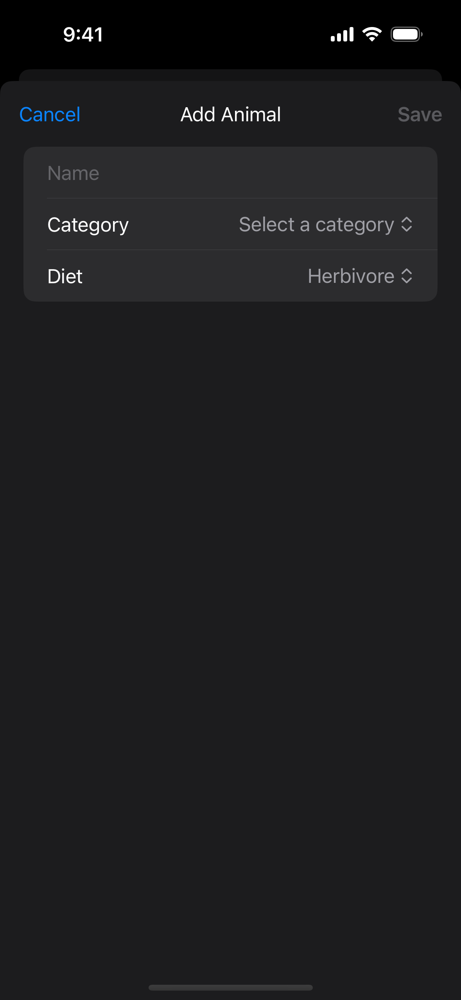

<head>
    
    
</head>

# Table of Contents

1.  [Algorithm](#org802be08)
2.  [Review](#org43b471d)
    1.  [简介](#orgba0d7c6)
    2.  [转换类为模型来使它们可持久化](#org34e0099)
    3.  [自定义模型属性的持久化行为](#orgc47e2d4)
    4.  [配置模型存储](#orgec9d8d0)
    5.  [保存模型后续使用](#orgd77ddc2)
    6.  [为显示或额外的处理获取模型](#orgb766121)
3.  [Tips](#orge87bc07)
    1.  [定义数据模型](#orgaeb75dd)
    2.  [设计数据编辑器](#org831d289)
    3.  [设置缺省值](#org8485b84)
    4.  [保存数据改变](#orgb9cfacf)
    5.  [丢弃数据改变](#orgf5b8972)
4.  [Share](#orgfd67130)

# Algorithm

Leetcode 1235: [Maximum Profit in Job Scheduling](https://leetcode.com/problems/maximum-profit-in-job-scheduling)

<https://dreamume.medium.com/leetcode-1235-maximum-profit-in-job-scheduling-96d6a96f28c1>

# Review

[跨启动保护你的应用程序模型数据](https://developer.apple.com/documentation/swiftdata/preserving-your-apps-model-data-across-launches)

使用库的宏描述你的模型类为 SwiftData，并存储这些模型的实例这样它们不在应用程序运行时间也存在

## 简介

多数应用程序定义一些自定义类型模型它创建或消费的数据。例如，一个旅行 app 可能定义代表旅行、航班和住所的类。使用 SwiftData，你可快速并 高效持有数据使得它在跨 app 启动时有效，且杠杆化 SwiftUI 库的集成来重获取数据和显示到屏幕

通过设计，SwiftData 支持你现存的模型类。库提供工具比如宏和属性封装器使得你用 Swift 代码表达描述你的 app 的方案，移除对外部依赖比如模型和迁移映射文件的任何依赖

## 转换类为模型来使它们可持久化

为让 SwiftData 保存一个模型类的实例，导入带 Model() 宏的类的库和注释。宏更新遵从 PersistentModel 协议的类，SwiftData 使用检查类并产生一个内部的方案。另外，宏通过类添加 Observable 协议的遵从启动变动追踪

    import SwiftData
    
    // Annotate new or existing model classes with the @Model macro.
    @Model
    class Trip {
        var name: String
        var destination: String
        var startDate: Date
        var endDate: Date
        var accommodation: Accommodation?
    }

缺省，SwiftData 使用兼容类型包含一个类中所有非计算属性。库支持原始类型比如 Bool、Int 和 String，复杂值类型比如结构、枚举和其他遵从 Codable 协议的值类型

你写的代码定义你的模型类现在作为你的 app 的模型层的真源，且库使用它来保持持久化数据在一个一致状态中

## 自定义模型属性的持久化行为

一个属性是一个 SwiftData 管理的模型类的属性。在多数情况下，库对属性的缺省行为是足够的。然而，如果你需要修改 SwiftData 如何处理一个特殊属性的持久化，使用一个提供的方案宏。例如，你可能想要通过指定一个属性的值跨所有该模型的实例中是唯一的来在你的模型数据中避免冲突

为自定义一个属性的行为，用 Attribute(\_ :originalName: hashModifier:) 宏注释属性并指明驱动想要行为的选项的值：

    @Attribute(.unique) var name: String

除了强制唯一的限制，@Attribute 支持，保留删除的值，Spotlight 索引和加密。你也可以使用 @Attribute 宏来正确处理重命名属性如果你想要在底层模型数据中保留原始的名字

当一个模型包含一个属性其类型也是一个模型（或模型聚集），SwiftData 间接管理这些模型的关系。缺省，库在你删除一个关联模型实例后设置关系属性为 nil。为指定一个不同的删除规则，用 Relationship(\_ :deleteRule:minimumModelCount:maximumModelCount:originalName:inverse:hashModifier:) 宏注释属性。例如，当你删除一趟旅行时你可能想要删除任意关联住所

    @Relationship(.cascade) var accommodation: Accommodation?

SwiftData 缺省持有所有非计算模型属性，但你可能不总是想要这样。例如，在一个类中一个或多个属性只是包含不需要存储的临时数据，比如一个即将到来的旅行的目的地的当前天气。在这样的场景中，用 Transient() 宏注释这些属性且 SwiftData 不会写它们的值到磁盘中

    @Transient var destinationWeather = Weather.current()

## 配置模型存储

在 SwiftData 可检查你的模型和产生需要的方案之前，你需要告诉它 - 在运行时 - 哪个模型要持久化，且可选的，使用底层存储的配置。例如，你可能想要当运行测试时存储只存在内存中，或当跨设备同步模型数据时使用一个特殊的 CloudKit 容器

为设置缺省的存储，使用 modelContainer(for:inMemory:isAutosaveEnabled:isUndoEnabled:onSetup:) 视图修改器并指明要持久化的模型类型的数组。如果你使用视图修改器，把它添加到视图层级的顶部这样所有嵌套视图继承适合的配置环境：

    import SwiftUI
    import SwiftData
    
    @main
    struct TripsApp: App {
        var body: some Scene {
            WindowGroup {
                ContentView()
                    .modelContainer(for: [
                        Trip.self,
                        Accommodation.self
                    ])
            }
        }
    }

如果你不使用 SwiftUI，使用适当的初始化函数手动创建一个模型容器：

    import SwiftData
    
    let container = try ModelContainer([
        Trip.self, 
        Accommodation.self
    ])

**提示** 如果一个模型类型包含一个关联关系，你可从数组中忽略目标模型类型。SwiftData 自动穿越一个模型的关联关系并包含你要的任意目标模型类型

使用 ModelConfiguration 来创建自定义存储。类型提供一些选项来配置包括是否：

-   存储只存在内存中
-   存储只读
-   app 使用一个特殊的 App 组来存储它的模型数据

    let configuration = ModelConfiguration(isStoredInMemoryOnly: true, allowsSave: false)
    
    let container = try ModelContainer(
        for: Trip.self, Accommodation.self, 
        configurations: configuration
    )

**重要** 自动 iCloud 同步依赖于 CloudKit 权利的在场，且 SwiftData 使用在那个权利中找到的第一个容器。如果你的 app 需要一个特殊的容器，使用一个模型配置的实例来指定该容器

## 保存模型后续使用

为在运行时管理你的模型类的实例，使用一个模型上下文 - 该对象负责内存模型数据和与模型容器协调来成功地持久化该数据。为获得一个你的模型容器的上下文对主 actor 有边界，使用 modelContext 环境变量：

    import SwiftUI
    import SwiftData
    
    struct ContentView: View {
        @Environment(\.modelContext) private var context
    }

在视图之外，或如果你不使用 SwiftUI，使用模型容器直接访问相同的 actor 边界上下文

    let context = container.mainContext

在两个实例中，返回的上下文定期检查是否它包含未保存的改变，且如果有，间接代表你保存这些改变。对你手工创建的上下文，设置 autosaveEnabled 属性为 true 来获得相同的行为

为启动 SwiftData 持久化一个模型实例并开始追踪它的改变，插入实例到上下文：

    var trip = Trip(name: name, 
                    destination: destination, 
                    startDate: startDate, 
                    endDate: endDate)
    
    context.insert(trip)

随着插入，你可通过调用上下文的 save() 方法立即保存，或依赖上下文的间接保存行为。上下文自动追踪到它们所知的模型实例的改变并在序列存储中包含这些改变。另外对存储，你可使用一个上下文来获取、迭代和删除模型实例

## 为显示或额外的处理获取模型

在你开始持久化模型数据之后，你将想要获取该数据，实现模型实例，并显示这些实例到视图中或在它们上执行一些操作。SwiftData 提供 Query 属性封装器和 FetchDescriptor 类型来执行获取

为获取模型实例，且可选地应用搜索准则并一个好的排序，使用 @Query 在你的 SwiftUI 视图中。@Model 宏添加 Observable 遵从到你的模型类，启动 SwiftUI 刷新包含的视图当改变发生在任意获取实例中

    import SwiftUI
    import SwiftData
    
    struct ContentView: View {
        @Query(sort: \.startDate, order: .reverse) var allTrips: [Trip]
    
        var body: some View {
            List {
                ForEach(allTrips) {
                    TripView(for: $0)
                }
            }
        }
    }

在一个视图之外，或如果你不使用 SwiftUI，使用 ModelContext 中两个获取方法之一。每个方法期望一个 FetchDescriptor 实例包含一个断言和一个排序。获取描述符允许额外的配置影响其他的批处理和获取

    let context = container.mainContext
    
    let upcomingTrips = FetchDescriptor<Trip>(
        predicate: #Predicate { $0.startDate > Date.now },
        sortBy: [
            .init(\.startDate)
        ]
    )
    upcomingTrips.fetchLimit = 50
    upcomingTrips.includePendingChanges = true
    
    let results = context.fetch(upcomingTrips)

# Tips

[在你的 app 中添加删除持久化数据](https://developer.apple.com/documentation/swiftdata/adding-and-editing-persistent-data-in-your-app)

添加和编辑数据是数据驱动 app 的基本特性，但一个 app 如何提高这些特性对 app 是唯一的。这个样例显示一个处理，用 SwiftData 来让某人添加、编辑和存储一个关于动物的数据条目

## 定义数据模型

在 SwiftData 可以从你的 app 存储数据之前，app 必须定义代表数据的数据模型。SwiftData 使用模型类来构建数据模型的方案。例如，样例 app 存储关于动物的数据，对这些动物分组为目录。为定义这个数据模型的方案，样例定义两个模型类：Animal 和 AnimalCategory

Animal 模型类存储动物的信息，像它的名字和饮食。为持久化动物实例，类定义应用 Model() 宏。这个宏在编译期产生代码确保类遵从 PersistentModel 协议且使它对 SwiftData 能保存动物数据到一个模型容器

    import SwiftData
    
    @Model
    final class Animal {
        var name: String
        var diet: Diet
        var category: AnimalCategory?
    
        init(name: String, diet: Diet) {
            self.name = name
            self.diet = diet
        }
    }

AnimalCategory 模型类存储关于动物目录的信息，比如哺乳动物或爬行动物。跟 Aminal 一样，AnimalCategory 定义应用 Model() 宏来确保类遵从 PersistentModel 并保存动物目录数据到一个模型容器

    import SwiftData
    
    @Model
    final class AnimalCategory {
        @Attribute(.unique) var name: String
        // `.cascade` tells SwiftData to delete all animals contained in the 
        // category when deleting it.
        @Relationship(deleteRule: .cascade, inverse: \Animal.category)
        var animals = [Animal]()
    
        init(name: String) {
            self.name = name
        }
    }

模型类也有两个属性

-   name
    
    目录名。每个目录名必须跨所有动物目录唯一。为确保唯一性，模型类应用Atribute(\_ :originalName:hasModifier:) 宏带唯一的选项到这个属性。这个选项确保一个属性的值跨所有相同类型模型是唯一的

-   animal
    
    在目录里包含的动物列表。模型类应用 Relationship(\_ :deleteRule:minimumModelCount:maximumModelCount:originalName:inverse:hashModifier:) 宏到这个属性来形成模型类 AnimalCategory 和 Animal之间的一个关系

## 设计数据编辑器

当决定人们在你的 app 中如何添加和编辑数据，考虑用户体验。样例 app，例如，让某人使用一个自定义条目视图添加和编辑动物信息，称为 AnimalEditor

AnimalEditor 的设计允许 app 使用相同的视图添加新的动物和编辑现存的动物。为提供这样的行为，编辑器声明动物属性作为一个可选 Animal 类型。如果 animal 为 nil，一个人使用编辑器是添加一个动物；否则，为编辑一个动物。编辑器通过基于 animal 计算属性的值决定编辑器的标题来使得意图明显化

    struct AnimalEditor: View {
        let animal: Animal?
    
        private var editorTitle: String {
            animal == nil ? "Add Animal" : "Edit Animal"
        }
        // ...
    }

为启动编辑一个新或现存的动物值，编辑器对每个可编辑值定义状态变量。这些状态变量存储人进入编辑器的数据，跟进入后存储在动物数据的值分割。这种分割确保 SwiftData 不保存人编辑的改变直到准备保存这些变化时。这也给它们一个机会丢弃在编辑器中它们改变的数据

    @State private var name = ""
    @State private var selectedDiet = Animal.Diet.herbivorous
    @State private var selectedCategory: AnimalCategory?
    
    var body: some View {
        NavigationStack {
            Form {
                TextField("Name", text: $name)
    
                Picker("Category", selection: $selectedCategory) {
                    Text("Select a category").tag(nil as AnimalCategory?)
                    ForEach(categories) { category in
                        Text(category.name).tag(category as AnimalCategory?)
                    }
                }
    
                Picker("Diet", selection: $selectedDiet) {
                    ForEach(Animal.Diet.allCases, id: \.self) { diet in
                        Text(diet.rawValue).tag(diet)
                    }
                }
            }
        }
    }

样例 app 用这种处理因为它使用 SwiftData 的自动保存特性。自动保存特性自动保存对模型类实例的改变，比如 animal，而不是依赖 app 来直接调用模型上下文 save() 方法

最后，为使编辑器目的对用户清晰，AnimalEditor 使用 editorTitle 计算属性显示工具条上 principle 条目段的标题

    .toolbar {
        ToolbarItem(placement: .principal) {
            Text(editorTitle)
        }
    }

## 设置缺省值

AnimalEditor 视图对一个新的动物声明它的状态变量缺省值，设置名字为一个空字符串，selectedDiet 为 herbivorous，selectedCategory 为 nil。但编辑器也支持编辑一个现存的动物

如果某人编辑一个动物，编辑器需要显示动物值来编辑。视图在 animal 属性上存储动物到编辑。为显示该动物当前值，编辑器应用 onAppear(perform:) 修饰符和从 animal 中拷贝可编辑值到状态变量

    .onAppear {
        if let animal {
            // Edit the incoming animal.
            name = animal.name
            selectedDiet = animal.diet
            selectedCategory = animal.category
        }
    }

## 保存数据改变

为允许一个人保存在编辑器中设置的改变，编辑器在工具条中提供一个保存按钮

    ToolbarItem(placement: .confirmationAction) {
        Button("Save") {
            withAnimation {
                save()
                dismiss()
            }
        }
    }

当一个人点击保存按钮，它调用编辑器的保存方法。如果这个人是编辑现存的动物，保存状态变量中的值到动物实例中。这种直接更新 SwiftData 管理的数据，并因为 app 使用自动保存特性，SwiftData 自动保存改变而不用调用模型上下文 save() 方法

    private func save() {
        if let animal {
            // Edit the animal.
            animal.name = name
            animal.diet = selectedDiet
            animal.category = selectedCategory
        } else {
            // Add an animal.
            // ...
        }
    }

当添加一个新的动物，save 函数创建一个新的动物实例，用状态变量中的 name 和 diet 初始化它。然后它设置 category 并通过调用模型上下文 insert(\_ :) 方法插入该动物到模型上下文

    private func save() {
        if let animal {
            // Edit the animal.
            // ...
        } else {
            // Add an animal.
            let newAnimal = Animal(name: name, diet: selectedDiet)
            newAnimal.category = selectedCategory
            modelContext.insert(newAnimal)
        }
    }

在保存数据之后，保存按钮通过调用 dismiss 关闭编辑器

**注意** AnimalEditor 视图从视图环境中通过 @Environment(\\.modelContext) private var modelContext 创建一个上下文引用来获取模型上下文

## 丢弃数据改变

为丢弃改变，编辑器在工具条上提供一个取消按钮

    ToolbarItem(placement: .cancellationAction) {
        Button("Cancel", role: .cancel) {
            dismiss()
        }
    }

# Share

