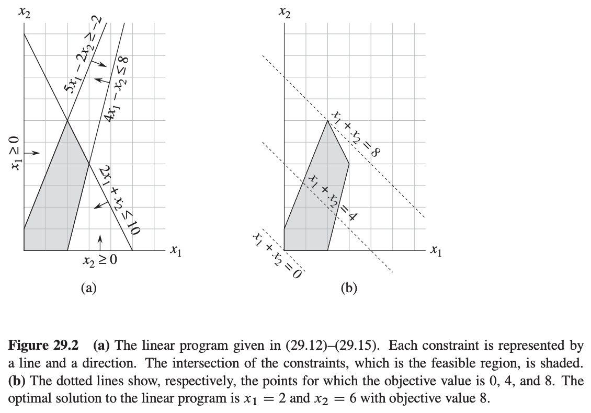
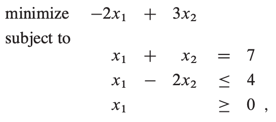
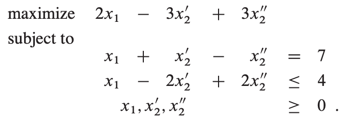
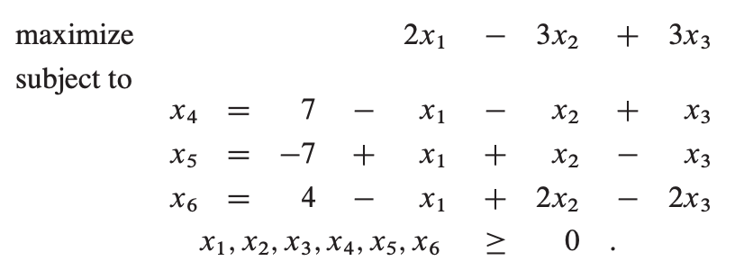

# Table of Contents

1.  [Algorithm](#orgb579c9a)
2.  [Review](#org3d3ac7d)
3.  [Tips](#org1de4d78)
4.  [Share](#org96bbcfe)
    1.  [一个选举投票问题的例子](#org96f7a80)
    2.  [简介](#org0fb42f6)
    3.  [标准形和松散形](#orgb713ac4)
        1.  [转换线性规划为标准形](#org7368444)
        2.  [松散形](#org44dfe55)

# Algorithm

# Review

# Tips

-   如果书上算法讲解内容比较长，不确定看懂了所有细节，可能写博客并写出算法实现是比较好的确定看明白的一种方法

# Share

Linear programming

算法导论29章中提到的算法

线性规划是通过指定一些包含变量的等式或不等式作为限制条件，获取目标函数最大值、最小值的问题。

## 一个选举投票问题的例子

假设你是一个政客想赢得选举。你的选区有三种类型区域&#x2013;城市、城乡结合部、农村。对应有100000，200000，50000注册选民。

你希望每个类型区域有至少一半的投票给你。你的主要主张是建造更多的路、控制枪支、投资农业、增收汽油税改善公共交通。

通过调研发现每花费1000美金广告支持某主张的投票变化表（投票人数单位：千）：

如何通过最小的花费达到每个类型区域至少一半投票给你的效果？

我们引入4个变量：

-   x1 为广告建造公路花费的金额（单位：千美金）
-   x2 为广告枪支控制花费的金额（单位：千美金）
-   x3 为广告投资农业花费的金额（单位：千美金）
-   x4 为广告汽油税花费的金额（单位：千美金）

可以得出以下公式：

为赢得至少50000城市居民投票：

-2x1 + 8x2 + 0x3 + 10x4 >= 50

赢得至少100000城乡结合部居民投票和25000农村居民投票：

5x1 + 2x2 + 0x3 + 0x4 >= 100

3x1 - 5x2 + 10x3 - 2x4 >= 25

以及最小的花费表达式：

x1 + x2 + x3 + x4

同时：

x1 >= 0, x2 >= 0, x3 >= 0, x4 >= 0

根据以上不等式，我们构造一个线性规划问题，整理如下：

最小化    x1 + x2 + x3 + x4

约束

-2x1 + 8x2 + 0x3 + 10x4 >= 50

5x1 + 2x2 + 0x3 + 0x4 >= 100

3x1 - 5x2 + 10x3 - 2x4 >= 25

x1, x2, x3, x4 >= 0

## 简介

我们看一个例子：

最小化    x1 + x2

约束

4x1 - x2 <= 8

2x1 + x2 <= 10

5x1 - 2x2 >= -2

x1, x2 >= 0

满足所有约束的x1、x2 我们称之为该线性规划问题的可行解，如下图：

我们称图中阴影部分为有解区域，目标函数在某一点的值为目标值。使目标值最大的点为最优解。

可以看到线性规划的最优解在可解区域的顶点上。由于有解区域是凸的，最优解必须出现在顶点上。相似的，可以推广到N维空间，如果我们有n个变量，每条约束定义了n维空间里的一个半空间，由于任具有凸性，最优解依然在一个顶点上。

## 标准形和松散形

线性规划中

标准形：

给定n个实数c1, c2, &#x2026;, cn，m个实数b1, b2, &#x2026;, bm，和mn个实数aij，i = 1,2,&#x2026;,m，j = 1,2,&#x2026;,n

### 转换线性规划为标准形

考虑如下4种情况：

1.  目标函数为求最小值而不是最大值
2.  变量不是非负的
3.  约束为等式
4.  不等式约束为大于等于

我们通过例子来说明：

改变目标函数为最大值，求得最大值，取负即为原最小值。

如果xj 缺少非负约束，我们将用x'j - x''j 替代xj，并添加约束x'j >= 0和x''j >= 0。

等式约束可以转成两个不等式约束：

最后，大于等于的约束改为小于等于，把x'2用x2 代替，x''2 作为x3：

### 松散形

在标准形的基础上我们通过再添加松散变量使其变成松散形（不等式约束变成等式约束），如下图的不等式：

记s为松散变量，不等式变换为如下等式形式：

再以之前的例子说明，转换成松散形后：

等式左边的变量我们称之为基本变量，右边的为非基本变量。我们用z表示目标函数的值，把例子简化成如下松散形：

