# Table of Contents

1.  [Algorithm](#org8eb282d)
2.  [Review](#org6914505)
3.  [Tips](#orge4e8852)
4.  [Share](#orgb0ba2aa)
    1.  [一个选举投票问题的例子](#org5f73c5e)
    2.  [简介](#orge3a2755)
    3.  [标准形和松散形](#orge4545a3)
        1.  [转换线性规划为标准形](#org70e42e2)
        2.  [松散形](#org839bd17)
    4.  [simplex算法](#orgde7b37e)
        1.  [simplex算法示例](#org5762f9c)
        2.  [Pivoting](#orga081067)
        3.  [形式化simplex算法](#orgd26ddf6)
    5.  [c++代码实现](#org5c6e528)

# Algorithm

# Review

# Tips

-   看完书上讲的算法认为看懂了，于是写博客把该算法描述出来，写的过程中发现有些细节不清楚，以至于一些步骤没法描述清楚，于是再看书；当把博客写完了后，再把该算法用c++实现一遍，实现的过程中又发现一些新的细节没有注意到，于是代码写不下去需要看书再确认细节，直到实现的代码跑出正确的结果，才算基本确认算法确实搞懂了。可见没有这个过程的话，自我认为懂了其实是很想当然的。

# Share

Linear programming

算法导论29章中提到的算法

线性规划是通过指定一些包含变量的等式或不等式作为限制条件，获取目标函数最大值、最小值的问题。

## 一个选举投票问题的例子

假设你是一个政客想赢得选举。你的选区有三种类型区域&#x2013;城市、城乡结合部、农村。对应有100000，200000，50000注册选民。

你希望每个类型区域有至少一半的投票给你。你的主要主张是建造更多的路、控制枪支、投资农业、增收汽油税改善公共交通。

通过调研发现每花费1000美金广告支持某主张的投票变化表（投票人数单位：千）：

如何通过最小的花费达到每个类型区域至少一半投票给你的效果？

我们引入4个变量：

-   x1 为广告建造公路花费的金额（单位：千美金）
-   x2 为广告枪支控制花费的金额（单位：千美金）
-   x3 为广告投资农业花费的金额（单位：千美金）
-   x4 为广告汽油税花费的金额（单位：千美金）

可以得出以下公式：

为赢得至少50000城市居民投票：

-2x1 + 8x2 + 0x3 + 10x4 >= 50

赢得至少100000城乡结合部居民投票和25000农村居民投票：

5x1 + 2x2 + 0x3 + 0x4 >= 100

3x1 - 5x2 + 10x3 - 2x4 >= 25

以及最小的花费表达式：

x1 + x2 + x3 + x4

同时：

x1 >= 0, x2 >= 0, x3 >= 0, x4 >= 0

根据以上不等式，我们构造一个线性规划问题，整理如下：

最小化    x1 + x2 + x3 + x4

约束

-2x1 + 8x2 + 0x3 + 10x4 >= 50

5x1 + 2x2 + 0x3 + 0x4 >= 100

3x1 - 5x2 + 10x3 - 2x4 >= 25

x1, x2, x3, x4 >= 0

## 简介

我们看一个例子：

最小化    x1 + x2

约束

4x1 - x2 <= 8

2x1 + x2 <= 10

5x1 - 2x2 >= -2

x1, x2 >= 0

满足所有约束的x1、x2 我们称之为该线性规划问题的可行解，如下图：

我们称图中阴影部分为有解区域，目标函数在某一点的值为目标值。使目标值最大的点为最优解。

可以看到线性规划的最优解在可解区域的顶点上。由于有解区域是凸的，最优解必须出现在顶点上。相似的，可以推广到N维空间，如果我们有n个变量，每条约束定义了n维空间里的一个半空间，由于任具有凸性，最优解依然在一个顶点上。

## 标准形和松散形

线性规划中

标准形：

给定n个实数c1, c2, &#x2026;, cn，m个实数b1, b2, &#x2026;, bm，和mn个实数aij，i = 1,2,&#x2026;,m，j = 1,2,&#x2026;,n

### 转换线性规划为标准形

考虑如下4种情况：

1.  目标函数为求最小值而不是最大值
2.  变量不是非负的
3.  约束为等式
4.  不等式约束为大于等于

我们通过例子来说明：

改变目标函数为最大值，求得最大值，取负即为原最小值。

如果xj 缺少非负约束，我们将用x'j - x''j 替代xj，并添加约束x'j >= 0和x''j >= 0。

等式约束可以转成两个不等式约束：

最后，大于等于的约束改为小于等于，把x'2用x2 代替，x''2 作为x3：

### 松散形

在标准形的基础上我们通过再添加松散变量使其变成松散形（不等式约束变成等式约束），如下图的不等式：

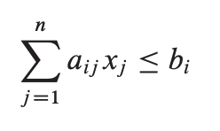

记s为松散变量，不等式变换为如下等式形式：

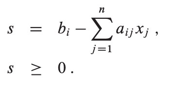

再以之前的例子说明，转换成松散形后：

等式左边的变量我们称之为基本变量，右边的为非基本变量。我们用z表示目标函数的值，把例子简化成如下松散形：

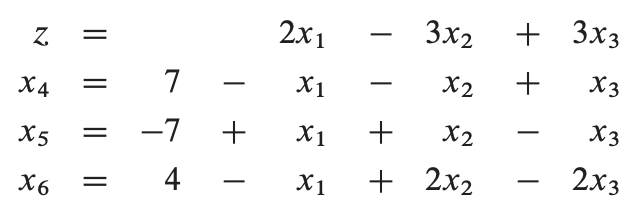

## simplex算法

simplex算法是解决线性规划问题的典型方法。同本书大多数其他算法不同，本算法最坏的情况下不是多项式时间复杂度。

simplex算法跟高斯消元有些相似，通过迭代消元来找到可行解最优值，每次迭代根据等式约束把一个非基变量变换为基本变量，通过设非基变量为0，依此求得基本变量值，从而获得目标函数值。我们还是通过例子来具体说明：

### simplex算法示例

考虑如下标准形的一个例子：

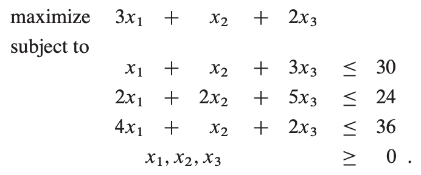

首先是转化成如下的松散形：

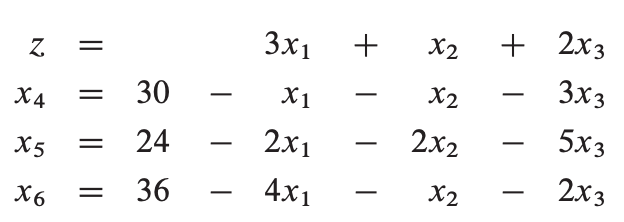

设基本变量x1, x2, x3 为0，则x4, x5, x6 分别为30, 24, 36，目标函数值z = (3 \* 0) + (1 \* 0) + (2 \* 0) = 0。

我们的目标是每次迭代能够获得更高的目标函数值。我们先考虑增加x1 的值，当x1 的值增加时，x4, x5, x6 的值将减少。根据约束，我们不能让它们的值减为负。如果x1 增加到30以上，x4 变成负数，相应的，当x1 增加到12、9时对应的x5、x6变为负。这样我们得到如下迭代后的松散形：

我们把这个操作叫做pivot，一个pivot选择一个非基变量xe和一个基本变量xl，交换它们的角色。以上pivot操作后目标函数值为(3 \* 9) + (1 \* 0) + (2 \* 0) = 27。

继续考虑迭代，我们选择一个新的变量来增加目标函数值，我们不考虑x6，因为它的值增加则目标函数值将减少。我们将尝试增加x2 或 x3，我们先选择x3。同理，根据上图约束我们可以转化为如下松散形：

获得目标函数值为111/4。现在我们只能选择增加x2，转换后如下：

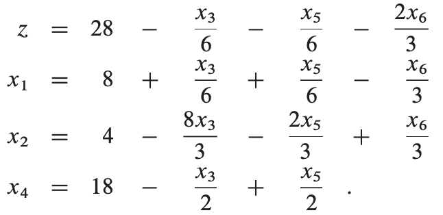

这时，目标函数上所有的系数都是负值，这时的目标函数值为28，是最优解。

### Pivoting

我们把pivoting的形式化代码写出如下：

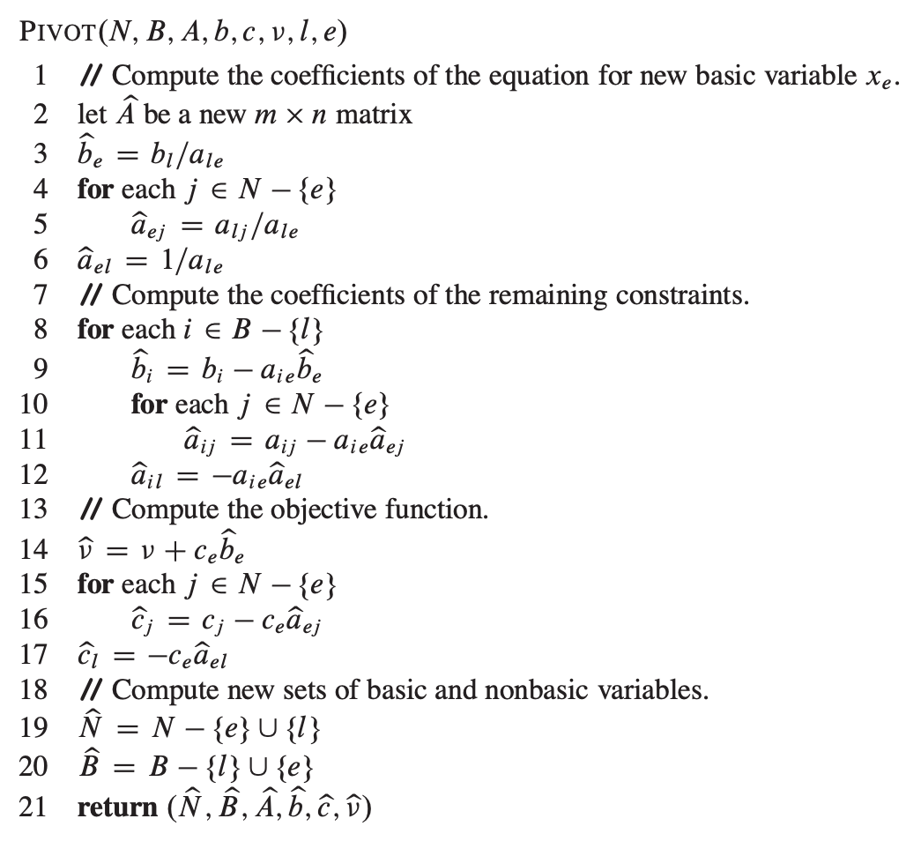

结合上面的示例看来会比较清晰。

### 形式化simplex算法

我们还需要考虑以下几个问题：

-   我们如何确定线性规划问题有可行解？
-   如果线性规划问题有可行解，但初始化方案无可行解？
-   如何确定线性规划问题无边界？
-   如何选择进入变量xe 和离开变量xl ?

在之后的29.5章节将说明如何确定问题是否有可行解，我们假设我们有一个INITIALIZE-SIMPLEX(A, b, c)的方法，把线性规划问题的标准形作为输入，mxn的矩阵A = ( aij )，m维向量b = ( bi )，n维向量c = ( cj )。如果线性规划问题无解，该方法返回问题无解的消息并终止，否则方法返回一个松散形。

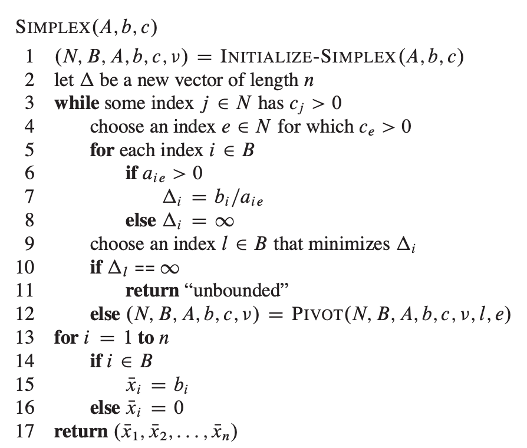

3-12行的循环过程是算法的主要部分。如果目标函数中的所有系数为负，则循环终止。否则第4行会选择一个变量xe，其系数在目标函数中为正，5-9行检查约束，确定xe 的增长值，如无约束限制xe 的增长，则算法无界。

注：每次迭代我们希望目标函数值将增加，但有可能迭代导致目标函数值不变，考虑如下示例：

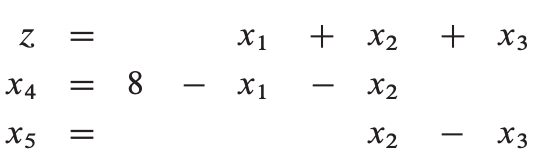

假设我们选择x1 作为xe，x4作为xl，则：

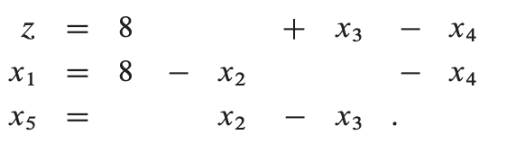

这时，只能选择x2作为xe，x5作为xl，则：

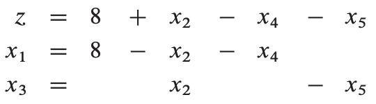

目标函数值不变，而我们继续迭代将导致重复上述两步的循环。

这种情况将导致simplex算法无法终止。循环在理论上是存在的，但一般很少出现。我们可以通过谨慎地选择xe 和 xl 来防止循环出现。一种办法是小心地选择输入使其不出现两个可行解导致相同的目标函数值的情况，另一种是迭代时总是选择最小index的变量，该策略叫Bland's rule。可以参考一下文章：<https://www.matem.unam.mx/~omar/math340/blands-rule.html>

## c++代码实现

<https://github.com/dreamume/introduction2algorithm/blob/master/chapter29/simplex.h>

<https://github.com/dreamume/introduction2algorithm/blob/master/chapter29/simplex.cc>

