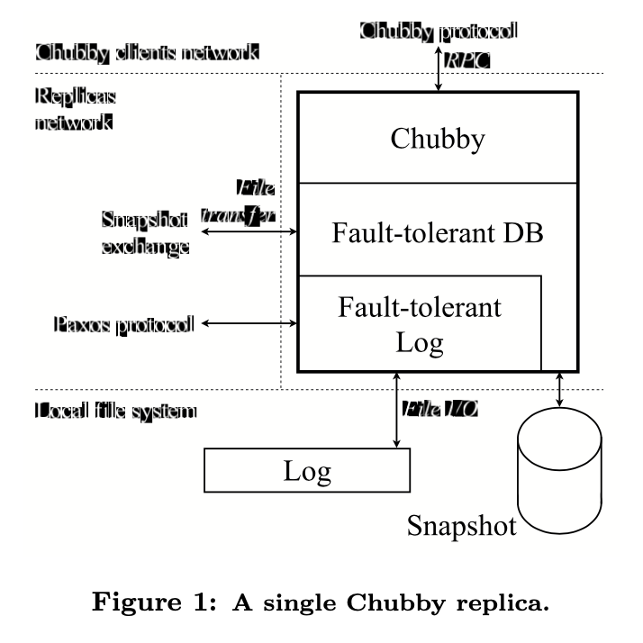

# Table of Contents

1.  [Algorithm](#org305f7b0)
2.  [Review](#org852dfe5)
    1.  [简介](#org50d195d)
    2.  [背景](#org5f6a4a8)
    3.  [架构简介](#org9e81bdc)
    4.  [Paxos](#orgb8c43fb)
        1.  [Paxos基础](#orgd9da20f)
        2.  [多Paxos](#org475018e)
    5.  [算法挑战](#org8dc61f9)
        1.  [处理磁盘损坏](#org6e88547)
        2.  [主节点租赁](#org14550a7)
        3.  [Epoch号](#orgee00182)
3.  [Tips](#orgebb48d7)
4.  [Share](#orgdadceff)
    1.  [简介](#orgd592f9a)
    2.  [编程模型](#orgd0dea68)
        1.  [示例](#orgde1c637)
        2.  [类型](#org17df49f)
        3.  [更多示例](#orgbfde6f7)
    3.  [实现](#org4e0e520)

# Algorithm

leetcode 321: <https://leetcode.com/problems/create-maximum-number/>

<https://medium.com/@dreamume/leetcode-321-create-maximum-number-45af2be1d47d?sk=ce3cc366807283e7f4db0b8f2ae78796>

# Review

Paxos Made Live

<https://ai.google/research/pubs/pub33002>

## 简介

我们知道容错可通过复制节点实现。通常的实现是使用一个共识算法确保所有复制节点一致。通过不断地应用该算法在输入数据序列中，则可以在复制节点上构建一个确定性的数据值日志。如果这些数据值是在一些数据结构中，复制节点上相同日志的应用程序可通过日志使该数据结构保持一致。例如，如果日志包含一系列数据库操作，如果这些操作应用到每个复制节点的本地数据库，最终所有节点的数据库内容一致。

这样可以实现各种原始的容错，数据库就是一个例子。最近二十年共识算法是一个研究热点。已有几种著名的共识算法有大量的设置并支持各种容错。Paxos算法已在理论和应用领域讨论了十多年。

我们使用Paxos算法作为框架的基础实现一个容错的日志。然后我们依赖该框架构建一个容错的数据库。尽管有这方面的文字描述，构建一个产品级的系统依然不是一个简单的任务。原因如下：

1.  Paxos算法用伪代码描述，我们的完整实现包含数千行c++代码。问题并不是简单因为我们使用C++实现而不是伪代码，也不是因为我们代码风格比较啰嗦。把算法转换为实现，产品级系统包含各种特性和优化，一些已发表还有一些并没有。
2.  容错算法通过一页的伪代码实现简短的证明。该证明没法扩展到系统的数千行代码，为证明一个真实系统的正确性，还得使用一些不同的方法
3.  容错算法容错了一些精心选择的有限错误集合。然而，现实中软件有各种各样的错误模型，包括算法的错误，实现中的bug，操作错误。我们不得不通过软件工程和设计可操作过程来稳健地处理各种错误模型
4.  真实系统需要非常精确。甚至指导说明可能在实现过程中改变，因此，实现需要是可控的。最后，由于错误地理解系统可能在指导说明描述的过程中出错。

本文讨论一些把Paxos引入实践的算法及工程方面的挑战性问题。这些练习更有研究意义而不是指导把伪代码转换为C++代码。

## 背景

Chubby是谷歌公司的容错系统提供分布式锁机制和存储小文件。典型情况下，每个数据中心有一个Chubby实例或cell。谷歌GFS和BigTable使用Chubby作为分布式协作和存储metadata。

Chubby通过复制节点实现容错。一个典型的Chubby cell包含5个复制节点，运行同一套代码，每个运行在一个专机上。每个Chubby对象（例如Chubby锁，或文件）作为数据库一个条目存储。在任一时刻，其中的一个节点会被作为主节点。

Chubby客户（例如GFS和Bigtable）联系一个Chubby cell来获得服务。主节点为所有Chubby请求提供服务。如果一个Chubby客户联系一个节点为非主节点，该非主节点将回复主节点的网络地址。如果主节点故障，一个新的主节点将自动选出，该主节点将以本地数据库的内容继续提供服务。这样，复制的数据库需确保Chubby状态在主节点故障的情况下的连续性。

第一版的Chubby基于一个商业的、三方的容错数据库；后面我们将以3DB指代该数据库。事实上，复制机制没有基于一个被证明的复制算法，我们并不知道它是否正确。基于产品问题的历史和Chubby的重要性，我们最终决定用我们自己基于Paxos算法的解决方案来取代3DB。

## 架构简介

上图显示了一个Chubby复制节点的架构。一个基于Paxos算法的容错复制日志在协议栈的最底部。每个复制节点维护日志的本地拷贝。Paxos算法不断地运行确保所有的复制节点在他们的本地日志中有确定顺序的条目。复制节点间通过Paxos特定协议通讯。

上一层是一个容错的数据库，每个复制节点有该数据库的本地拷贝。数据库包含一个本地快照和一个数据库操作的重放日志。新数据库操作提交到该复制日志中。当一个数据库操作在复制节点中出现，它将应用于复制节点的本地数据库拷贝中。

最后，Chubby使用该容错数据库存储它的状态。Chubby客户通过Chubby特定协议联系一个Chubby复制节点。

我们努力设计清晰的接口隔离Paxos框架，数据库和Chubby。我们部分通过系统发展的清晰化，及意图在其他应用程序中重用复制日志层。我们预测谷歌未来的系统将通过复制节点实现容错。我们相信容错日志是构建这样的系统的强大原始因素。

我们的容错日志api如上图所示。包含一个调用提交新值到日志。一旦一个提交值进入容错日志，我们的复制节点系统将调用一个回调给客户应用程序来传递该值。

我们的系统是多线程的，多个值可以在不同的线程并行提交。复制日志不创建自己的线程，但可以被任意数目的线程并行调用。

## Paxos

本节我们将给出基本Paxos算法的非形式化概述和说明如何执行多个Paxos。

### Paxos基础

Paxos是一个共识算法，被一系列进程执行，简称为复制节点。该节点可能崩溃并之后恢复。网络可能丢掉节点间的消息。节点从崩溃恢复时访问持久化存储。一些节点会提交值及达成共识。如果多数节点在没有崩溃的情况下运行足够长的时间并没有故障，所有的节点将保证都同意被提交的某一个值。

算法包含3个阶段，每个阶段可能因为故障而重复：

1.  选择一个节点作为协调者
2.  协调者选择一个值并广播给所有复制节点一个接收消息。其他复制节点要么回应该消息要么拒绝
3.  一旦多数节点回应协调者，共识即被达成，协调者广播一个提交消息通知复制节点

为说明算法如何工作，考虑只有一个协调者并且无故障的场景。一旦多数复制节点从协调者那收到接受消息并确认则共识达成。如果任意多数复制节点故障，我们将依然确保至少一个接受到共识值的复制节点依然存活着。

实际情况是协调者也可能故障。Paxos不需要同一时间只有一个复制节点作为协调者。多个复制节点可能决定变成协调者并在任意时间执行算法。典型情况下系统可能人为地限制了协调者改变速率，因这会导致延迟达成共识。

灵活选举策略意味着多个复制节点同时认为它们是协调者。这些协调者可能选择不同的值。Paxos确保共识在某个值上，需要引入以下两个机制：

1.  给成功的协调者分配一个排序
2.  限制对选择的值的每个协调者的选择

排序协调者允许每个复制节点区分当前的协调者和之前的协调者。这样，复制节点可能拒绝就协调者的消息，防止它们干扰达成的共识。Paxos通过给协调者一个递增的序号来排序。每个复制节点保存它看到的最近序号的记录。当一个复制节点想要变成一个协调者时，它生成一个唯一的序号，比它所看到的都高，并广播一个建议消息给所有复制节点。如果多数节点回复并表示没有看到更高的序号，则该复制节点将作为一个协调者。这些回复叫做承诺消息，复制节点承诺因此拒绝老的协调者消息。提议/承诺消息交换构成了上述所说的步骤1。

一旦共识在某值上达成，Paxos必须强制未来的协调者选择相同的值来继续。为保证如此，复制节点的承诺消息包含它所了解的最新的值，及了解该值的协调者序号。新的协调者选择最近协调者的值。如果没有一个承诺消息包含值，协调者将自由选择一个提交值。

以上工作的推理证明很简单，新的协调者多数节点提议消息的响应。因此，如果之前的协调者已达成共识，新的协调者被确保能从至少一个复制节点了解到该值。该值有所有收到的响应的最高序号，这样新的协调者就能够选择该值。

### 多Paxos

Paxos的实现系统像积木一样达成一系列共识，例如利用重复日志。最简单的方法实现是重复执行Paxos算法。我们标示每个执行为一个Paxos实例。提交值表示执行一个Paxos实例来提交该值。

在多Paxos中，一些慢的复制节点可能没有参与最近的Paxos实例。我们使用一个追赶机制使慢的节点追赶上其他节点。

每个复制节点维护一个本地持久化日志来记录所有Paxos行为。当一个节点崩溃并之后恢复，它将重放持久化日志来恢复状态。节点也使用日志帮助慢的节点追赶。Paxos算法请求所有的消息发送者在发送之前记录它们的状态，这样算法请求五个写操作（提议、承诺、接受、确认和提交消息）到磁盘。在系统进一步处理之前所有的写必须立即刷新到磁盘。如果复制节点紧临网络，则磁盘刷新时间将是延迟的关键。

有一个著名的优化是通过把多个Paxos实例串起来来减少消息数量。提议消息可能被忽略，如果协调者在实例中没有改变的话。这不会影响Paxos的属性，因任意复制节点在任意时刻都可以尝试变成协调者，通过广播一个更高序号的提议消息。为了利用该优化，多Paxos算法可设计为固定一个协调者一段时间。我们把该协调者作为master，通过这个优化，Paxos算法对每个Paxos实例在每个复制节点只请求一次写磁盘操作，并行执行多个实例。master在发送它的接受消息后立即写磁盘，其他复制节点在发送它的了解消息前写磁盘。

为在并行系统中获得更高的吞吐量，可以批量提交不同应用程序的值给一个Paxos实例。

## 算法挑战

Paxos核心算法已是精确描述的，基于此实现容错日志还是需要大量努力地。一些复制性源于现实世界中的不完美（例如硬盘故障，有限的资源），一些源于增加的需求（例如，主节点租赁）。许多这样的挑战的算法解决方案跟Paxos核心算法紧密相关。以下我们将描述一些我们引入的机制。

### 处理磁盘损坏

复制节点时常遭遇磁盘损坏。由于媒体故障或操作错误导致磁盘损坏（操作可能是误擦除了关键数据）。当复制节点磁盘损坏，复制节点将丢失它持久化的状态，导致之前对其他节点的承诺会有违背的情况。这是一个Paxos中关键的假设。我们使用如下机制处理这个问题。

磁盘损坏有两个明显的判断方法。要么文件内容被改变要么文件不能访问。为检测前者，我们在文件中存储文件的checksum。后者可以用新复制节点打标签和空盘来区分 - 我们通过用一个新节点在GFS中做一个标签来做检测。如果该节点以空盘再次重启，它将发现GFS的标签显示它是一个损坏的磁盘。

一个带损坏磁盘的复制节点按如下步骤重建它的状态。作为非投票成员参与Paxos，即使用追赶机制追赶但不响应承诺或确认消息。在它开始重建状态之后会一直停留在该状态，直到观察到一个完整的Paxos实例。在这期间，我们确保这个复制节点不会违背之前的承诺。

这个机制启动如下优化改进系统延迟。由于系统可以处理偶然出现的磁盘损坏，在一些条件下，它可接受不立即刷新写入磁盘。我们考虑一些方案利用这个观察，但我们还没有实现。

### 主节点租赁

当基本Paxos算法用来实现复制节点数据结构，读取数据结构需要执行一个Paxos实例。通过读取和更新串行化，确保读取到当前的状态。读取操作只能作用于主节点拷贝的数据结构，因为其他节点可能选举了其他主节点并修改数据结构而没有通知旧的主节点。这种情况下会导致主节点的读操作读取的是脏数据。因读取操作经常由所有操作的大部分组成，Paxos串行读取成本很高。

变通办法是实现主节点租赁规则：当主节点租赁时，保证其他节点不能成功地通过Paxos提交值。这样租赁的主节点本地数据结构中保持着最新的信息可以用来服务本地的读操作。使主节点在租赁到期之前续租可让主节点一直租赁。在我们的系统中，主节点维持一次租赁几天。

在我们的实现中，所有节点允许租赁之前Paxos实例的主节点，拒绝处理在此期间收到的其他节点的Paxos消息。主节点维持一个比其他节点要短一点的租赁超时，保护系统避免时钟放缓问题。主节点定期提交一个心跳值给Paxos来刷新它的租赁。

多Paxos优化展示了如下稳定性问题，在网络不间断地被耗尽的情况下。当一个主节点临时掉线，Paxos会选举一个新主节点。新主节点会在Paxos实例中维持一个固定顺序号。同时，当掉线的旧主节点试图运行Paxos算法，如果它连接另一个节点，它可能增加它的序号，当它重连接时，它可能有一个比新主节点更高的序号，并可能替代新主节点。然后，它又掉线，然而继续重复以上步骤。

该行为导致Chubby主节点改变对一些用户会有一些影响。在弱连接环境下，该行为将降低主节点切换速度。在我们的实现中，主节点定期通过跑完整的Paxos算法流程来大幅增加序号，包括发送提议消息。定期的增加序号避免了多数情况下的主节点切换抖动问题。

注意扩展租赁概念到所有节点也是可能的。这将允许任意租赁节点从它本地的数据结构服务读请求。这种扩展租赁机制在读远多于写的场景下非常有用。我们有节点租赁检测算法，但还没有实现。

### Epoch号

# Tips

-   看不懂文章的话就翻译它
-   费曼学习法很有效，看懂、理解比看更重要，要cover住所看过的内容，否则等于没看

# Share

MapReduce: Simplified Data Processing on Large Clusters

## 简介

最近五年，作者和许多其他谷歌同事实现了很多各种特殊目的的大数据计算。例如爬文档，网页请求日志等。为计算各种各样的数据，例如反转索引、网页文档图结构的呈现，按主机爬到的网页数据的总结，某日最频繁查询请求的集合。大多数这样的计算是非常概念性的。然而，输入数据通常非常庞大且计算不得不分布于成千上百的机器中来实现在可接受的时间内完成。如何并行计算，分布数据及处理错误激发人们去从原始的简单计算的复杂代码中处理这些问题。

为应对这种复杂性，我们设计一种新的抽象允许我们表达该简单计算，隐藏并行处理地细节、容错、数据分布和负载平衡。我们的抽象激发于Lisp语音中对map和reduce的原始呈现。我们意识到大多数计算应用map操作于每个输入的逻辑记录以用来计算一系列临时的键值对，然后用reduce操作相同键的所有值，用来合并数据。我们使用用户特定的map和reduce操作的函数模型，允许我们方便地并行大量地计算，并用重新执行的方式作为容错的主要手段。

本工作的主要贡献是提供一个简单强大的接口来支持自动并行的分布式的巨量可扩展计算，达到大集群PC的高性能。

## 编程模型

该计算输入为一系列键值对，MapReduce库的用户表达计算为两种函数：Map和Reduce。

Map把输入对产生一系列中间的键值对。MapReduce库对所有中间值根据键进行分组然后传递给Reduce函数。

Reduce函数合并这些值为一系列更小的值集。典型的是每个Reduce调用返回0或1个输出值。中间值通过迭代器传递给Reduce函数。这样允许我们处理远超过内存大小的数据值。

### 示例

考虑统计单词出现次数的问题。用户可能写下如下伪代码：

    map(String key, String value):
      // key: document name
      // value: document contents
      for each word w in value:
        EmitIntermediate(w, "1");
    
    reduce(String key, Iterator values):
      // key: a word
      // values: a list of counts
      int result = 0;
      for each v in values:
        result += ParseInt(v);
      Emit(AsString(result));

用户编写代码填充在mapreduce特殊对象为输入输出文件名，和一个可选的调整参数。

### 类型

之前的伪代码以字符串作为输入输出，用户提供的map和reduce函数有如下相关类型：

map    (k1, v1)       -> list(k2, v2)

reduce (k2, list(v2)) -> list(v2)

输入键值和输出键值为不同的域，中间键值和输出键值域相同。

我们的C++实现从用户定义的函数传递字符串，并让用户代码来转换字符串到相关类型。

### 更多示例

一些简单有趣的示例表达为MapReduce计算：

分布式Grep: map函数对匹配范型的行进行触发。reduce函数拷贝数据到输出。

计数URL访问频率：map函数处理web页面的请求日志，输出<URL, 1>。reduce函数统计相同URL的值，触发<URL, total count>元组。

反转Web链接图：map函数输出<target, source>元组，reduce函数拼接列表生成<target, list(source)>

主机的元素向量：元素向量统计文件中最重要的单词<word, frequency>。map函数对每个输入文档生成一个<hostname, term vector>元组，reduce函数统计主机的元素向量，去掉不频繁使用的元素，并触发生成<hostname, term vector>元组。

反转索引：map函数解析每个文档，触发一系列<word, document ID>元组，reduce函数排序并生成<word, list(document ID)>元组数据。

分布式排序：map函数从每个记录里解析出key，触发<key, record>元组，reduce函数不修改直接触发数据。

## 实现
