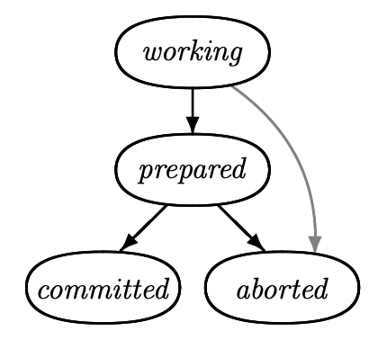

# Table of Contents

1.  [Algorithm](#org6c584ed)
2.  [Review](#orgb5a2b0c)
    1.  [简介](#org002ee2d)
    2.  [交易提交](#org211e5f6)
    3.  [两阶段提交](#org9794927)
        1.  [协议](#orgd608358)
        2.  [两阶段提交的成本](#org8400a66)
        3.  [两阶段提交的问题](#orgac7ae9a)
3.  [Tips](#orgb6129f8)
4.  [Share](#org9f85f00)
    1.  [简介](#org0c08b11)
    2.  [Trie数据结构](#org6cc9685)
    3.  [后缀树算法](#org7cefc52)
    4.  [最小DFA](#org9a04539)
    5.  [设计一个自动完成系统](#org606a323)
    6.  [结论](#org055cc96)

# Algorithm

Leetcode 324: <https://leetcode.com/problems/wiggle-sort-ii/>

<https://medium.com/@dreamume/leetcode-324-wiggle-sort-ii-ba6416b84648>

# Review

<https://www.microsoft.com/en-us/research/publication/consensus-on-transaction-commit/?from=http%3A%2F%2Fresearch.microsoft.com%2Fapps%2Fpubs%2Fdefault.aspx%3Fid%3D64636>

Consensus on Transaction Commit

## 简介

分布式交易包含多个操作，执行在多个站点，请求提交或放弃交易时终止。站点使用交易提交协议来决定是否交易被提交或放弃。交易能被提交仅当所有站点将要提交该交易。在分布式系统中达成这种所有或无的原子属性是不容易的。交易提交的要求在第2节中将详细描述。

经典的交易提交协议是两阶段提交，描述在第3节。它使用单个协调者来达到一致。协调者故障会导致协议被阻塞，无进程会了解，直到协调者恢复。在第4节，我们使用Paxos共识算法来获得一个使用多个协调者的交易提交协议；它在多数协调者工作的情况下能取得进展。第5节比较两阶段提交和Paxos提交。我们将展示两阶段提交是一种单协调者Paxos提交算法的降级，只有在该协调者工作的时候能保证进展。第6节讨论一些交易管理的实战。相关工作在总结中讨论。

我们的计算模型假设算法执行在一系列进程中，互相通过消息通讯。每个进程执行在一个网络节点。进程在遭遇故障是可保存数据到稳定的存储中。不同的进程可能执行在同一个节点。我们的模型统计节点间消息、消息延迟、写存储、写存储延迟。我们假设同一个节点的进程消息成本可忽略不计。我们的故障模型假设节点、它们的进程可能故障；消息会丢失或重复，但不会损坏。任意进程在故障节点会停止执行任何行为；它不执行不正确的行为和不会忘记它的状态。实现进程故障模型需要写信息到存储，可能会是昂贵的操作。我们将看到在两阶段提交和Paxos提交中写存储引起的延迟。

一般来说，算法必须满足两种正确的属性：安全性和活跃性。安全属性描述什么是允许发生的，活跃属性描述什么必须发生。

我们的算法是异步的，它们的安全属性不依赖进程执行的时间顺序或消息延迟的边界。进展依赖进程如何快速响应和消息如何转发。

我们定义一个非故障节点，该节点进程以某个时间限制响应消息。网络节点非故障当且仅当所有它的节点非故障且节点进程间发送的消息能在某个时间限制内转发。

本文主要部分描述交易提交和我们的两个协议。附录包含形式化的TLA+安全属性说明，即说明删除进度或实时限制的假设和需求。我们期望只是最关注的读者会查看这些说明。我们算法的进度属性和伴随的非故障定义也是形式化的，例如，像De Prisco，Lampson和Lunch的终止属性那样，我们只是以非形式化的方式解释它们。

## 交易提交

在分布式系统中，交易被一系列进程执行，这些进程被称为资源管理器，每个执行在不同的节点上。当一个资源管理器提出请求提交或取消交易时交易结束。对被提交的交易，每个参与的资源管理者必须提交它。否则，交易将被取消。在交易请求之前，任何资源管理者可自由决定取消它的交易部分。基本的需求是所有的资源管理者必须最终同意交易提交或取消。

为参与，一个资源管理者必须首先加入交易。我们假设固定集合的资源管理者决定。6.2节讨论资源管理者如何加入交易。

我们抽象交易提交协议的需求如下。我们假设一系列资源管理者进程，每个开始于工作状态。协议的目的是对所有资源管理者达到提交状态或取消状态。

两个协议的安全需要如下：

-   稳定性 一旦一个资源管理者进入提交状态或取消状态，它将永远在这个状态
-   一致性 资源管理者不可能一个在提交状态，另一个在取消状态

这两个属性意味着一旦资源管理者进入已提交状态，其他资源管理者则不能进入取消状态，反之依然。

每个资源管理者有准备状态。我们需要：

-   资源管理者只有在所有资源管理者在准备状态后才能进入已提交状态

这些要求意味着交易可提交，即所有资源管理者都进入已提交状态，只能通过如下顺序的事件：

-   所有资源管理者进入准备状态（以任意顺序）
-   所有资源管理者进入已提交状态（以任意顺序）

协议允许如下事件防止交易提交：

-   任意在工作状态下的资源管理者可进入取消状态

稳定性和一致性条件意味着取消事件不可能在一些资源管理者进入已提交状态后发生。实际上，一个工作中的资源管理者当它意识到它不能执行它的交易部分时它会取消。

算法的目标是]]让所有资源管理者达到已提交或取消状态，但在资源管理者故障或因通讯失败被隔绝的情况下无法实现。经典的FLP理论意味着一个确定性、纯异步的算法不能在满足稳定性和一致性的条件下依然保证进展（即使只有一个故障）。我们因此要求只在正确的时间顺序假设满足的情况下有进展。交易提交协议的两个活跃要求如下：

-   非平凡性 如果协议执行期间整个网络正常，则(a)如果所有资源管理者进入准备状态，则所有资源管理者最终进入已提交状态，(b)如果一些资源管理者进入取消状态，则所有资源管理者最终进入取消状态
-   非阻塞性 在任意时刻，大量的网络节点正常工作足够长时间，则这些节点的每个资源管理者最终进入已提交或取消状态

这两个条件的精确描述需要精确定义什么是网络节点非故障。非阻塞性里的“足够长时间”依赖于非故障进程和网络通讯的响应时间。我们在这里不会继续描述。

我们可通过指定逻辑行为集合来更精确地指出交易提交协议，这里行为指一系列系统状态。我们指定带一些初始信息的安全属性和描述所有可能步骤（状态转换）的下一步状态的关系。初始信息为所有资源管理者为工作状态。为定义下一步状态关系，我们先定义两个状态信息：

-   可提交 当且仅当所有资源管理者为准备状态或已提交状态
-   不可提交 当且仅当没有资源管理者进入已提交状态

下一个状态关系断言对每个资源管理者，每个步骤包含如下两个行为之一：

-   准备 资源管理者可从工作状态进入准备状态
-   决定 如果资源管理者在准备状态且可提交，则它可进入已提交状态；如果资源管理者在工作状态或准备状态且不可提交，则它可进入取消状态

## 两阶段提交

### 协议

两阶段提交协议是一种使用交易管理器进程协调决定过程的交易提交实现。资源管理者按交易提交说明在协议中有相同的状态。交易管理者有如下状态：初始化（它的初始化状态），准备，已提交和取消。

当资源管理者进入准备状态并发送一个准备消息给交易管理者时开始两阶段提交协议。在收到准备消息后，交易管理者进入准备状态并发送一个准备消息给每个其他资源管理者。收到准备消息后，仍在工作状态的资源管理者可进入准备状态并发送一个准备消息给交易管理者。当它接收到所有资源管理者的准备消息后，交易管理者可进入已提交状态并发送提交消息给所有其他进程。资源管理者在收到交易管理者的提交消息后可进入已提交状态。两阶段提交协议的消息流如下图。

本图显示一个资源管理者正在准备中，事实上，任意资源管理者可从工作状态进入准备状态并在任意时刻发送一个准备消息。交易管理者的准备消息可认为是一个可选的建议，认为现在是一个好的时机来提交。其他事件，包括实时超时时间，可能使工作的资源管理者进入准备。该观察基于两阶段提交协议使用更少的消息。

一个资源管理者在工作状态中时可自然地进入取消状态，交易管理者除非它已进入已提交状态可自然地进入取消状态。当交易管理者取消时，它发送一个取消消息给所有资源管理者。当收到该消息后，资源管理者进入取消状态。在实现中，自然取消可被超时触发。

在两阶段提交中，在任意的异步算法，处理故障并重启是非常容易的。在发送任意消息之前，每个进程记录它的当前状态到存储中。例如，当收到一个准备消息，交易管理者记录它已进入准备状态的信息到存储中然后发送一个准备消息。当故障进程重启时，它从存储中恢复它的状态并继续执行该算法。处理故障并重启相当于进程暂停，异步算法是允许该操作的。6.4节将讨论在我们交易提交协议中的进程故障并重启的更多细节。

两阶段提交有很多描述，它的形式化说明在附录的A.2节，使用一个理论断言它实现交易提交的详细说明。该理论被TLC模型检测机用大量足够的配置检测，所有它不太可能出错。

### 两阶段提交的成本

交易提交协议的重要高效度量是正常情况下的成本。设N为资源管理者的数量。两阶段提交协议在正常情况下发送如下消息序列：

-   初始化资源管理者进入准备状态并发送一个准备消息给交易管理者（1个消息）
-   交易管理者发送准备消息给每个其他的资源管理者（N - 1个消息）
-   每个其他资源管理者发送一个准备消息给交易管理者（N - 1个消息）
-   交易管理者发送一个提交消息给每个资源管理者（N个消息）

这样，正常情况下，资源管理者在4个消息延迟后学习到交易已被提交。总共3N - 1个消息发送。典型地，交易管理者可作为同一个节点上的初始化资源管理者。这样，两个消息在节点内，所以一共是3N - 3个消息和3个消息延迟。

如3.1节讨论的那样，我们可消除交易管理者的准备消息，减少消息复杂度为2N。但实际上，这需要额外的消息延迟或一些实时假设。

在消息延迟之外，两阶段提交协议还会伴随写存储的延迟：第一个资源管理者准备时的写入，其他管理者准备时地写入，和交易管理者作出交易决定时地写入。使所有资源管理者同时准备可减少到两个写入延迟。

### 两阶段提交的问题

# Tips

-   设计思想是共同的，通过学习一些案例可以获得一些通用的思路
-   通过翻译等的手段看似学习某知识时花费时间长，但质量高，远比看过效果好百倍
-   书中有些看不懂的内容，带着目的反复看几遍很可能就看懂了，第一遍看的时候往往太略，不细，忽略了很多细节或有些内容并没有真正理解或只是自以为理解了
-   对于计算机书籍，如内容看不懂，把例子用代码实现一下是非常好的理解原理的方法

# Share

如何设计自动完成系统

<https://dzone.com/articles/how-to-design-a-autocomplete-system>

## 简介

自动完成用于搜索建议。该特性增加文本输入速度。事实上，它想要加速搜索交互，通过输入尝试预测你的搜索。自动完成通常会在搜索引擎和消息app中。一个好的自动完成需要在用户输入下一个字母时快速并立即更新建议列表。自动完成仅建议它知道的单词。建议的单词从预定义词汇表中获取，例如，Wikipedia所有不同的单词或英语词典。词汇表的单词数量可能是巨大的：Wikipedia包含数百万个不同的单词。如果自动完成需要识别多单词和条目名，词汇表将更大。

系统的核心是获取前缀和搜索某前缀的词汇表单词的API。典型的，只有k个可能的结果返回。有许多设计实现这样的系统。本文中，我将描述一个百万词汇系统的中等设计。在此之前，我将介绍基本的概念和它们的使用，然后是设计部分。

## Trie数据结构

Trie是一种数据获取数据结构。它减少搜索复杂度并改进成功率和速度。Trie可以以O(M)的复杂度搜索键。然而，它需要数据存储。存储可在内存缓存（Redis或Memcached），数据库，或文件。假设S为一系列K字符串。S = {s1, s2, &#x2026;, sk}。模型集合S以根节点T，从T开始的每个路径到任意它的节点对应至少S中一个字符串的前缀。最好的方法展示该构建是考虑一个例子集。假设S = {het, hel, hi, car, cat}和ε对应一个空字符串。则Trie树如下：

考虑内部节点的每条边到它的子节点被一个字母标注。每个节点对应S的字符串则标注颜色。我们的观察是如果它是S中另一个字符串的前缀，则节点对应它的内部节点，否则，它是一个叶子节点。一些时候，所有的节点对应到S的字符串为叶子节点是非常有用的，或则把$字符添加到尾部：

为了创建Trie，可用一个节点做为根代表空字符串ε。如果你想要插入一个字符串e，按字符串中字符顺序依次插入。

为查找字符串e，你可从根节点开始迭代查找字符。

## 后缀树算法

后缀树是字符串所有后缀的压缩trie树。后缀树在解决许多字符串相关问题如模式匹配，寻找不同的子串，找最长的回文等非常有效。后缀树是使用trie数据结构解决模型匹配问题的一种改进。基本上，它是一种有长路径且没有分支的trie。更好的方法是减少这些长路径为一个路径，即减少trie的大小。

考虑字符串为abakan的后缀树。单词abakan有6个后缀{abakan, bakan, akan, kan, an, n}，它的后缀树如下：

Ukkonen设计了一种算法使用后缀树实现以字符串长度的线性时间复杂度。

后缀树能解决许多复杂问题，因它包含字符串本身的很多数据。例如，为了知道字符串中匹配模型P多少次，它可通过在后缀树中查找P并返回子树节点的大小来解决。另一个有名的应用程序是查找不同子字符串的数量。

前缀的自动完成可通过沿着路径查找前缀。这将在一些内部节点中结束。例如，图片前缀树，前缀对应着从根节点到子节点的路径。自动完成则通过继续遍历所有子节点来产生。

在前缀树中查找是非常快的。需要比较的步骤数量为查找一个前缀的字符数。特别的，这意味着搜索时间独立于字典大小。因此，前缀树适合大字典。前缀树相对于排序队列提供了显著的改进。

## 最小DFA

前缀树处理有共同的前缀非常有效，但其他的共享单词部分依然存储在独立的每个分支。例如，后缀，比如-ing和-ion，在英语里很常见。幸运地是，有一个方法能非常有效地保存共享的单词部分。前缀树是一种更一般的非循环确定性有限自动机（DFA）的数据结构的类实例。有很多算法可用很少的节点转换一种DFA到对应的DFA。最小前缀树DFA能缩减数据结构大小。最小DFA在即使字典很大的情况下也能放入内存。避免昂贵地磁盘操作是轻量快速自动完成的关键。

Myhill-Nerode理论给了我们一个理论化的最小DFA描述。两个状态不可区分意味着对所有字符串，它们都能运行到最终状态或非最终状态。我们说p和q为k区分仅当它们能以字符串长度不超过k的情况下能被区分。

很容易理解这种关系的推演属性：

p和q为k区分的仅当它们为k - 1区分的，或δ(p,σ)和δ (q,σ) 为k - 1可区分的,σ ∈ Σ

构建对应的类开始如下：

p和q为0不可区分的仅当它们都为最终或非最终状态。所以我们开始用算法分割为两块：最终或非最终。

在每两个这样的分区，p和q为1可区分的仅当有一个符号σ使δ (p,σ)和δ(q,σ)为0可区分的。例如，一个为最终另一个为非最终。我们近一步区分每个组为1可区分的状态集合。

方法是继续分割这些分区集合：

在分区集合中的p和q为k区分的仅当有一个符号σ 使δ(p,σ) 和δ(q,σ) 为k - 1可区分的。

在一些节点上，我们不能继续分割分区，我们终止算法因为不能进一步产生新的分割。当我们终止时，我们有了不可区分度对应的类，其将形成最小DFA的状态。从一种类到另一种类的转移通过获得在源类中选择任意状态，应用该转换：

开始区分最终和非最终：{q1, q3}, {q2, q4, q5, q6}

组中不同状态，获得下一步分区：{q1, q3}, {q4, q6}, {q5}, {q2}

-   b区分q2, q4：q4: δ(q2,b) ∈ {q1,q3}, δ(q4,b) ∈ {q2,q4,q5,q6}
-   b区分q2, q5: δ(q2,b) ∈ {q1,q3}, δ(q5,b) ∈ {q2,q4,q5,q6}
-   a区分q4, q5: δ(q4,a) ∈ {q1,q3}, δ(q5,a) ∈ {q2,q4,q5,q6}
-   非a、b区分(q4,q6)

最小DFA有开始状态{q1, q3}，单最终状态{q4, q6}，转换方法如下：

<table border="2" cellspacing="0" cellpadding="6" rules="groups" frame="hsides">

<colgroup>
<col  class="org-left" />

<col  class="org-left" />

<col  class="org-left" />
</colgroup>
<thead>
<tr>
<th scope="col" class="org-left">&#xa0;</th>
<th scope="col" class="org-left">a</th>
<th scope="col" class="org-left">b</th>
</tr>
</thead>

<tbody>
<tr>
<td class="org-left">{q1, q3}</td>
<td class="org-left">{q2}</td>
<td class="org-left">{q4, q6}</td>
</tr>

<tr>
<td class="org-left">{q4, q6}</td>
<td class="org-left">{q1, q3}</td>
<td class="org-left">{q5}</td>
</tr>

<tr>
<td class="org-left">{q2}</td>
<td class="org-left">{q5}</td>
<td class="org-left">{q1, q3}</td>
</tr>

<tr>
<td class="org-left">{q5}</td>
<td class="org-left">{q5}</td>
<td class="org-left">{q5}</td>
</tr>
</tbody>
</table>

## 设计一个自动完成系统

在系统设计中，大多数时间是没有唯一的方法来实现一个实际的目标。我们考虑一般的自动完成如google搜索。但我不会描述一些公共特性，比如空间检查、本地化、隐私信息和非英语单词。一个通常的实现是只使用trie数据结构，但我相信自动完成更加复杂。事实上，我们需要设计一个速度快且可扩展的系统。在系统设计领域，每个人有不同的观点和态度来对待复杂度且总是考虑更好的观点。

一般来说，自动完成获取前缀请求并发送给API。API服务器前端，我们需要有一个负载均衡。负载均衡分发前缀给一个节点。该节点为一个微服务响应检查是否有该前缀数据的缓存。如果有，则返回给API，否则检查zookeeper找到正确的后缀树服务器。

ZooKeeper定义后缀树服务器的有效性。例如，在zookeeper中，定义a\(s-1。它表示从a到\)（后缀结尾），服务器s1会响应。同样地，我们需要后台进程获得一捆字符串并聚集它们到数据库，进而应用到后缀树服务器。

通过后台进程，我们获得语法流和权重（这些流可从术语表、字典等获得）。权重基于数据挖掘技术，对每个系统会不同。

我们需要hash我们的权重和语法并发送给聚集器聚集相似的术语，创建时间和权重总数给数据库。这样我们可基于相关性和权重来推荐数据。

当前系统没有对数千个并行请求进行优化。我们需要改进它。我们可通过垂直扩展来改进我们的系统，但单个服务器是单点故障。我们需要更多的服务器来水平扩展我们的系统来分发请求，我建议用一个轮转算法来在不同系统间分发请求。我们需要对我们的缓存服务器做一些修改，我们可以简单地添加更多的缓存服务器，然而，问题是我们分发数据给不同的缓存服务器，我们如果保证每个服务器接收到的数据相当。例如，如果我们决定基于前缀的开始字符来处理数据段，则我们如何证明所有的服务器有对应相当的数据？我们可简单地使用哈希算法来决定什么数据插入到哪个服务器。但，如果一个服务器故障，我们的系统将不会按预期执行。

这样，我们需要一个一致性哈希技术。一致性哈希是一种分布式哈希方案，在分布式哈希表中独立操作服务器或对象数量，分配它们一个抽象循环或哈希环上的一个位置。这允许服务器和对象扩展并不影响所有的系统。同样，我们的zookeeper需要一些改变，当我们添加更多的后缀树服务器，我们需要改变zookeeper定义为a-k s1, l-m s2, m-z s3$。这将帮助节点服务器获取后缀树的正确数据。

## 结论

以上描述了如何设计一个自动完成系统。同样，这些数据结构可多方式扩展来改进性能。通常，相对于用户接口，存在对特定前缀更多可能的完整性。

自动完成数据结构非常有趣，它不需要你来实现它们。有开源库提供了相关功能。例如，Elasticsearch，Solr，和其他基于Lucence的搜索引擎提供了高效稳定的自动完成系统。

