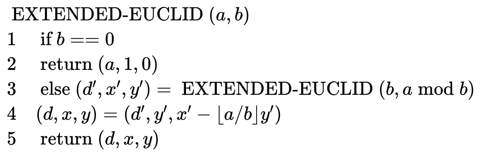
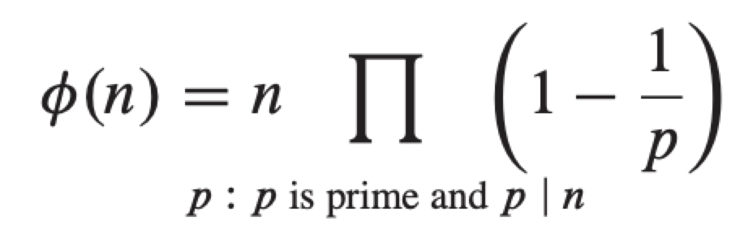
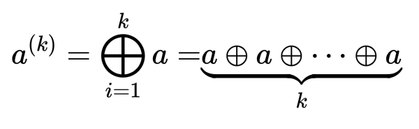

# Table of Contents

1.  [Algorithm](#orgc30919f)
2.  [Review](#org92366af)
    1.  [抽象](#org3e251b6)
    2.  [简介](#orgff18057)
        1.  [目标](#org51f30e4)
        2.  [假设](#orga5c2386)
3.  [Tips](#org07a0c93)
4.  [Share](#org9bb37d6)
    1.  [最大公约数](#orgda17808)
    2.  [模的算术](#orgf0eb08a)
    3.  [解模的线性等式](#orgc506ca9)
    4.  [中国余数定理](#org3254196)
    5.  [元素的幂](#orgdabae70)

# Algorithm

Leetcode 330: <https://leetcode.com/problems/patching-array/>

<https://medium.com/@dreamume/leetcode-330-patching-array-2477a76f40a0>

# Review

Life beyond Distributed Transactions: an Apostate’s Opinion

<http://www.ics.uci.edu/~cs223/papers/cidr07p15.pdf>

## 抽象

分布式交易包括2PC，Paxos和各种关于法定人数的协议已发展了几十年。这些协议提供给应用程序开发人员一个全局的顺序化。在我的部分职业生涯中我已经投入实现和使用平台提供的全局顺序保证相关工作。

我最近十年的经验使我专注于类似马奇诺防线那样的系统。一般来说，应用程序开发人员实现大规模可扩展性应用程序都假设为分布式交易。当他们尝试使用分布式交易时，项目因为性能成本和脆弱性问题使得无法正常工作。因此开始了自然选择&#x2026;应用程序开始使用不同的技术构建，不提供相同的交易保障但能满足商业需要。

本文探讨并命名一些世界上拒绝分布式交易的实现大规模紧急任务的应用程序实现。我们讨论使用适度尺寸应用程序数据管理，其可能随着应用程序增长进行数据分区。我们也讨论在这些可分区数据间发送消息的设计模型。

开始这些讨论的两个原因是提高新模型的知晓度。首先，我相信这会使人们开发大规模可扩展应用程序更加容易；其次，通过观察模型，希望工业界可创建平台使构建大规模应用程序更加容易。

## 简介

让我们检查本文的一些目标，为讨论我做的一些假设和从这些假设中推演的一些观点。因我对高可用性的痴迷，本文将忽略这样的问题并聚焦于可扩展性。特别地，我们将聚焦于假设我们不能有大规模可扩展分布式交易的争执。

### 目标

本文有3大目标：

1.  讨论可扩展应用程序
    
    许多设计可扩展系统的需求被许多应用程序设计者理解为谁构建大规模系统。
    
    问题是交易交互和可扩展系统的难点、概念和抽象还没有命名及很好地理解。当它们被应用时，它们非一致地应用，有时会反击到我们。本文的一个目标是启动一个讨论，使这些概念更明确，希望驱动一些共同的术语及对可扩展程序的同意意见。
    
    本文尝试命名和形式化多年来实现可扩展系统的一些抽象

2.  思考一些几乎无限扩展的应用程序
    
    为展开扩展性的讨论，本文呈现一个非正式的想法实验关于无穷扩展。我假设客户数，可购买条目，订单，发送物品，健康护理的病人，打的人，银行账户，和所有其他生意概念，随时间应用程序需要处理的事物快速增长。典型地，个人事物没有明显增长，我们只是简单地获得更多的东西。首先计算机被什么资源占满并不重要，需求的增加将驱动我们把之前运行在小型规模机器下改为运行在更大的机器集群。
    
    几乎无限的扩展是一种松散的、不精确的、无形的方法促使一些需要非常清晰，什么时候什么地方我们知道一些事情适合在一台机器上，如果我们不能确保它适合在一台机器应该怎么做。更进一步，我们想要扩展几乎线性的负载（数据和计算）。

3.  描述一些可扩展程序的通用模型
    
    什么是无穷扩展业务逻辑上的决定性的因素？我断言扩展意味着程序中使用一个新的抽象称为条目。一个条目在一个时间存活在一个机器中，应用程序一次只能操作一个条目。无穷扩展的结果是程序抽象必须导出到开发者的业务逻辑中。
    
    为命名并讨论该未命名的概念，希望我们对构建扩展性系统能有一致性编程和一致性的问题理解。
    
    更进一步地是，条目的使用意味着消息模型跟条目关联。这些使尝试构建可扩展解决方案的初级的应用程序开发者对状态机的创建必须考虑消息转发不一致的问题。

### 假设

# Tips

-   有些书中习题可能就是从本章知识中不容易解决，需要参考其他书籍，不能指望作者给出的习题刚好就是本章内容能解决，有可能有部分知识超纲

# Share

《算法导论》31章 数论算法

跳过前面介绍基础部分，我们直接进入比较关键或有趣的内容。

## 最大公约数

我们引入求最大公约数的Euclid算法：

    EUCLID(a, b)
    1  if b == 0
    2      return a
    3  else return EUCLID(b, a mod b)

该算法时间复杂度跟斐波那契数有关，定理31.11:

对任意整数k >= 1，如果a > b >= 1且b < Fk+1，则EUCLID(a, b)递归执行次数少于k次

我们现在重写Euclid算法来计算一些额外的有用信息。我们扩展算法计算整数系数x和y，使

    d = gcd(a, b) = ax + by

注意x和y可以为0或负数。

算法如下：

## 模的算术

先定义有限群：

群(S, ⊕)为集合S及S上的二元操作符⊕，满足如下属性：

1.  闭合：对任意a, b ∈ S，我们有a ⊕ b ∈ S
2.  单位元：存在一个元素e ∈ S，称为群的单位元，对任意a ∈ S，e ⊕ a = a ⊕ e = a
3.  交换性：对任意a, b, c ∈ S，有(a ⊕ b) ⊕ c = a ⊕ (b ⊕ c)
4.  倒数：对每个a ∈ S，存在唯一的元素b ∈ S，称为a的倒数，a ⊕ b = b ⊕ a = e

如果该群满足交换律，即对任意a, b ∈ S，有a ⊕ b = b ⊕ a，则称其为阿贝尔群。如果| S | < ∞，则为有限群。

定理31.13:

系统(Zn\*, .n)是一个有限阿贝尔群。

这里集合Zn\*的元素为

    Z_n^* = {[a]_n ∈ Z_n : gcd(a, n) = 1}

二元操作符为两元素相乘再对n取模。

例如：Z15\* = {1, 2, 4, 7, 8, 11, 13, 14}。

Zn\*的元素总个数定义为φ(n)，该函数被称为欧拉的phi函数，满足如下等式：

例如：φ(45) = 45 (1 - 1/3) (1 - 1/5) = 45 (2/3) (4/5) = 24

如果(S, ⊕)是一个群，S' ⊆ S, 且(S', ⊕) 也是一个群，则(S', ⊕) 是 (S, ⊕)的一个子群。

定理31.14 （一个有限群的非空闭合子集是一个子裙）

如果(S, ⊕)是一个有限群且S'是集合S的任意非空子集，对任意a, b ∈ S', 有a ⊕ b ∈ S'，则(S', ⊕) 是(S, ⊕)的一个子群。

定理31.15 （拉格朗日定理）

如果(S, ⊕) 是一个有限群且(S', ⊕) 是(S, ⊕)的一个子群，则| S' | 是| S |的除数。

引理31.16

如果S'是有限群S的子群，则| S' | <= | S | / 2;

定理31.14给我们提供了一个简单的方法来生成一个有限群(S, ⊕)的子群：选择一个元素a并用群操作符从a产生所有的元素。对k >= 1，定义a(k) ：

例如：我们让a = 2，群为Z6，则序列a(1) , a(2) ,a(3) , &#x2026;为2, 4, 0, 2, 4, 0, 2, 4, 0, &#x2026;

在群Zn 中，我们有a(k) = ka mod n，且在群zn\* 中，我们有a(k) = ak mod n，我们定义元素a生成的子群，记为<a> 或(<a>, ⊕)，<a> = {a(k) : k >= 1}

我们说a生成子群<a>或a是子群<a>的生成器。因S是有限的，<a>是S的有限子集，可能包含S的所有元素。因⊕的交换律，有a(i) ⊕ a(j) = a(i + j)

<a>是闭合的，因此，<a>是S的子群。例如：Z6，我们有

<0> = {0},

<1> = {0, 1, 2, 3, 4, 5}

<2> = {0, 2, 4}

同样的，Z7\* ，我们有：

<1> = {1},

<2> = {1, 2, 4},

<3> = {1, 2, 3, 4, 5, 6}

S群中a的序，记为ord(a)，定义为最小的正整数t，a(t) = e

定理31.17

对任意有限群(S, ⊕)和任意a ∈ S，a的序跟它生成的子群的大小相等，即ord(a) = | < a > |

引理31.18

序列a(1) ，a(2) ，&#x2026;以t = ord(a)为周期；即a(i) = a(j) 当且仅当i ≡ j(mod t)

引理31.19

如果(S, ⊕)为有限群，单位元为e，则对任意a ∈ S，有a(|S|) = e

## 解模的线性等式

定理31.20

对任意正整数a和n，如果d = gcd(a, n)，则在Zn 中，< a > = < d > = {0, d, 2d, &#x2026;, ((n / d) - 1)d}，且| < a > | = n / d

引理31.21

等式ax ≡ b (mod n) 可解当且仅当d | b，d = gcd(a, n)

引理31.22

等式ax ≡ b (mod n) 要么有d个不同的解，d = gcd(a, n)，要么无解

定理31.23

设d = gcd(a, n)，假设d = ax' + ny'，如果d | b，则ax ≡ b (mod n)有一个解为x0，x0 = x'(b / d) mod n

定理31.24

假设等式ax ≡ b (mod n)可解，即d | b，d = gcd(a, n)，且x0 是该等式的解。则该等式有d个不同的解，xi = \_0 + i(n / d)，i = 0, 1, &#x2026;, d - 1

    MODULAR_LINEAR_EQUATION_SOLVER(a, b, n)
    1  (d, x', y') = EXTENDED_EUCLID(a, n)
    2  if d | b
    3      x_0 = x'(b / d) mod n
    4      for i = 0 to d - 1
    5          print (x_0 + i(n / d)) mod n
    6  else print "no solutions"

引理31.25

对任意n > 1，如果gcd(a, n) = 1，则等式ax ≡ b (mod n)有一个唯一解。

引理31.26

对任意n > 1，如果gcd(a, n) = 1，则等式ax ≡ 1 (mod n)有唯一解，否则无解。

## 中国余数定理

定理31.27 （中国余数定理）

设n = n1 n2 &#x2026; nk ，ni 为相互prime，考虑a <-> (a1 , a2 , &#x2026;, ak )，a ∈ Zn ，ai ∈ Zni ，且ai = a (mod ni ) ，可推得如果a <-> (a1 ,a2 , &#x2026;, ak )，b <-> (b1 ，b2 ，&#x2026;, bk )，则(a + b) mod n <-> ((a1 + b1 ) mod n1 , &#x2026;, (ak + bk ) mod nk )，(a - b) mod n <-> ((a1 - b1 ) mod n1 , &#x2026;, (ak , bk ) mod nk )，(ab) mod n <-> (a1 b1 mod n1 , &#x2026;, ak bk mod nk )

引理31.28

如果n1 , n2 , &#x2026;, nk 互质，n = n1 n2 &#x2026; nk ，则对任意整数a1 ,a2 ,&#x2026;, ak , x ≡ ai (mod ni )，i = 1, 2, &#x2026;, k有一个唯一的解x mode n。

引理31.29

如果n1 , n2 , &#x2026;, nk 互质，n = n1 n2 &#x2026; nk ，则对所有整数x和a, x ≡ a(mod ni )，i = 1, 2, &#x2026;, k当且仅当x ≡ a (mod n)

## 元素的幂

定理31.30（欧拉定理）

对任意整数n > 1，任意a ∈ Z\*n ，有aφ(n) ≡ 1 (mod n)

定理31.31 （费马定理）

如果p是质数，任意a ∈ Z\*p ， 有a(p-1) ≡ 1 (mod p)

如果ordn (g) = | Z\*n |，则Z\*n 中每个元素都是g的幂，模上n，则g为原始根或Z\*n 的生成器。例如，3是原始根，模7，但2不是原始根，模7。如果Z\*n 有一个原始根，则群Z\*n 为可循环的。

定理31.32

对所有质数p > 2且所有正整数e，n > 1，Z\*n 为可循环的根为2，4，pe ，2pe

定理31.33

如果g是Z\*n 的原始根，则等式gx ≡ gy (mod n)当且仅当x ≡ y (mod φ(n))

